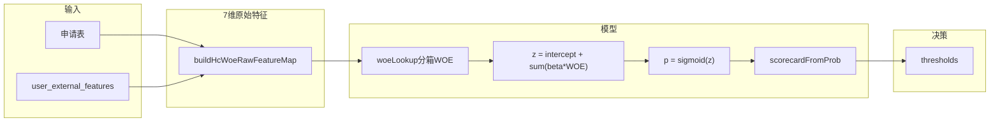

# Home Credit A 卡评分 — 使用说明

> **文档版本**：v2.0（对齐 A 卡 **v7.0-hc-woe** / B 卡 **v1.0-b-woe**；以 `risk-assessment/output/*.json` 与 `load_to_mysql.py` 为准）

本文档说明如何从 `home_credit_train_min.parquet` 完成 **A 卡清洗 → 训练 → 入库 → Java 推理** 全链路，并概述 **B 卡** 与黑名单同步。特征契约与表结构见 [`csv数据来源和数据库表设计.md`](csv数据来源和数据库表设计.md)（§3、附录 C）。

---

## 1. 评分卡范围（A 卡）

| 项 | 说明 |
|----|------|
| 类型 | **申请评分卡（A 卡）**：贷前、申请时点预测违约 |
| 模型 | IV 筛选 + **WOE 分箱** + 逻辑回归 + PDO 评分卡 |
| 入模特征 | **7 维**（IV ≥ 0.02；3 申请 + 4 第三方） |
| 标签 | `TARGET`（1 = 还款困难） |
| 分数区间 | 350–950；阈值 **788 / 642** |
| 不做 | 宽表 300+ 列竞赛衍生不全部入模；当前仅 7 维 WOE+LR |

## 1B. B 卡（贷后行为）范围

| 项 | 说明 |
|----|------|
| 类型 | **行为评分卡（B 卡）**：贷后还款行为监控 |
| 脚本 | `clean_behavior_features.py` → `train_b_card_model.py` |
| 输出 | `output/b_scoring_rules.json`（`v1.0-b-woe`） |
| 入模特征 | 7 维 `inst_*` / `pos_*`（见 §1B 下方列表） |
| 阈值 | `watch=684.6`，`reduce_limit=547.4` |
| 入库表 | `user_behavior_features`、`behavior_scoring_rules` |
| Java | `BehaviorScoreEngineImpl` |
| 与 A 卡关系 | 规则 JSON 与表物理分离；借款/贷后流程读取 B 卡 |

B 卡入模 7 维：`inst_amt_paid_1y`、`inst_dbd_mean_total`、`inst_dbd_mean_1y`、`pos_dpd_mean`、`inst_late_ratio_total`、`inst_partial_payment_ratio`、`pos_dpd_def_mean`

---

## 2. 环境准备

```bash
cd risk-assessment
pip install -r requirements.txt
```

依赖含 `pandas`、`scikit-learn`、`pyarrow`（读 parquet）、`mysql-connector-python`。

配置数据库：复制并编辑 `.env`（`DB_HOST`、`DB_USER`、`DB_PASSWORD`、`DB_NAME=credit_data_db`）。

---

## 3. 数据文件

将 parquet 放在：

```text
risk-assessment/data/raw/home_credit_train_min.parquet
```

快速检查：

```python
import pandas as pd
df = pd.read_parquet("data/raw/home_credit_train_min.parquet")
print(df.shape)
for c in ["TARGET", "DAYS_BIRTH", "EXT_SOURCE_2", "active_loans_count"]:
    print(c, c in df.columns)
print(df["TARGET"].mean())  # 违约率
```

---

## 4. 操作流程

### 4.1 训练评分模型（全量 parquet）

```bash
python train_scoring_model.py
```

- 优先读取 `data/raw/home_credit_train_min.parquet`（经 `feature_engineering_hc.py` + `woe_binning.py`）
- 输出 `output/scoring_rules.json`（`model_type=hc_woe_lr`）
- 成功标志：控制台打印 `WOE 训练完成 AUC=...`，且 JSON 中 `coefficients` 含非零 `ext_source_2`

验证：

```bash
python -c "import json; r=json.load(open('output/scoring_rules.json',encoding='utf-8')); print(r['model_type'], r['version']); print(list(r['coefficients'].keys()))"
```

期望：`hc_woe_lr v7.0-hc-woe`，系数列表含 `ext_source_2`、`ext_source_3` 等 7 个键。

### 4.2 清洗样本并准备入库（演示用 500 条）

```bash
python clean_user_features.py
```

- 从 parquet 去重、随机抽样（每地区 250，共 500）
- 输出 `data/cleaned/cleaned_user_features.csv`
- 含 `sk_id_curr`、WOE 扩展列及第三方字段（见 [`csv数据来源` 附录 C](csv数据来源和数据库表设计.md#附录-ccsv--db-字段映射cleaned_user_featurescsv)）

### 4.3 清洗黑名单（全量演示）

```bash
python clean_blacklist.py
```

产出 `data/cleaned/cleaned_blacklist.csv`。生产增量更新见 [第 11 章](#11-黑名单与扣子同步)。

### 4.4 B 卡训练与清洗

```bash
python clean_behavior_features.py
python train_b_card_model.py
```

产出 `cleaned_behavior_features.csv`、`output/b_scoring_rules.json`。

### 4.5 写入 MySQL

```bash
python load_to_mysql.py
```

依次：建库建表 → 黑名单 → `user_external_features` → `scoring_rules` → B 卡特征与规则。

### 4.6 可选：校准测试分数

```bash
python score_demo_users.py
```

### 4.7 启动 Java 后端

使用主项目 Spring Boot 启动后，提交风控评估。外部特征按 **身份证号** 查询（与主库 `user.id_card` 一致）：

```text
resolveExternalFeatures(idCard)
  → 先 UserExternalFeaturesMapper.selectByIdCard(idCard)
  → 若无且 idCard 为纯数字，再 selectBySkIdCurr
```

**联调约定**：注册与申请使用的 `id_card`，必须等于 `cleaned_user_features.csv` 中的 **`id_card` 列**（18 位演示证号）。`sk_id_curr` 仅作 HC 业务 ID 存档。

---

## 5. 特征契约（Python 训练 = Java 推理）

当前默认 **`model_type=hc_woe_lr`**：原始值 → WOE 查表 → LR → PDO。Java 在 `CreditScoreEngineImpl.isHcWoeModel()` 为真时走 `buildHcWoeRawFeatureMap` → `woeLookup`。

### 5.1 入模 7 维（WOE）

| 键名 | 来源 | Java 推理取值 |
|------|------|---------------|
| `ext_source_3` | external | `UserExternalFeatures.extSource3` |
| `ext_source_2` | external | `UserExternalFeatures.extSource2` |
| `edu_mid` | application | 申请表 `education` → 档位映射（`mid=1`） |
| `phone_change_days` | external | `daysLastPhoneChange` 取绝对值 |
| `age_years` | application | 申请表 `birthday` 推算年龄 |
| `prev_refused_count` | external | `UserExternalFeatures.prevRefusedCount`（缺省 0） |
| `gender_male` | application | `request.gender == 1` → 1.0，否则 0.0 |

WOE 分箱定义见 JSON `features.<键名>.cuts/woe/missing_bin`；系数见 `coefficients`。

### 5.2 外部表须入库字段

**WOE 入模依赖**：`ext_source_2`、`ext_source_3`、`days_last_phone_change`、`prev_refused_count`

**历史最小 5 列（仍须入库）**：`ext_source_2/3`、`credit_bureau_week/mon`、`active_loans_count`

**WOE 候选 / 验真扩展列**（当前 IV 未入模，但 CSV 清洗会写入）：`gender_male`、`married`、`own_realty`、`employment_stable`、`credit_income_ratio`、`cc_utilization`、`loan_overdue_max_6m`、`flag_own_car`、`amt_income_total`、`days_birth`、`days_employed` 等。完整映射见 [`csv数据来源` §3 与附录 C](csv数据来源和数据库表设计.md)。

### 5.3 验真 / 规则（不进当前 7 维 LR）

| 场景 | 逻辑 |
|------|------|
| 收入验真 | 自填月收入区间 vs 外部 `amt_income_total / 12` |
| 黑名单 | 姓名 + 地域 + 出生年 |
| 历史被拒 | `prev_refused_count` 既入 WOE，也可做规则拦截 |
| 第三方缺失 | 无 `user_external_features` 时 Java 抛 `THIRD_PARTY_MISSING` |

### 5.4 Java 分支与风控顺序

| `model_type` | Java 路径 |
|--------------|-------------|
| `hc_woe_lr`（**当前默认**） | `buildHcWoeRawFeatureMap` → `woeLookup` → `calculateLogisticScorecard` → PDO |
| `hc_lr_standardized`（fallback） | `buildHcRawFeatureMap` → `buildHcScaledFeatureMap` → LR → PDO |

风控顺序：

1. 身份校验  
2. 黑名单  
3. 数据验真（含收入）  
4. 重复申请检查  
5. WOE+LR 评分（`getScoreDetailReport`）

第三方评分已进入 LR 后，**勿在额度层对 `ext_source` 重复惩罚**（策略层仅保留非 LR 规则）。

---

## 6. 评分维度说明

| 维度 | 特征 | 作用 |
|------|------|------|
| 外部权威分 | `ext_source_2/3` | 强预测力（IV 最高） |
| 申请人口统计 | `age_years`、`gender_male` | 年龄与性别 WOE |
| 申请背景 | `edu_mid` | 中等学历档位 |
| 行为稳定性 | `phone_change_days` | 手机换号间隔 |
| 历史申请 | `prev_refused_count` | 被拒次数 |

决策阈值见 `output/scoring_rules.json` 中 `thresholds.auto_approve`、`thresholds.manual_review`（PDO 分）；逐项解读见 [第 10 章](#10-评分规则解读scoring_rulesjson)。

---

## 7. 故障排查

| 现象 | 处理 |
|------|------|
| `No module named 'pyarrow'` | `pip install pyarrow` |
| 训练显示「合成 HC 特征」 | 确认 parquet 路径正确且含 `DAYS_BIRTH`、`TARGET` |
| `coefficients` 无 `ext_source_2` | 确认 `use_hc=True`、`use_woe=True`（默认）且未走 LC 分支 |
| JSON 仍为 `hc_lr_standardized` | 重训：`python train_scoring_model.py`；或检查是否误设 `use_woe=False` |
| Java 外部特征全 0 | `id_card` 是否与 CSV 一致；是否执行 `load_to_mysql.py` |
| 仍用 500 行小样本训练 | 删除或移走优先于 parquet 的旧 CSV；以 parquet 为准 |
| AUC 异常高 | 检查是否误用 `TARGET`、`final_score` 等泄漏列 |

---

## 8. 相关脚本

| 脚本 | 作用 |
|------|------|
| `feature_engineering_hc.py` | HC 宽表特征工程 |
| `woe_binning.py` | WOE 分箱（A/B 卡共用） |
| `train_scoring_model.py` | A 卡 HC **WOE+LR** 训练 → `output/scoring_rules.json` |
| `train_b_card_model.py` | B 卡 WOE+LR → `output/b_scoring_rules.json` |
| `clean_user_features.py` | parquet → A 卡清洗 CSV |
| `clean_blacklist.py` | 原始黑名单 → 清洗 CSV |
| `clean_behavior_features.py` | parquet → B 卡行为 CSV |
| `load_to_mysql.py` | 建表 + 全量入库 |
| `score_demo_users.py` | 离线复现 Java WOE+PDO 算分 |

---

## 9. 与教师评审对齐要点

1. **训练与推理同一数据体系（HC）**，不用 LC 训练、HC 硬套权重。  
2. **第三方列必须出现在 `coefficients` / `features`**（如 `ext_source_2`）。  
3. **申请表与第三方在业务上分视图**，在 WOE+LR 中联合、键名与 JSON `features` 一致。  
4. 宽表 318 列经 IV 筛选后 **当前入模 7 维**；其余列入库供验真/WOE 候选/回测，见 [`csv数据来源` §2.4](csv数据来源和数据库表设计.md)。

---

## 10. 评分规则解读（scoring_rules.json）

**完整分箱表与系数**见 [`output/scoring_rules.md`](../risk-assessment/output/scoring_rules.md)（与 JSON 同目录，重训后需手动同步）。

本章解释当前训练产物 [`output/scoring_rules.json`](../risk-assessment/output/scoring_rules.json)（**版本 `v7.0-hc-woe`**）。重新执行 `python train_scoring_model.py` 后，本章数值需与 JSON 同步更新。

### 10.1 模型概览

| 项 | 值 |
|----|-----|
| 版本 | `v7.0-hc-woe` |
| 模型类型 | `hc_woe_lr` |
| 说明 | Home Credit：IV 筛选 + 分箱 WOE + LR + PDO（350–950） |
| 训练样本 | 100,000 条（Home Credit） |
| 训练违约率 | 8.72%（`TARGET=1` 为还款困难） |
| 离线 Accuracy | 66.10% |
| 离线 AUC | 0.714 |
| 规则加成 | `application_rule_bonus.enabled = false` |



与 Java 实现一致：[`CreditScoreEngineImpl`](../src/main/java/org/example/risklendpro/service/impl/CreditScoreEngineImpl.java) 在 `isHcWoeModel()` 为真时：`buildHcWoeRawFeatureMap` → `woeLookup` → `calculateLogisticScorecard` → `scorecardFromProb`。

### 10.2 评分计算公式

#### Step 1 — 原始值 → WOE

对每个入模特征 \(j\)，取原始值 \(x_j\)，按 JSON `features.<j>` 查 WOE：

- **数值型**：按 `cuts` 边界落入区间，取对应 `woe[i]`；超出最大边界取最后一档
- **缺失**：取 `missing_bin.woe`
- **分类型**：按类别键查 `categories.<值>.woe`

逻辑与 Python [`woe_binning.transform_row_woe`](../risk-assessment/woe_binning.py) 及 Java `woeLookup` 一致。

#### Step 2 — 违约概率（逻辑回归）

\[
z = \beta_0 + \sum_j \beta_j \cdot WOE_j,\quad
p = \frac{1}{1 + e^{-z}}
\]

- \(\beta_0\) = `intercept` = **-0.000868**
- \(\beta_j\) = `coefficients` 中对应系数（均为负，WOE 越大 → \(z\) 越小 → 违约概率越低）
- \(p\) 越大表示违约（还款困难）概率越高

#### Step 3 — PDO 信用分（350–950）

与 `train_scoring_model` / Java `scorecardFromProb` 一致：

\[
\text{odds} = \frac{p}{1-p},\quad
\text{factor} = -\frac{\text{pdo}}{\ln 2},\quad
\text{offset} = \text{target\_score} - \text{factor} \cdot \ln(\text{target\_odds})
\]

\[
\text{score} = \mathrm{clip}\big(\mathrm{round}(\text{offset} + \text{factor} \cdot \ln(\text{odds})),\ 350,\ 950\big)
\]

**分数越高，违约概率越低**（与 \(p\) 单调反向）。

当前 `scorecard` 标定参数：

| 参数 | 值 | 含义 |
|------|-----|------|
| `scale` | `odds_pdo` | PDO + log-odds 映射 |
| `pdo` | 125.081232 | 好坏比翻倍时，信用分约变化 125 分 |
| `target_score` | 650.0 | 锚点分数 |
| `target_odds` | 0.7456299122 | 锚点好坏比（校验集 odds 中位数） |
| `min_score` / `max_score` | 350 / 950 | 最终分截断上下限 |

PDO 由训练脚本根据校验集 odds 分位跨度反推（`span_frac=0.82`）。完整分箱边界见 JSON `features`，不在此逐条复制。

### 10.3 入模特征详解（7 维）

| 特征键 | 业务含义 | 来源 | 系数 β | 方向说明 |
|--------|----------|------|--------|----------|
| `ext_source_3` | 第三方权威评分 B | external | -0.875 | IV 最高；WOE 档越高 → 违约概率越低 |
| `ext_source_2` | 第三方权威评分 A | external | -0.825 | 与 ext_source_3 并列主导因子 |
| `edu_mid` | 中等学历=1 | application | -0.875 | 申请表学历档位映射 |
| `phone_change_days` | 手机换号天数 | external | -0.420 | 稳定性 proxy |
| `age_years` | 年龄（岁） | application | -0.488 | 生日推算 |
| `prev_refused_count` | 历史被拒次数 | external | -0.662 | 被拒越多 WOE 越高风险 |
| `gender_male` | 性别男=1 | application | -0.907 | 申请表 gender |

**未入模但已入库的 IV 候选**（`feature_selection_report.iv_table` 中 `selected=false`）：`cc_utilization`、`amt_income_total`、`active_loans_count`、`loan_overdue_max_6m`、`own_car`、`credit_income_ratio`、`employment_stable`、`married`、`own_realty` 等（IV<0.02）。

#### 第三方与外部表

WOE 入模直接依赖：`ext_source_2/3`、`days_last_phone_change`（→ `phone_change_days`）、`prev_refused_count`。

- 无 `user_external_features` 记录时，Java 抛出 `THIRD_PARTY_MISSING`，**不会**用全 0 静默通过。
- 字段映射见 [第 5 章](#5-特征契约python-训练--java-推理) 与 [`csv数据来源` 附录 C](csv数据来源和数据库表设计.md#附录-ccsv--db-字段映射cleaned_user_featurescsv)。

### 10.4 决策阈值

阈值为 **PDO 信用分**（非违约概率 \(p\)），取自 `thresholds`：

| 分数区间 | 业务决策 | JSON 键 |
|----------|----------|---------|
| ≥ **788** | 自动通过 | `auto_approve` |
| **642 – 787** | 人工审核 | `manual_review` ≤ score < `auto_approve` |
| < **642** | 自动拒绝 | 低于 `manual_review` |

阈值由 `train_scoring_model.py` 在**校验集 PDO 分**上取分位数生成。旧版 LC 的 720/580 及旧版 HC 8 维的 776 **均不适用**，以当前 JSON 为准。

WOE+LR 评分在 [`RiskAssessmentServiceImpl`](../src/main/java/org/example/risklendpro/service/impl/RiskAssessmentServiceImpl.java) 中位于：身份校验 → 黑名单 → 数据验真 → 重复申请 **之后**。

### 10.5 算分示例：赵六（高分通过）

权威离线复现：

```bash
python score_demo_users.py
```

结果写入 [`output/demo_user_scores.json`](../risk-assessment/output/demo_user_scores.json)。赵六（`id_card=110112199602030012`）：

| 项 | 值 |
|----|-----|
| 生日 | 1996-02-03 → `age_years=30` |
| 学历 | 本科 → `edu_mid=0`（非 mid 档） |
| 性别 | 女 → `gender_male=0` |
| `ext_source_2` / `ext_source_3` | 0.7662 / 0.761（第三方，高于多数 WOE 档） |
| **PDO 分** | **950.0**（触顶 `max_score`） |
| **决策** | `APPROVE`（950 ≥ 788） |

与 [`sql/测试用例.md`](../sql/测试用例.md) 预期一致。高分主因：`ext_source_2/3` 落入高 WOE 档，负系数 \(\beta\) 使 \(z\) 显著为负。

### 10.6 与旧版的区别

| 对比项 | 旧版 LC | 旧版 HC 8 维（v6） | **当前 HC WOE（v7）** |
|--------|---------|-------------------|----------------------|
| 特征形式 | 分箱 one-hot | 8 维连续 + StandardScaler | IV 筛选 7 维 + WOE 分箱 |
| 模型标识 | 非 `hc_*` | `hc_lr_standardized` | **`hc_woe_lr`** |
| JSON 系数 | `feature_scores` | `feature_weights` + `feature_scaler` | **`coefficients` + `features`** |
| 决策阈值 | 720 / 580 | 776 / 642 | **788 / 642** |
| Java 分支 | `buildLegacyLcFeatureMap` | `buildHcScaledFeatureMap` | **`buildHcWoeRawFeatureMap` + `woeLookup`** |
| 训练入口 | LC CSV | `use_woe=False` | **`use_woe=True`（默认）** |

`train_scoring_model(use_woe=False)` 仍可产出 8 维 `hc_lr_standardized`；Java 按 `model_type` 分支兼容。**当前部署应保证库表/JSON 为 `hc_woe_lr`**。详见 [`csv数据来源` 附录 D](csv数据来源和数据库表设计.md#附录-d旧版-hc_lr_standardized可选-fallback)。

### 10.7 维护与同步

1. 修改训练数据或特征后执行：`python train_scoring_model.py`
2. 检查 `output/scoring_rules.json`：`model_type=hc_woe_lr`，`coefficients.ext_source_2` 非零
3. 入库：`python load_to_mysql.py`（写入 `scoring_rules` 表）
4. 重启 Java 后端，使 `ScoringRulesMapper.selectActiveRule()` 加载新规则
5. 运行 `python score_demo_users.py` 校准测试用例分数
6. 同步更新本章表格数值，或注明「以 JSON 文件修改时间为准」

相关文件：

- 规则 JSON：[`risk-assessment/output/scoring_rules.json`](../risk-assessment/output/scoring_rules.json)
- 训练脚本：[`train_scoring_model.py`](../risk-assessment/train_scoring_model.py)
- 数据字典与表结构：[`csv数据来源和数据库表设计.md`](csv数据来源和数据库表设计.md) 第五节、附录 C

---

## 11. 黑名单与扣子同步

黑名单进入 `credit_data_db.blacklist` 有两条路径：

| 路径 | 说明 |
|------|------|
| 离线全量 | `clean_blacklist.py` + `load_to_mysql.py`（DROP 重建，开发用） |
| 扣子增量 | Cron 抓取温州公开 CSV → 清洗 → `POST /api/v1/sync/blacklist` |

- 字段映射与去重规则：[`csv数据来源和数据库表设计.md`](csv数据来源和数据库表设计.md) 第四、七章
- API 请求格式：[`接口文档.md`](接口文档.md)「黑名单同步」
- 扣子环境变量：`SPRING_BASE_URL`、`BLACKLIST_SYNC_TOKEN`（对应 Java `risk.blacklist-sync.api-token`）
