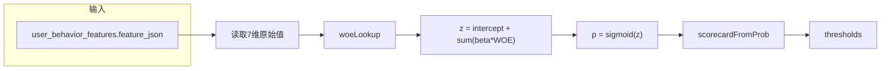

# B 卡评分规则解读（b_scoring_rules.json）

> **对应文件**：同目录 [`b_scoring_rules.json`](b_scoring_rules.json)  
> **版本**：`v1.0-b-woe` · **模型类型**：`b_card_woe` · **卡种**：B（贷后行为）  
> **维护说明**：本文档为 JSON 的人类可读副本；重新执行 `python train_b_card_model.py` 后，请手动同步本文数值。

---

## 1. 模型概览

| 项 | 值 |
|----|-----|
| 说明 | B 卡：HC `inst_*` / `pos_*` 行为特征 WOE + LR + PDO |
| 训练样本 | 100,000 条 |
| 训练违约率 | 8.72% |
| 数据来源 | Home Credit inst_/pos_ |
| 离线 Accuracy | 0.6101 |
| 离线 AUC | 0.5713 |
| 入模特征数 | 7 |

B 卡用于**贷后**还款行为监控；规则与 A 卡物理分离（`behavior_scoring_rules` 表 + `BehaviorScoreEngineImpl`）。

---

## 2. JSON 顶层字段字典

| 字段 | 说明 |
|------|------|
| `version` | 规则版本号 |
| `model_type` | Java 分支标识：`b_card_woe` |
| `card_type` | 固定 `B` |
| `description` | 模型简述 |
| `selected_features` | 入模 7 维特征名列表 |
| `feature_derivation` | 各特征来源说明 |
| `features` | WOE 分箱定义 |
| `coefficients` | 逻辑回归系数 β |
| `intercept` | 截距 β₀ |
| `thresholds` | 观察 / 降额阈值（`watch` / `reduce_limit`） |
| `scorecard` | PDO 标定参数 |
| `training_data` | 训练集规模 |
| `model_metrics` | 离线 accuracy / AUC |
| `iv_table` | 各特征 IV 与是否入模 |

行为特征入库：`clean_behavior_features.py` → `user_behavior_features.feature_json`（键名与 `selected_features` 一致）。

---

## 3. 算分流程

### Step 1 — 原始值 → WOE

规则同 A 卡：数值型按 `cuts`/`woe` 分档，缺失取 `missing_bin.woe`。与 Python `woe_binning`、Java `BehaviorScoreEngineImpl.woeLookup` 一致。

### Step 2 — 逻辑回归

\[
z = \beta_0 + \sum_j \beta_j \cdot WOE_j,\quad
p = \frac{1}{1 + e^{-z}}
\]

- \(\beta_0\) = **-0.0005089810929602766**

### Step 3 — PDO 信用分（350–950）

| 参数 | 值 |
|------|-----|
| `scale` | `odds_pdo` |
| `min_score` / `max_score` | 350 / 950 |
| `pdo` | 515.169276 |
| `target_score` | 650.0 |
| `target_odds` | 0.9040787474 |

校验集 odds 分位（文档参考）：p05=0.766，p50=0.904，p95=1.484。

---

## 4. 入模特征业务释义

| 键名 | 含义 |
|------|------|
| `inst_amt_paid_1y` | 近 1 年已还金额 |
| `inst_dbd_mean_total` | 全期平均逾期天数（Days Past Due） |
| `inst_dbd_mean_1y` | 近 1 年平均逾期天数 |
| `pos_dpd_mean` | 贷后平均 DPD |
| `inst_late_ratio_total` | 全期迟还比例 |
| `inst_partial_payment_ratio` | 部分还款比例 |
| `pos_dpd_def_mean` | 违约样本 DPD 均值 |

---

## 5. 入模特征分箱明细

### 5.1 inst_amt_paid_1y（numeric）

| 区间 | WOE |
|------|-----|
| \(x \leq 41311.602\) | 0.001617 |
| \(41311.602 < x \leq 126289.215\) | -0.026126 |
| \(126289.215 < x \leq 333744.597\) | -0.021508 |
| \(333744.597 < x \leq 9000328.95\) | 0.04506 |
| \(x > 9000328.95\) | 0.04506 |
| 缺失 | 0.0 |

### 5.2 inst_dbd_mean_total（numeric）

| 区间 | WOE |
|------|-----|
| \(x \leq 4.306\) | -0.120706 |
| \(4.306 < x \leq 7.386\) | -0.063874 |
| \(7.386 < x \leq 10.703\) | 0.013833 |
| \(10.703 < x \leq 15.846\) | 0.048255 |
| \(15.846 < x \leq 194.889\) | 0.138088 |
| \(x > 194.889\) | 0.138088 |
| 缺失 | 0.0 |

### 5.3 inst_dbd_mean_1y（numeric）

| 区间 | WOE |
|------|-----|
| \(x \leq 0\) | 0.032498 |
| \(0 < x \leq 2.625\) | -0.242147 |
| \(2.625 < x \leq 7.167\) | -0.111242 |
| \(7.167 < x \leq 13\) | 0.011154 |
| \(13 < x \leq 212.727\) | 0.154428 |
| \(x > 212.727\) | 0.154428 |
| 缺失 | 0.0 |

### 5.4 pos_dpd_mean（numeric）

| 区间 | WOE |
|------|-----|
| \(x \leq 2622.078\) | 0.000065 |
| \(x > 2622.078\) | 0.000065 |
| 缺失 | 0.0 |

### 5.5 inst_late_ratio_total（numeric）

| 区间 | WOE |
|------|-----|
| \(x \leq 0.0426\) | 0.178102 |
| \(0.0426 < x \leq 0.139\) | -0.079554 |
| \(0.139 < x \leq 1\) | -0.358241 |
| \(x > 1\) | -0.358241 |
| 缺失 | 0.0 |

### 5.6 inst_partial_payment_ratio（numeric）

| 区间 | WOE |
|------|-----|
| \(x \leq 0.0156\) | 0.155584 |
| \(0.0156 < x \leq 0.143\) | -0.058782 |
| \(0.143 < x \leq 1\) | -0.331415 |
| \(x > 1\) | -0.331415 |
| 缺失 | 0.0 |

### 5.7 pos_dpd_def_mean（numeric）

| 区间 | WOE |
|------|-----|
| \(x \leq 1671.398\) | 0.000065 |
| \(x > 1671.398\) | 0.000065 |
| 缺失 | 0.0 |

---

## 6. 逻辑回归系数

| 特征 | 系数 β | 备注 |
|------|--------|------|
| `inst_amt_paid_1y` | -1.554009 | 主效应特征 |
| `inst_dbd_mean_total` | 0.160035 | 唯一正系数 |
| `inst_dbd_mean_1y` | -0.822641 | |
| `pos_dpd_mean` | -2.87e-08 | 近零，WOE 档亦近常数 |
| `inst_late_ratio_total` | -0.732732 | |
| `inst_partial_payment_ratio` | -0.321609 | |
| `pos_dpd_def_mean` | -2.87e-08 | 近零 |
| **intercept** | **-0.000509** | — |

---

## 7. 决策阈值

| 分数区间 | 业务含义 | JSON 键 |
|----------|----------|---------|
| ≥ **684.6** | 正常 | 高于 `watch` |
| **547.4 – 684.5** | 观察 | `reduce_limit` ≤ score < `watch` |
| < **547.4** | 大幅降额 | 低于 `reduce_limit` |

阈值为 PDO 信用分；由 `train_b_card_model.py` 在校验集上标定。

---

## 8. IV 表

| 特征 | IV | 入模 |
|------|-----|------|
| inst_amt_paid_1y | 0.000631 | 是 |
| inst_dbd_mean_total | 0.007998 | 是 |
| inst_dbd_mean_1y | 0.011862 | 是 |
| pos_dpd_mean | 4.20e-09 | 是 |
| inst_late_ratio_total | 0.048748 | 是 |
| inst_partial_payment_ratio | 0.039367 | 是 |
| pos_dpd_def_mean | 4.20e-09 | 是 |

---

## 9. 代码消费点

| 环节 | 文件 / 类 |
|------|-----------|
| 训练产出 | [`train_b_card_model.py`](../train_b_card_model.py) |
| 行为特征清洗 | [`clean_behavior_features.py`](../clean_behavior_features.py) |
| WOE 变换 | [`woe_binning.py`](../woe_binning.py) |
| MySQL 入库 | [`load_to_mysql.py`](../load_to_mysql.py) → `behavior_scoring_rules`、`user_behavior_features` |
| Java 推理 | `BehaviorScoreEngineImpl` + `BehaviorScoreService` |
| 业务触发 | 贷后流程、额度调整（`OverdueLimitAdjustTask` 等） |

---

## 10. 与 A 卡的关系

| 对比项 | A 卡 | B 卡 |
|--------|------|------|
| 规则 JSON | `scoring_rules.json` | `b_scoring_rules.json` |
| 解读文档 | [`scoring_rules.md`](scoring_rules.md) | 本文 |
| 特征来源 | 申请 + 第三方征信 | HC 贷后 inst_/pos_ |
| 阈值语义 | 通过 / 人工 / 拒绝 | 观察 / 降额 |
| 时点 | 贷前 | 贷后 |

---

## 相关文档

- B 卡流水线：[`参考文件/HomeCredit评分卡使用说明.md`](../../参考文件/HomeCredit评分卡使用说明.md) §1B、§4.4
- 表结构：[`参考文件/csv数据来源和数据库表设计.md`](../../参考文件/csv数据来源和数据库表设计.md) §6
- B 卡测试：[`sql/B卡借款测试用例.md`](../../sql/B卡借款测试用例.md)
