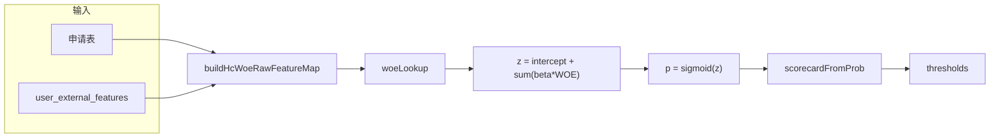

# A 卡评分规则解读（scoring_rules.json）

> **对应文件**：同目录 [`scoring_rules.json`](scoring_rules.json)  
> **版本**：`v7.0-hc-woe` · **模型类型**：`hc_woe_lr`  
> **维护说明**：本文档为 JSON 的人类可读副本；重新执行 `python train_scoring_model.py` 后，请手动同步本文数值。

---

## 1. 模型概览

| 项 | 值 |
|----|-----|
| 说明 | Home Credit：IV 筛选 + 分箱 WOE + LR + PDO（350–950） |
| 训练样本 | 100,000 条 |
| 训练违约率 | 8.72%（`TARGET=1` = 还款困难） |
| 离线 Accuracy | 0.66095 |
| 离线 AUC | 0.71384 |
| 规则加成 | `application_rule_bonus.enabled = false` |
| 入模特征数 | 7（IV ≥ 0.02，候选 19 维） |

---

## 2. JSON 顶层字段字典

| 字段 | 说明 |
|------|------|
| `version` | 规则版本号 |
| `model_type` | Java 分支标识：`hc_woe_lr` |
| `description` | 模型简述 |
| `feature_derivation` | 各特征来源（application / external） |
| `features` | WOE 分箱定义（cuts / categories / missing_bin） |
| `coefficients` | 逻辑回归系数 β |
| `intercept` | 截距 β₀ |
| `thresholds` | PDO 分决策阈值 |
| `scorecard` | PDO 标定参数（350–950 量表） |
| `application_rule_bonus` | 申请表额外加分（当前关闭） |
| `feature_selection_report` | IV 筛选报告 |
| `training_data` | 训练集规模与违约率 |
| `model_metrics` | 离线 accuracy / AUC |

入库：`load_to_mysql.py` 将 `coefficients` 写入 `scoring_rules.feature_weights` 列；Java 通过 `ScoringRulesMapper.selectActiveRule()` 加载。

---

## 3. 算分流程

### Step 1 — 原始值 → WOE

- **数值型**：按 `cuts` 边界落入区间，取 `woe[i]`；超出最大边界取最后一档
- **分类型**：按 `categories.<值>.woe` 查表
- **缺失**：取 `missing_bin.woe`

与 Python [`woe_binning.transform_row_woe`](../woe_binning.py)、Java `CreditScoreEngineImpl.woeLookup` 一致。

### Step 2 — 逻辑回归

\[
z = \beta_0 + \sum_j \beta_j \cdot WOE_j,\quad
p = \frac{1}{1 + e^{-z}}
\]

- \(\beta_0\) = **-0.00086805002314112**
- \(p\) 越大 → 违约（还款困难）概率越高
- 所有 \(\beta_j\) 为负 → WOE 越高 → \(z\) 越小 → 违约概率越低

### Step 3 — PDO 信用分（350–950）

| 参数 | 值 |
|------|-----|
| `scale` | `odds_pdo` |
| `min_score` / `max_score` | 350 / 950 |
| `pdo` | 125.081232 |
| `target_score` | 650.0 |
| `target_odds` | 0.7456299122 |

校验集 odds 分位（文档参考，Java 不读）：p05=0.208，p50=0.746，p95=3.179。

**分数越高，违约概率越低。**

---

## 4. 入模特征分箱明细

### 4.1 ext_source_3（第三方权威分 B · external · numeric）

| 区间 | WOE |
|------|-----|
| \(x \leq 0.317\) | -0.766344 |
| \(0.317 < x \leq 0.46\) | -0.101197 |
| \(0.46 < x \leq 0.578\) | 0.296668 |
| \(0.578 < x \leq 0.685\) | 0.553226 |
| \(0.685 < x \leq 0.888\) | 0.909456 |
| \(x > 0.888\) | 0.909456（最后一档） |
| 缺失 | -0.136521 |

### 4.2 ext_source_2（第三方权威分 A · external · numeric）

| 区间 | WOE |
|------|-----|
| \(x \leq 0.344\) | -0.760581 |
| \(0.344 < x \leq 0.515\) | -0.105731 |
| \(0.515 < x \leq 0.609\) | 0.181161 |
| \(0.609 < x \leq 0.682\) | 0.464779 |
| \(0.682 < x \leq 0.855\) | 0.834007 |
| \(x > 0.855\) | 0.834007 |
| 缺失 | -0.157839 |

### 4.3 edu_mid（中等学历 · application · categorical）

| 取值 | 标签 | WOE |
|------|------|-----|
| 0 | 否 | -0.148254 |
| 1 | 是 | 0.435299 |
| 缺失 | — | 0.0 |

### 4.4 phone_change_days（手机换号天数 · external · numeric）

| 区间 | WOE |
|------|-----|
| \(x \leq 178\) | -0.1867 |
| \(178 < x \leq 558\) | -0.216879 |
| \(558 < x \leq 1060\) | -0.077203 |
| \(1060 < x \leq 1732\) | 0.206699 |
| \(1732 < x \leq 4153\) | 0.384953 |
| \(x > 4153\) | 0.384953 |
| 缺失 | -1.249257 |

Java 推理取 `daysLastPhoneChange` 绝对值。

### 4.5 age_years（年龄 · application · numeric）

| 区间 | WOE |
|------|-----|
| \(x \leq 30.7\) | -0.297183 |
| \(30.7 < x \leq 37\) | -0.14702 |
| \(37 < x \leq 42.9\) | 0.051052 |
| \(42.9 < x \leq 50\) | 0.150893 |
| \(50 < x \leq 69\) | 0.351926 |
| \(x > 69\) | 0.351926 |
| 缺失 | 0.0 |

### 4.6 prev_refused_count（历史被拒次数 · external · numeric）

| 区间 | WOE |
|------|-----|
| \(x \leq 1\) | 0.107655 |
| \(1 < x \leq 58\) | -0.408942 |
| \(x > 58\) | -0.408942 |
| 缺失 | 0.0 |

### 4.7 gender_male（性别男 · application · categorical）

| 取值 | 标签 | WOE |
|------|------|-----|
| 0 | 否（女） | 0.154888 |
| 1 | 是（男） | -0.220945 |
| 缺失 | — | 0.0 |

---

## 5. 逻辑回归系数

| 特征 | 系数 β | 方向（WOE↑ 且 β<0 → 违约↓） |
|------|--------|------------------------------|
| `ext_source_3` | -0.875156 | 权威分越高 → 风险越低 |
| `ext_source_2` | -0.825335 | 同上 |
| `edu_mid` | -0.874745 | 中等学历 WOE 高 → 风险低 |
| `phone_change_days` | -0.420199 | 换号间隔长 → 风险低 |
| `age_years` | -0.487611 | 年龄 WOE 档影响 |
| `prev_refused_count` | -0.662132 | 被拒次数 WOE 档影响 |
| `gender_male` | -0.907086 | 性别 WOE 档影响 |
| **intercept** | **-0.000868** | — |

---

## 6. 决策阈值

| 分数区间 | 业务决策 | JSON 键 |
|----------|----------|---------|
| ≥ **788** | 自动通过 | `auto_approve` |
| **642 – 787** | 人工审核 | `manual_review` ≤ score < `auto_approve` |
| < **642** | 自动拒绝 | 低于 `manual_review` |

阈值在校验集 PDO 分上取分位数生成（量表 350–950）。

---

## 7. IV 特征筛选报告

筛选规则：候选 19 维，IV ≥ 0.02 入模，共选中 7 维。

| 特征 | IV | 缺失率 | 入模 | 原因 |
|------|-----|--------|------|------|
| ext_source_3 | 0.345625 | 19.68% | 是 | 入模 |
| ext_source_2 | 0.301121 | 0.19% | 是 | 入模 |
| edu_mid | 0.06419 | 0% | 是 | 入模 |
| phone_change_days | 0.052194 | 0% | 是 | 入模 |
| age_years | 0.050943 | 0% | 是 | 入模 |
| prev_refused_count | 0.043864 | 0% | 是 | 入模 |
| gender_male | 0.034125 | 0% | 是 | 入模 |
| cc_utilization | 0.018409 | 0% | 否 | IV<0.02 |
| amt_income_total | 0.017041 | 0% | 否 | IV<0.02 |
| active_loans_count | 0.016972 | 0% | 否 | IV<0.02 |
| loan_overdue_max_6m | 0.013938 | 0% | 否 | IV<0.02 |
| own_car | 0.012228 | 0% | 否 | IV<0.02 |
| credit_income_ratio | 0.011286 | 0% | 否 | IV<0.02 |
| employment_stable | 0.010025 | 0% | 否 | IV<0.02 |
| married | 0.002856 | 0% | 否 | IV<0.02 |
| own_realty | 0.000175 | 0% | 否 | IV<0.02 |
| edu_high | 0.000056 | 0% | 否 | IV<0.02 |
| credit_inquiry_1m | 0.0 | 13.3% | 否 | IV<0.02 |
| credit_inquiry_week | 0.0 | 13.3% | 否 | IV<0.02 |

---

## 8. 代码消费点

| 环节 | 文件 / 类 |
|------|-----------|
| 训练产出 | [`train_scoring_model.py`](../train_scoring_model.py) → `train_hc_woe_scoring_model` |
| WOE 变换 | [`woe_binning.py`](../woe_binning.py) |
| 离线复算 | [`score_demo_users.py`](../score_demo_users.py) |
| MySQL 入库 | [`load_to_mysql.py`](../load_to_mysql.py) → `scoring_rules` 表 |
| Java 推理 | `CreditScoreEngineImpl`：`isHcWoeModel()` → `buildHcWoeRawFeatureMap` → `woeLookup` → `scorecardFromProb` |
| 业务编排 | `RiskAssessmentServiceImpl`（黑名单 / 验真之后调用评分） |

---

## 9. 联调示例

来源：[`demo_user_scores.json`](demo_user_scores.json)（运行 `python score_demo_users.py` 生成）。

### 赵六 — 高分自动通过

| 项 | 值 |
|----|-----|
| id_card | 110112199602030012 |
| ext_source_2 / ext_source_3 | 0.7662 / 0.761 |
| PDO 分 | **950.0**（触顶 max_score） |
| 决策 | **APPROVE**（≥ 788） |

### 李四 — 低分自动拒绝

| 项 | 值 |
|----|-----|
| id_card | 110112200101080001 |
| ext_source_2 / ext_source_3 | 0.4576 / 0.4794 |
| has_default_history | 1 |
| PDO 分 | **549.6** |
| 决策 | **REJECT**（< 642） |

---

## 相关文档

- 操作流程：[`参考文件/HomeCredit评分卡使用说明.md`](../../参考文件/HomeCredit评分卡使用说明.md)
- 数据与表结构：[`参考文件/csv数据来源和数据库表设计.md`](../../参考文件/csv数据来源和数据库表设计.md)
