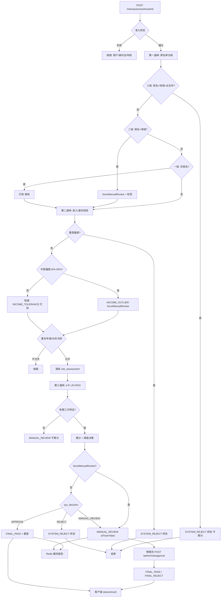
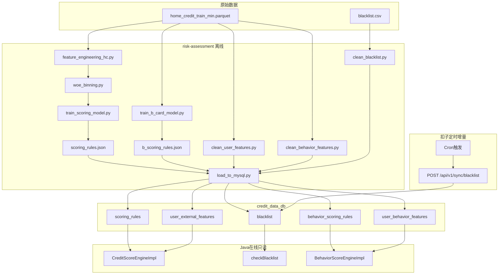
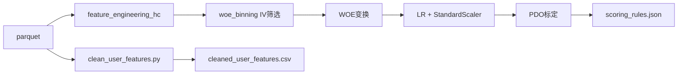
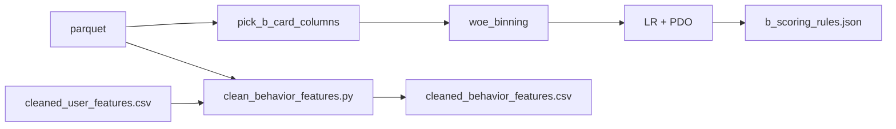

# RiskLendPro 详细风控流程

本文档描述 **贷前 A 卡** 全链路风控逻辑：从用户提交申请到系统决策、人工复核与终态。实现入口以 `RiskAssessmentServiceImpl.submit` / `executeRiskAssessment` 及 `CreditScoreEngineImpl` 为准；**Python 离线流水线**见本文 **§七**，评分卡公式详见 [`HomeCredit评分卡使用说明.md`](HomeCredit评分卡使用说明.md)。

---

## 一、设计原则

| 原则 | 说明 |
|------|------|
| 概率决策 | 黑名单无身份证时，用 **姓名 → 地域 → 出生年** 逐级收紧，避免「一刀切」误杀 |
| 核验门槛 + 风险标签 | 收入偏差等不一律报错，而是 **打标 + 转人工** 或 **谨慎通过** |
| 规则可 override 模型 | 黑名单二级、收入异常等标记 **强制人工** 时，**模型分再高也不自动通过** |
| 可解释 | LR+PDO 评分 + `scoreDetails` 分项贡献；Redis 缓存完整报告 |
| 失败封闭 | 三级黑名单、重度收入偏差、评估异常 → 倾向 **拒绝** 或 **人工**，不默认可信 |

---

## 二、总体流程（三道闸）



**执行顺序摘要（与代码一致）**：

1. 准入：用户存在、注册身份证与申请一致、年龄 ≥ 18  
2. 黑名单 `checkBlacklist` → 三级 **立即拒绝并 return**  
3. 二级设 `forceManualReviewByRule`；一级仅 `riskTags` + `auditRemark`  
4. `resolveExternalFeatures` + `verifyUserData` → 重度拒绝 / 中度强制人工 / 轻度打标  
5. 重复申请校验（已通过不可再提；WAITING/MANUAL_REVIEW 不可并发；拒绝后 30 天冷却）  
6. `insert` 后 `executeRiskAssessment`：无第三方 → 人工不算分；否则 LR+PDO  
7. **`forceManualReviewByRule == true` 时，最终状态必为 `MANUAL_REVIEW`**（覆盖 APPROVE）  
8. 报告写入 Redis；用户轮询 `status` → `isFinal` 后 `result`

---

## 三、第一道闸：黑名单分级匹配

### 3.1 核心判定矩阵

| 匹配程度 | 命中因子 | 风险判定 | 系统动作 | 是否继续算分 |
|----------|----------|----------|----------|--------------|
| 全不中 | 姓名未命中 | 安全 | 进入收入核验 | 是 |
| 一级弱匹配 | **仅姓名** | 低风险 | 打标 `BLACKLIST_NAME_ONLY`，继续 | 是 |
| 二级中匹配 | **姓名 + 地域**（身份证前 6 位地域码） | 中风险 | **软拒绝**：`MANUAL_REVIEW`（强制人工） | **是**（仍算分，但结果被 override） |
| 三级强匹配 | **姓名 + 地域 + 出生年**（身份证 7–10 位） | 高风险 | **硬拒绝**：`SYSTEM_REJECT`，`isFinal=true` | **否** |

### 3.2 匹配逻辑说明

- **姓名**：支持黑名单侧通配（如 `张*`），与用户真实姓名正则匹配。  
- **地域码**：用户身份证前 6 位 vs 黑名单 `area_code`。  
- **出生年**：用户身份证第 7–10 位 vs 黑名单 `birth_year`（爬虫从公告「1990 年出生」等解析）。  

**为何引入出生年（概率对冲）**：

- 同城同名仍可能多人；加上出生年后，命中概率大幅下降，三级匹配才做硬拒。

### 3.3 二级匹配的「软拒绝」与人工审什么

系统 **不直接 REJECT**，而是进入 **MANUAL_REVIEW**，管理员（`AdminController` → `approveRisk`）：

1. **查看案由**：黑名单原因 vs 本次贷款类型是否相关。  
2. **要求补材料**：如个人征信报告（简版）或工资流水（收入异常场景）。  
3. **核实后决策**：  
   - 确认为本人 / 风险成立 → `FINAL_REJECT`  
   - 重名误伤 → `FINAL_PASS` + 管理员填写 `creditLimit`

接口：`GET /admin/risk/pending` 待审列表；`POST /admin/risk/approve`（`auditResult`: PASS / REJECT）。

---

## 四、第二道闸：收入与身份分级核验

设计为 **「核验门槛 + 风险标签」**，实现见 `RiskAssessmentServiceImpl.verifyUserData`。

### 4.1 对照关系

用户自填为 **月收入区间**（如 `8000-15000`）；后台 `user_external_features.amt_income_total` 为 **年收入**，核验时换算为 **月收入 = 年收入 / 12**。

| 情况 | 判定逻辑（相对自填区间下界） | 系统动作 | auditRemark / 标签 |
|------|------------------------------|----------|-------------------|
| 后台月收入落在自填区间内 | 一致 | 继续，打标「收入在区间内」 | `INCOME_TOLERANCE` |
| 后台低于下界，偏差 **≤ 15%** | 轻度偏差 | 继续，谨慎通过 | `INCOME_TOLERANCE` |
| 后台低于下界，偏差 **15%–50%** | 中度偏差 | **强制人工** | `INCOME_OUTLIER` + `forceManualReviewByRule` |
| 后台低于下界，偏差 **> 50%** | 重度偏差（疑似虚报） | **SYSTEM_REJECT 终态** | `DATA_VERIFICATION_FAILED` |
| 注册身份证与申请不一致 | 身份问题 | submit 阶段直接抛错 | — |

### 4.2 对用户话术

重度偏差 **不要** 返回「数据不符」，统一：**「抱歉，由于您的身份核验未通过，请核对信息后重新提交或联系客服。」**（业务层包装，内部仍记 `DATA_VERIFICATION_FAILED`）。

### 4.3 进模收入（设计 vs 实现）

- **设计目标**：偏差 &lt; 15% 时 **取自填与后台较小值** 进入 LR 的 `amt_income_total`（谨慎原则）。  
- **当前实现**：验真与打标已在 `RiskAssessmentServiceImpl` 完成；`CreditScoreEngineImpl.buildHcRawFeatureMap` 中 **`amt_income_total` 主要来自申请表单区间映射值**，外部表年收入 **主要用于验真**（见引擎内注释）。后续可将验真后的保守收入写回请求或引擎入参以对齐设计。

---

## 五、第三道闸：A 卡模型评分（LR + PDO）

### 5.1 前置条件

- `credit_data_db.scoring_rules` 存在 **`is_active=1`** 的规则 JSON（Python `train_scoring_model.py` 产出）。  
- 用户 `id_card` 在 `user_external_features` 有记录（或 sk_id_curr 联调）；否则 **不算分，直接 MANUAL_REVIEW**（`THIRD_PARTY_MISSING`）。

### 5.2 入模 8 维（键名 Python/Java 一致）

| 键名 | 来源 |
|------|------|
| days_birth, days_employed, amt_income_total |  mainly 申请表（employed 缺省 0） |
| ext_source_2, ext_source_3, amt_req_credit_bureau_mon/week, active_loans_count | `user_external_features` |

### 5.3 计算与决策

1. 按 JSON 中 `feature_scaler` 标准化 → 线性组合 + sigmoid → 违约概率  
2. PDO 映射为 **350–950** 分（当前规则版本 **v6.0-hc**）  
3. 阈值（以库中 JSON 为准，当前典型值）：

| 分数 | 系统决策 sys_decision |
|------|------------------------|
| ≥ 776 | APPROVE |
| 642 – 775 | MANUAL_REVIEW |
| &lt; 642 | REJECT |

4. APPROVE 时计算 `creditLimit` 与额度失效日；REJECT 额度为 0。

### 5.4 最终状态 override（重要）

```text
if (forceManualReviewByRule) {
    status = MANUAL_REVIEW;   // 黑名单二级 或 INCOME_OUTLIER
    isFinal = false;
} else {
    按 APPROVE → FINAL_PASS / MANUAL_REVIEW / REJECT → SYSTEM_REJECT 分支;
}
```

即：**规则层人工标记优先于模型 APPROVE**。

---

## 六、申请状态与客户端交互

### 6.1 状态枚举

| status | 含义 | isFinal |
|--------|------|---------|
| WAITING | 刚创建（短暂） | false |
| SYSTEM_REJECT | 系统拒绝 | true |
| MANUAL_REVIEW | 人工复核中 | false |
| FINAL_PASS | 已通过 | true |
| FINAL_REJECT | 人工拒绝终态 | true |

### 6.2 接口

| 接口 | 说明 |
|------|------|
| `POST /api/v1/risk/assessment/submit` | 提交评估（JWT） |
| `GET /api/v1/risk/assessment/status?applyId=` | 轮询，`isFinal=true` 停止 |
| `GET /api/v1/risk/assessment/result?applyId=` | 终态后取额度 |

Redis 键：评估报告（含 `scoreDetails`、`riskTags`、`blacklistCheck` 等），TTL 约 1 天。

---

## 七、Python 离线侧（规则与数据从哪来）

### 7.0 定位

`risk-assessment/` 目录负责 **ETL、模型训练、全量入库**，不参与实时申请处理。Java 在线服务 **只读** `credit_data_db`，不在请求链路中调用 Python。

| 离线职责 | 在线消费（本文前述章节） |
|----------|--------------------------|
| 训练 A 卡规则 → `scoring_rules` | §五 `CreditScoreEngineImpl` LR+PDO |
| 清洗用户特征 → `user_external_features` | §四 收入验真 + §五 第三方 5 列 |
| 清洗/同步黑名单 → `blacklist` | §三 黑名单分级匹配 |
| 训练 B 卡规则 + 行为特征 | 贷后 `BehaviorScoreEngineImpl`（与 §二–§六 A 卡流程并列） |

**原始数据**：

- `risk-assessment/data/raw/home_credit_train_min.parquet` — Home Credit 宽表（A/B 卡训练）
- `risk-assessment/data/raw/blacklist.csv` — 温州失信被执行人公开数据（黑名单全量）



PDO 公式与阈值解读见 [`HomeCredit评分卡使用说明.md`](HomeCredit评分卡使用说明.md) 第 10 章；操作命令见 [`运行说明.md`](运行说明.md)。

### 7.1 目录与脚本一览

| 脚本 | 输入 | 输出 | 支撑在线环节 |
|------|------|------|--------------|
| `feature_engineering_hc.py` | parquet | 候选特征宽表（被训练脚本 import） | A 卡 WOE 特征工程 |
| `woe_binning.py` | 特征列 + `TARGET` | IV 筛选、WOE 分箱定义 | A/B 卡训练；Java 在线 WOE 查表 |
| `train_scoring_model.py` | parquet | `output/scoring_rules.json` | §五 A 卡 LR+PDO |
| `clean_user_features.py` | parquet | `data/cleaned/cleaned_user_features.csv` | `user_external_features`；联调 `id_card` |
| `clean_blacklist.py` | `data/raw/blacklist.csv` | `data/cleaned/cleaned_blacklist.csv` | §三 黑名单 |
| `train_b_card_model.py` | parquet `inst_*` / `pos_*` | `output/b_scoring_rules.json` | B 卡贷后 |
| `clean_behavior_features.py` | parquet + user CSV | `data/cleaned/cleaned_behavior_features.csv` | B 卡特征入库 |
| `load_to_mysql.py` | 上述 CSV + JSON | `credit_data_db` 各表 | Java 数据源 |
| `score_demo_users.py` | CSV + JSON | `output/demo_user_scores.json` | 测试用例分数校准 |

### 7.2 A 卡离线流水线



**训练路径**（[`train_scoring_model.py`](../risk-assessment/train_scoring_model.py)）：

1. **`feature_engineering_hc.build_hc_training_features`**：从 parquet 构建候选特征（`HC_CANDIDATE_FEATURES`，约 19 维候选）。
2. **`woe_binning.select_features`**：按 IV 筛选（最多 12 维入模）→ **`fit_feature_woe`** → WOE 变换。
3. **逻辑回归 + StandardScaler**（8 维 HC 管道与 Java `buildHcRawFeatureMap` 键名一致）：

```python
HC_FEATURE_COLS = [
    "days_birth", "days_employed", "amt_income_total",
    "ext_source_2", "ext_source_3",
    "amt_req_credit_bureau_mon", "amt_req_credit_bureau_week",
    "active_loans_count",
]
THIRD_PARTY_FEATURE_COLS = [
    "ext_source_2", "ext_source_3",
    "amt_req_credit_bureau_mon", "amt_req_credit_bureau_week",
    "active_loans_count",
]  # 5 列必须写入 user_external_features
```

4. **PDO 标定** → `output/scoring_rules.json`（`model_type: hc_lr_standardized`，阈值典型值 **776 / 642**，分数 **350–950**）。

**演示样本路径**（[`clean_user_features.py`](../risk-assessment/clean_user_features.py)）：

- 从 parquet 去重后按地区抽样（约 500 条）。
- 生成演示用 **`id_card`**（18 位）；**联调时注册/申请必须使用 CSV 中相同身份证号**。
- 输出第三方 5 列、`sk_id_curr`、`AMT_INCOME_TOTAL` 等验真字段。

### 7.3 B 卡离线流水线

B 卡与 A 卡 **规则 JSON 物理分离**，用于贷后行为监控（借款后由 `BehaviorScoreEngineImpl` 读取）。



**训练**（[`train_b_card_model.py`](../risk-assessment/train_b_card_model.py)）：

1. **`pick_b_card_columns`**：从 parquet 选取 `inst_*`、`pos_*` 数值列（最多 7 列，非空率 ≥ 50%）。
2. 共用 **`woe_binning`** → LR → PDO。
3. 输出 **`output/b_scoring_rules.json`**（版本键如 `v1.0-b-woe`，与 A 卡 `scoring_rules.json` 分开存放）。

**行为特征清洗**（[`clean_behavior_features.py`](../risk-assessment/clean_behavior_features.py)）：

- 依赖已生成的 `cleaned_user_features.csv`（须先跑 `clean_user_features.py`）。
- 按 **`sk_id_curr`** 从 parquet 提取 B 卡选中列，合并 **`id_card`**。
- 输出 `cleaned_behavior_features.csv`，供 `load_to_mysql.py` 写入 `user_behavior_features.feature_json`。

### 7.4 黑名单：全量 vs 增量

| 通道 | 入口 | 适用 | 对 `blacklist` 表 |
|------|------|------|-------------------|
| **全量** | `clean_blacklist.py` → `load_to_mysql.py` | 开发、重导 | DROP 重建 + 批量 INSERT |
| **增量** | 扣子 Cron → 抓取温州 CSV → 清洗 → `POST /api/v1/sync/blacklist` | 生产定时 | 单条 INSERT；`(name, area_code, birth_year)` 去重 |

**`clean_blacklist.py` 清洗规则**（增量侧扣子代码节点应复刻同一逻辑）：

| 原始列 | 清洗/API 字段 | 规则 |
|--------|---------------|------|
| 被执行人姓名/名称 | `name` | 去空姓名行 |
| 执行法院 | `area_code` | `COURT_TO_AREA_CODE` 映射 + 省市 fallback（如含「北京」→ `110000`） |
| 出生日期 | `birth_year` | 正则提取前 4 位年份 |
| 案号 / 法院 / 履行 / 行为 | `case_no` 等 | 原样填充 |
| — | `risk_level` | `全部未履行`→HIGH；`部分未履行`→MEDIUM；其他→LOW |
| — | `created_at` / `expire_at` | 全量：脚本时间 / NULL；增量：Java 服务端写入 |

**在线匹配字段**（衔接 §三）：

| 维度 | 表字段 | 申请侧取值 |
|------|--------|-----------|
| 姓名 | `name`（含 `*` 通配） | 用户 `real_name` |
| 地域 | `area_code` | 身份证前 6 位 |
| 出生年 | `birth_year` | 身份证第 7–10 位 |

匹配级别：L3 拒绝 / L2 强制人工 / L1 弱匹配。实现见 [`CreditScoreEngineImpl.checkBlacklist`](../src/main/java/org/example/risklendpro/service/impl/CreditScoreEngineImpl.java)；增量写入见 [`BlacklistServiceImpl`](../src/main/java/org/example/risklendpro/service/impl/BlacklistServiceImpl.java)。

### 7.5 load_to_mysql.py 入库步骤

[`load_to_mysql.py`](../risk-assessment/load_to_mysql.py) 主流程（`if __name__ == "__main__"`）：

| 步骤 | 动作 | 说明 |
|------|------|------|
| 1 | `CREATE DATABASE IF NOT EXISTS credit_data_db` | 读取 `.env` 连接配置 |
| 2 | **DROP** 并重建 `blacklist`、`user_external_features`、`scoring_rules` | **生产环境慎用** |
| 3 | 读 `cleaned_blacklist.csv` → INSERT `blacklist` | 全量黑名单 |
| 4 | 读 `cleaned_user_features.csv` → INSERT `user_external_features` | 含 `id_card` 关联键 |
| 5 | 读 `scoring_rules.json` → INSERT `scoring_rules`（`is_active=1`） | A 卡生效规则 |
| 6 | B 卡：`behavior_scoring_rules` + `cleaned_behavior_features` | 表 **CREATE IF NOT EXISTS**；特征表 **DELETE 后 INSERT** |

配置：`.env` 中 `DB_NAME=credit_data_db`，与 Java `spring.datasource.credit` 指向同一库。

### 7.6 score_demo_users.py 离线校准

[`score_demo_users.py`](../risk-assessment/score_demo_users.py) 在本地复现 Java **WOE+PDO 算分**与**收入验真**逻辑：

- 输入：`cleaned_user_features.csv` + `scoring_rules.json`
- 输出：`output/demo_user_scores.json`
- 用途：与 [`sql/测试用例.md`](../sql/测试用例.md) 预期分数对照（线上实测允许 ±2 分四舍五入误差）

**注意**：`clean_user_features.py` 重跑会随机生成 `id_card` 月日部分，重导 CSV 后须同步更新测试用例中的身份证号，或先运行本脚本校准。

### 7.7 推荐执行顺序

在 `risk-assessment/` 目录、已激活 Conda 环境且 `pip install -r requirements.txt` 完成后：

```bash
# 1. 清洗
python clean_blacklist.py
python clean_user_features.py
python clean_behavior_features.py

# 2. 训练
python train_scoring_model.py
python train_b_card_model.py

# 3. 入库（会 DROP A 卡相关表，生产慎用）
python load_to_mysql.py

# 4. 可选：校准测试用例预期分数
python score_demo_users.py
```

生产环境黑名单日常更新：使用扣子工作流调用 `POST /api/v1/sync/blacklist`，**不要**频繁全量 `load_to_mysql.py`。

### 7.8 Python 产出 → Java 在线读取对照

| Python 产出 | `credit_data_db` 表 | Java 消费点 | 对应本文章节 |
|-------------|---------------------|-------------|--------------|
| `output/scoring_rules.json` | `scoring_rules` | `CreditScoreEngineImpl` | §五 |
| `cleaned_user_features.csv` | `user_external_features` | `resolveExternalFeatures`、`verifyUserData` | §四、§五 |
| `cleaned_blacklist.csv` / sync API | `blacklist` | `checkBlacklist` | §三 |
| `output/b_scoring_rules.json` | `behavior_scoring_rules` | `BehaviorScoreEngineImpl` | 贷后（B 卡） |
| `cleaned_behavior_features.csv` | `user_behavior_features` | B 卡借款/贷后评分 | 贷后（B 卡） |

**联调最小闭环**：完成步骤 1–3 后启动 Java → 使用 CSV 中存在的 `id_card` 注册用户 → 提交评估 → 应命中第三方特征并完成 §五 算分；若 `id_card` 不在库中则触发 `THIRD_PARTY_MISSING`（§八）。

---

## 八、风险标签与 auditRemark 一览

| 场景 | riskTags / auditRemark 示例 |
|------|----------------------------|
| 仅姓名命中黑名单 | `仅姓名命中黑名单` / `BLACKLIST_NAME_ONLY` |
| 二级黑名单 | `姓名+地域命中黑名单` / `BLACKLIST_MATCH_LEVEL_2` |
| 三级黑名单 | `BLACKLIST_MATCH_LEVEL_3` |
| 收入轻度通过 | `收入偏差(已自动通过)` / `INCOME_TOLERANCE` |
| 收入中度 | `收入异常(需人工复核)` / `INCOME_OUTLIER` |
| 收入/身份重度 | `DATA_VERIFICATION_FAILED` |
| 无第三方特征 | `THIRD_PARTY_MISSING` |
| 分数过低 | `SCORE_LOW` |

---

## 九、与旧版「100 分加减法」说明

早期文档曾描述「基础分 100 + 业务规则加减」。**当前实现**以 **Home Credit LR + PDO 评分卡（v6.0-hc）** 为主，阈值 **776 / 642**，分数区间 **350–950**。汇报与联调请以本章及 `scoring_rules.json` 为准。

---

**文档版本**：v2.1 | 更新：§七 Python 离线流水线扩写（A/B 卡、入库、扣子同步） | 适用：RiskLendPro 贷前风控
