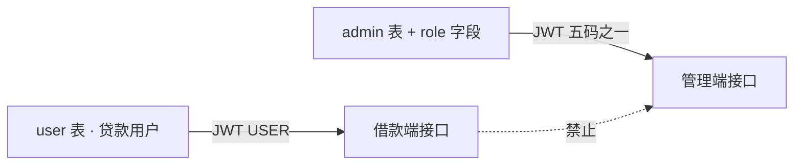

# 综设 III 身份与权限对照（升级规格）

> 本文是身份框架升级的规格，**先定角色码和权限，再改 JWT / `admin` 表 / 网关**。  
> 职责颜色仍以 [综设III角色与功能模块图.md](./综设III角色与功能模块图.md) 为准；需求编号对齐 [综设III需求清单.md](./综设III需求清单.md)（R01–R12）。  
> 文档版本：v1.1｜2026-09-22  
> 角色码 / JWT / 网关路径校验已按本文落地；后续接口继续套同一权限矩阵。

---

## 0. 先看结论

1. **两套身份域互不混用**：贷款用户在 `user` 表，运营人员在 `admin` 表。`user.role` 固定 `USER`，不再写成 `ADMIN`。
2. **运营侧五码写入 JWT**，替代现在一律签发的 `ADMIN` 和写死的 `SUPER_ADMIN`。
3. **系统管理员不是超级风控**：不能审批放款、不能催收结案、不能改/删审计记录。
4. **审计人员全只读**，列表脱敏。
5. **本学期不做动态 RBAC 菜单表**：角色码绑定固定权限集合，Vue 按权限码显示菜单，接口用 `@PreAuthorize`。动态授权表列为提升，不挡升级。

---

## 1. 现状（必须升级的原因）

| 点 | 现状 | 问题 |
|----|------|------|
| 借款人 | `user.role` 默认 `USER`，登录原样写入 JWT | 注释允许 `USER/ADMIN`；若手工改库，借款人 Token 可冒充管理端 |
| 运营人员 | `admin` 表无角色字段；登录一律 `role=ADMIN` | 风控 / 催收 / 客服 / 审计 / 系统无法隔离 |
| 展示角色 | `GET /admin/profile` 写死 `SUPER_ADMIN` | 前端无法按角色裁菜单 |
| 网关 | 非 `ADMIN` 访问 `/api/v1/admin/**` → 403 | 只能挡住借款人；挡不住「催收去审批」 |
| 方法级鉴权 | 几乎只有 `/repayment/statistics`、`/repayment/overdue` 带 `@PreAuthorize("hasRole('ADMIN')")` | 直连服务端口时 USER JWT 可能打到多数 `/admin/**` |
| 客服 / 催收 / 审计 | 需求已写，独立接口未齐 | 现在所有管理员权限相同，无法演示职责分离 |

机器同步 `POST /api/v1/sync/blacklist` 使用独立 API Token（Spring 权威 `ROLE_SYNC`），**不是人员角色**，升级后保持独立。

---

## 2. 身份模型（升级目标）

| 规则 | 说明 |
|------|------|
| 双表 | 借款人只存在 `user`；运营人员只存在 `admin` |
| JWT `role` | 借款人固定 `USER`；运营人员为下表五码之一，**不再签发** `ADMIN` / `SUPER_ADMIN` |
| 登录入口 | 借款端 `POST /api/v1/auth/login`；管理端 `POST /api/v1/admin/login` |
| 主体 | 借款人 Token subject = `user.id`；运营 Token subject = `admin.id` |
| 硬隔离 | `USER` 访问 `/api/v1/admin/**` 必须 403；运营 Token 不得调用「当前用户」借款接口冒充客户 |

### 2.1 角色码（后续代码按此改，不要另起别名）

| 人员 | JWT / DB 码 | 身份域 | 使用端 |
|------|-------------|--------|--------|
| 贷款用户 | `USER` | `user` | Android 借款端 |
| 风控管理人员 | `RISK_MANAGER` | `admin` | Vue 管理端 |
| 贷后催收人员 | `COLLECTOR` | `admin` | Vue 管理端 |
| 审计人员 | `AUDITOR` | `admin` | Vue 管理端 |
| 客服人员 | `CS_AGENT` | `admin` | Vue 管理端 |
| 系统管理员 | `SYS_ADMIN` | `admin` | Vue 管理端 |

`admin.role` 建议 `VARCHAR(32) NOT NULL`，取值仅上表五码。历史管理员行升级时默认 `SYS_ADMIN`（与现「全能 ADMIN」最接近，但升级后立刻收回审批/催收写权限）。

### 2.2 职责分离（SoD）

| 角色 | 能做什么 | 明确不能做什么 |
|------|----------|----------------|
| `USER` | 自己的注册、评估、借款、还款、客服对话 | 任何管理接口、他人数据、全局统计 |
| `RISK_MANAGER` | 规则/模型/审批/反欺诈/贷中预警与调额 | 冻结用户、产品上下架、催收结案、改系统配置、删审计 |
| `COLLECTOR` | 逾期案件、催收登记、结案释额 | 贷前审批、调额、改规则、看完整内部规则明细 |
| `AUDITOR` | 按时间查审批/调额/催收/关单（脱敏只读） | 一切写操作、导出未脱敏原件 |
| `CS_AGENT` | 会话记录、人工工单受理/回复/关闭 | 审批、催收、系统配置；客服摘要仅白名单字段 |
| `SYS_ADMIN` | 账号、配置、产品、渠道、网关安全 | 风控终审、催收结案、删除或改写审计记录 |

同一自然人需要兼岗时，**开两个 `admin` 账号**（或后续提升再做多角色），本学期一个账号只绑一个角色码，便于答辩演示越权 403。

---

## 3. 权限码

给 Vue 菜单和 `@PreAuthorize("hasAuthority('…')")` 共用。本学期权限集合按角色写死，不建 `permission` / `role_menu` 表。

约定：未另标「只读」的码表示该模块读写；只读用同一码在矩阵里标「只读」，代码侧可拆成 `xxx:read` / `xxx:write`，但文档与菜单先用下表短码。

| 权限码 | 中文 | 模块 | 默认语义 |
|--------|------|------|----------|
| `user:profile` | 本人资料与登录会话 | 用户与账号 | 读写本人 |
| `user:assess` | 提交评估 / 查进度结果 / 补材料 | 风险决策 | 读写本人 |
| `user:loan` | 选产品、申请借款、查记录 | 借款 | 读写本人 |
| `user:repay` | 还款计划与还款 | 还款 | 读写本人 |
| `user:cs` | 借款端智能客服 | 智能客服 | 读写本人会话 |
| `risk:rule` | 评分规则列表与启停 | 风控规则管理 | 读写 |
| `risk:model` | 激活模型与版本 | 模型管理 | 只读（本学期不提供一键切主卡） |
| `risk:approve` | 评估/借款人工审批 | 风险决策 | 读写 |
| `risk:fraud` | 反欺诈处置、黑名单观察 | 反欺诈 | 读写 |
| `risk:monitor` | 贷中预警、B 卡观察、建议降额 | 贷中监控 | 读写 |
| `loan:approve` | 额度外借款审批、放款记录 | 借款与还款 | 读写 |
| `credit:adjust` | 额度查询与调额 | 额度 | 读写 |
| `collection:case` | 逾期开案、案件列表 | 贷后催收 | 读写 |
| `collection:action` | 催收登记、提醒、结案释额 | 贷后催收 | 读写 |
| `cs:session` | 管理端会话与模型调用记录 | 智能客服 | 只读 |
| `cs:ticket` | 人工工单受理/回复/关闭 | 智能客服 | 读写 |
| `audit:read` | 统一操作审计 | 审计 | 只读 |
| `sys:user` | 贷款用户列表、冻结 | 用户与账号 | 读写 |
| `sys:admin` | 运营账号 CRUD、指定角色 | 用户与账号 | 读写 |
| `sys:config` | 系统配置、备份占位 | 系统安全 | 读写 |
| `sys:product` | 贷款产品目录 | 产品管理 | 读写 |
| `sys:channel` | 渠道/邀请码与漏斗 | 获客 | 读写 |

### 3.1 角色 × 权限矩阵

图例：**读写** / **只读** / **无**。

| 权限码 | USER | RISK_MANAGER | COLLECTOR | AUDITOR | CS_AGENT | SYS_ADMIN |
|--------|------|--------------|-----------|---------|----------|-----------|
| `user:profile` | 读写 | 无 | 无 | 无 | 无 | 无 |
| `user:assess` | 读写 | 无 | 无 | 无 | 无 | 无 |
| `user:loan` | 读写 | 无 | 无 | 无 | 无 | 无 |
| `user:repay` | 读写 | 无 | 无 | 无 | 无 | 无 |
| `user:cs` | 读写 | 无 | 无 | 无 | 无 | 无 |
| `risk:rule` | 无 | 读写 | 无 | 只读 | 无 | 无 |
| `risk:model` | 无 | 只读 | 无 | 只读 | 无 | 无 |
| `risk:approve` | 无 | 读写 | 无 | 只读 | 无 | 无 |
| `risk:fraud` | 无 | 读写 | 无 | 只读 | 无 | 无 |
| `risk:monitor` | 无 | 读写 | 无 | 只读 | 无 | 无 |
| `loan:approve` | 无 | 读写 | 无 | 只读 | 无 | 无 |
| `credit:adjust` | 无 | 读写 | 无 | 只读 | 无 | 只读 |
| `collection:case` | 无 | 只读 | 读写 | 只读 | 无 | 无 |
| `collection:action` | 无 | 无 | 读写 | 只读 | 无 | 无 |
| `cs:session` | 无 | 无 | 无 | 只读 | 只读 | 无 |
| `cs:ticket` | 无 | 无 | 无 | 只读 | 读写 | 无 |
| `audit:read` | 无 | 无 | 无 | 只读 | 无 | 无 |
| `sys:user` | 无 | 无 | 无 | 只读 | 无 | 读写 |
| `sys:admin` | 无 | 无 | 无 | 只读 | 无 | 读写 |
| `sys:config` | 无 | 无 | 无 | 只读 | 无 | 读写 |
| `sys:product` | 无 | 只读 | 无 | 只读 | 只读 | 读写 |
| `sys:channel` | 无 | 无 | 无 | 只读 | 无 | 读写 |

跨角色只读口径：

- 风控可看逾期案件摘要（`collection:case` 只读），**不能**催收登记或结案。
- 催收**不能**看评分卡内部规则、命中明细、完整征信字段（`risk:rule` / 报告内部段无权限）。
- 客服产品摘要仅白名单（产品名、期限、利率档），不能改产品。
- 审计可看脱敏后的全模块记录，但不能走业务写接口「顺便改一笔」。
- 系统管理员可看额度列表（`credit:adjust` 只读）以便客服/运营核对，**不能**调额、不能点通过/拒绝。

---

## 4. 角色 × 功能 × 接口

外部前缀一律 `/api/v1`。状态：**已有** = 当前 Controller 已存在；**将有** = 需求已列、代码未齐；**应收口** = 接口已有但权限过宽，升级后要按角色收窄。

### 4.1 贷款用户 `USER`

| 功能 | 状态 | 接口 | 权限码 | 需求 |
|------|------|------|--------|------|
| 注册 / 登录 | 已有 | `POST /auth/register`、`POST /auth/login` | `user:profile`（登录后） | R10-1 |
| 提交评估、进度、结果 | 已有 | `POST /risk/assessment/submit`、`GET …/submit-eligibility`、`GET …/status`、`GET …/result` | `user:assess` | R03-1 |
| 补材料 | 已有 | `GET /risk/assessment/supplement/requirements`、`POST …/upload` | `user:assess` | R03-3 |
| 查本人额度 | 已有 | `GET /user/credit-limit` | `user:loan` | R03 / R05 |
| 申请借款、记录 | 已有 | `POST /loan/request`、`GET /loan/user/history`、`GET /loan/user/applications` | `user:loan` | R05-1 |
| 还款计划与还款 | 已有 | `GET /repayment/plans`、`POST /repayment/execute`、`GET /repayment/record/{planId}` | `user:repay` | R05-2 |
| 选产品 | 将有 | 借款端产品列表（待定，如 `GET /products`） | `user:loan` | R04-2 |
| 渠道/邀请码注册 | 将有 | 注册扩展字段 | `user:profile` | R09-1 |
| 智能客服 | 将有 | `POST /cs/chat` 等（`GET /cs/status` 仅为健康检查） | `user:cs` | R08-1 |

硬禁：任何 `/admin/**`；`GET /repayment/statistics`、`GET /repayment/overdue`（现已 `hasRole('ADMIN')`，升级后改为催收/风控权威，仍禁止 `USER`）。

### 4.2 风控管理人员 `RISK_MANAGER`

| 功能 | 状态 | 接口 | 权限码 | 需求 |
|------|------|------|--------|------|
| 待审列表、评分报告、人工通过/拒绝 | 已有 | `GET /admin/risk/list`、`GET /admin/risk/report/{applyId}`、`POST /admin/risk/approve` | `risk:approve` | R03-2 |
| 借款待审与审批 | 已有 | `GET /admin/loan/pending-list`、`POST /admin/loan/approve`、`GET /admin/loan/**`、`POST /admin/loan/batch-approve` | `loan:approve` | R05-3 |
| 额度列表、调额、历史 | 已有 | `GET /admin/credit/**`、`POST /admin/credit/limits/{userId}/adjust`、`POST …/batch-adjust` | `credit:adjust` | R06 / 贷中 |
| 反欺诈列表与处置 | 已有 | `GET /admin/risk/anti-fraud`、`POST /admin/risk/anti-fraud/{id}/handle` 及 overview / credit-scores / multi-loan / credit-reports | `risk:fraud` | R03-4 |
| B 卡监控 / 重算 / 快照 | 已有 | `GET /admin/b-card/monitor`、`POST /admin/b-card/recalculate/{userId}`、snapshot、features | `risk:monitor` | R06 |
| 下载补材料 | 已有 | `GET /admin/supplement/file/{materialId}` | `risk:approve` | R03-3 |
| BI / 看板 | 已有 | `GET /admin/bi/vintage`、`GET /admin/bi/roll-rate`、`GET /admin/dashboard/stats` | `risk:monitor` 只读看板 | — |
| 规则启停 | 将有 | 规则列表/启停（沿用 `scoring_rules`） | `risk:rule` | R01-1、R01-2 |
| 激活模型只读 | 将有 | 模型注册表只读页 | `risk:model` | R02-1 |
| 贷中预警案件与建议降额 | 将有 | 与 B 卡监控衔接的预警处置 | `risk:monitor`、`credit:adjust` | R06-1 |
| 逾期摘要 | 应收口 | 现可打到全部 `/admin/repayment/**` | 升级后仅案件只读，见 §5 | — |

无权限：`sys:user` 冻结、`sys:product` 上下架、`collection:action` 结案、`sys:config`。

### 4.3 贷后催收人员 `COLLECTOR`

| 功能 | 状态 | 接口 | 权限码 | 需求 |
|------|------|------|--------|------|
| 逾期列表、提醒、报表 | 已有（过宽） | `GET /admin/repayment/overdue-stats`、`overdue-records`、`POST /admin/repayment/reminders`、`report`；以及 `GET /repayment/overdue` | `collection:case` / `collection:action` | R07 |
| 还款计划查询 | 已有（过宽） | `GET /admin/repayment/plans` 等 | 催收可查逾期相关计划；非催收全量运营报表应收口 | — |
| 逾期开案 | 将有 | ` /admin/collection/**` 开案 | `collection:case` | R07-1 |
| 催收登记、结案释额 | 将有 | `/admin/collection/**` 动作与关案 | `collection:action` | R07-2 |

无权限：`risk:approve`、`credit:adjust` 写、`risk:rule`。不得调用评分报告内部段。

### 4.4 审计人员 `AUDITOR`

| 功能 | 状态 | 接口 | 权限码 | 需求 |
|------|------|------|--------|------|
| 拼装操作日志 | 已有（应迁移） | `GET /admin/system/operation-logs` | `audit:read` | R11 |
| 统一审计查询 | 将有 | `GET /admin/audit/**`（审批/调额/催收/关单） | `audit:read` | R11-1 |

无权限：一切 POST/PUT/PATCH/DELETE。敏感字段（身份证、手机号）必须脱敏。贷款用户无法访问（R11 验收）。

升级后 `operation-logs` 从「系统配置菜单」挪到审计模块；`SYS_ADMIN` **不再**拥有该查询（避免自己改配置再自查无隔离）。若演示需要系统管理员看登录失败次数，另开 `sys:config` 下的安全事件，不与业务审计混表。

### 4.5 客服人员 `CS_AGENT`

| 功能 | 状态 | 接口 | 权限码 | 需求 |
|------|------|------|--------|------|
| 服务健康 | 已有 | `GET /cs/status`（可不鉴权或仅运维） | — | — |
| 会话与模型记录 | 将有 | `/admin/cs/sessions/**` | `cs:session` | R08 |
| 人工工单 | 将有 | `/admin/cs/tickets/**` | `cs:ticket` | R08-2 |
| 产品只读摘要 | 将有 | 只读产品白名单字段 | `sys:product` 只读 | R08 |

无权限：审批、催收、用户冻结、系统配置。

### 4.6 系统管理员 `SYS_ADMIN`

| 功能 | 状态 | 接口 | 权限码 | 需求 |
|------|------|------|--------|------|
| 管理端登录 / 本人资料 | 已有 | `POST /admin/login`、`GET /admin/profile` | 任意运营角色 | R12 |
| 公开注册管理员 | 已有（必须关） | `POST /admin/register` | 升级后对公网 **403/404**，改由 `sys:admin` 创建 | R10-2 |
| 贷款用户 CRUD / 冻结 / 导出 | 已有 | `/admin/users/**` | `sys:user` | R10-2 |
| 运营账号 CRUD | 已有 | `/admin/system/admins/**` | `sys:admin`（创建时写入 `role`） | R10 / R12 |
| 配置 / 备份占位 | 已有 | `/admin/system/config`、`/admin/system/backups/**` | `sys:config` | R12-2 |
| 额度只读核对 | 已有 | `GET /admin/credit/stats`、`GET /admin/credit/limits`（升级后去掉 POST adjust） | `credit:adjust` 只读 | — |
| 产品目录 | 将有 | `/admin/products/**` | `sys:product` | R04-1 |
| 渠道漏斗 | 将有 | `/admin/channel/**` | `sys:channel` | R09-1 |
| 限流与密钥外置 | 将有 | 网关配置，无业务写审批 | `sys:config` | R12-1 |

无权限：`POST /admin/risk/approve`、`POST /admin/loan/approve`、催收结案、删除审计记录。

---

## 5. 路径前缀 × 允许角色（网关 / SecurityConfig 速查）

升级后 JWT 不再出现 `ADMIN`。网关第一刀：`role == USER` 或无运营角色 → `/api/v1/admin/**` 一律 403。第二刀：按下表前缀匹配；未列出的管理路径默认 **拒绝**。

| 路径前缀 | 允许角色 | 备注 |
|----------|----------|------|
| `POST /api/v1/auth/**` | 匿名 | 借款人注册登录 |
| `/api/v1/risk/assessment/**`、`/api/v1/user/**`、`/api/v1/loan/**`、`/api/v1/repayment/plans`、`/execute`、`/record/**` | `USER` | 仅本人数据 |
| `GET /api/v1/repayment/statistics`、`GET /api/v1/repayment/overdue` | `COLLECTOR`；`RISK_MANAGER` 可只读 overdue | 禁止 `USER` |
| `POST /api/v1/admin/login` | 匿名 | 管理端登录 |
| `POST /api/v1/admin/register` | 关闭 | 仅内网或直接删除；改走 `sys:admin` |
| `GET /api/v1/admin/profile` | 任一运营五码 | 返回真实 `role`，禁止写死 `SUPER_ADMIN` |
| `/api/v1/admin/risk/**`、`/api/v1/admin/b-card/**`、`/api/v1/admin/supplement/**` | `RISK_MANAGER` 读写；`AUDITOR` GET 只读 | `SYS_ADMIN` **不可**审批 |
| `/api/v1/admin/loan/**`、`POST /api/v1/admin/loan/approve`、`GET /api/v1/admin/loan/pending-list` | `RISK_MANAGER` 读写；`AUDITOR` GET 只读 | 额度外审批归风控，不给 `SYS_ADMIN` 写 |
| `/api/v1/admin/bi/**`、`GET /api/v1/admin/dashboard/stats` | `RISK_MANAGER`、`AUDITOR` | 看板只读 |
| `GET /api/v1/admin/credit/**` | `RISK_MANAGER`、`SYS_ADMIN`、`AUDITOR` | 系统管理员只读 |
| `POST /api/v1/admin/credit/**` | `RISK_MANAGER` | 调额 |
| `/api/v1/admin/repayment/**` | `COLLECTOR` 读写；`RISK_MANAGER` 仅 GET 逾期摘要；`AUDITOR` GET | 收口现有过宽权限 |
| `/api/v1/admin/collection/**` | `COLLECTOR` 读写；`RISK_MANAGER` GET 案件摘要；`AUDITOR` GET | 将有 |
| `/api/v1/admin/users/**` | `SYS_ADMIN` 读写；`AUDITOR` GET | 冻结只给系统管理员 |
| `/api/v1/admin/system/admins/**`、`/config`、`/backups/**` | `SYS_ADMIN` | 审计不改配置 |
| `/api/v1/admin/system/operation-logs` | 过渡期 `AUDITOR`；目标迁到 `/admin/audit/**` | `SYS_ADMIN` 不再查询业务审计 |
| `/api/v1/admin/audit/**` | `AUDITOR` | 将有；禁止删除 |
| `/api/v1/admin/cs/**` | `CS_AGENT` 读写工单；`AUDITOR` GET | 将有 |
| `/api/v1/admin/products/**` | `SYS_ADMIN` 读写；`RISK_MANAGER` / `CS_AGENT` / `AUDITOR` GET | 将有 |
| `/api/v1/admin/channel/**` | `SYS_ADMIN` 读写；`AUDITOR` GET | 将有 |
| `POST /api/v1/sync/blacklist` | API Token → `ROLE_SYNC` | 非人员角色 |
| `/internal/**` | 仅服务间 | 禁止经网关对公网暴露 |

`SYS_ADMIN` 不可审批、不可催收写操作，即使能登录管理端。

---

## 6. Vue 菜单建议（同一登录，按权限码显隐）

| 菜单 | 所需权限（任一） | 默认可见角色 |
|------|------------------|--------------|
| 风控规则 / 模型 / 审批 / 反欺诈 / 贷中 | `risk:*` / `loan:approve` | `RISK_MANAGER`；审计只读菜单 |
| 额度 | `credit:adjust` | 风控读写；系统只读 |
| 贷后催收 | `collection:case` | `COLLECTOR`；风控仅案件只读入口 |
| 客服工单 / 会话 | `cs:ticket` / `cs:session` | `CS_AGENT` |
| 审计查询 | `audit:read` | `AUDITOR` |
| 用户 / 管理员 / 配置 | `sys:user` / `sys:admin` / `sys:config` | `SYS_ADMIN` |
| 产品 / 渠道 | `sys:product` / `sys:channel` | `SYS_ADMIN`；风控/客服产品只读 |

借款端无管理菜单。无对应权限的路由前端隐藏，**后端仍必须 403**（不能只靠藏菜单）。

---

## 7. 下一轮代码落地清单（本稿不实施）

按依赖顺序：

1. `admin` 表增加 `role VARCHAR(32) NOT NULL`；存量行填 `SYS_ADMIN`。
2. 种子各角色一个演示账号（密码走现有哈希，文档只写角色名与用户名，不把生产密钥写入 Git）。
3. `AdminAuthServiceImpl.login` 签发真实 `admin.role`；`getProfile` 返回该码，删除 `SUPER_ADMIN`。
4. 注册借款人强制 `user.role = USER`；忽略客户端传入的角色。
5. 网关：`USER` 禁 `/admin/**`；运营路径按 §5 前缀校验五码。
6. 各服务 `SecurityConfig` + `@PreAuthorize` 按权限码（或 `hasAnyRole('RISK_MANAGER', …)`），禁止只靠网关。
7. 关闭公网 `POST /admin/register`。
8. 收口 `/admin/repayment/**`、`/admin/credit` 写接口、`/admin/loan/approve`。
9. 审计查询迁到 `/admin/audit/**`；`operation_audit_log` 持久化（R11-1）。
10. 直连服务端口的越权用例纳入安全抽测：USER 打 admin、催收打审批、系统管理员点通过，均 403。

不在本学期做：动态权限表、一人多角色、按钮级数据权限引擎。

---

## 8. 与旧口径的差异（避免两份文档打架）

| 旧口径（角色模块图曾写） | 本文 |
|--------------------------|------|
| JWT 仅 `USER` / `ADMIN`，管理端用菜单分组演示 | JWT 直接用六类人员对应码（借款人 1 + 运营 5） |
| 来不及五套角色码时共用管理员账号 | **不再作为目标**；共用账号无法验收 R12-1 越权 |
| 系统管理员「全能后台」 | 系统管理员不管审批/催收写 |
| profile `SUPER_ADMIN` | 废除，改为 `SYS_ADMIN` 等真实码 |
| R05-3「系统管理员额度外审批」 | **改归 `RISK_MANAGER`**（`loan:approve`）；系统管理员不写审批。需求清单导入飞书时以本文为准修订角色列 |
