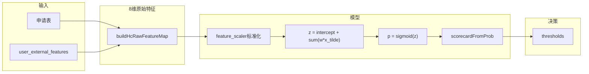

# Home Credit A 卡评分 — 使用说明

本文档说明如何从 `home_credit_train_min.parquet` 完成 **清洗 → 训练 → 入库 → Java 推理** 全链路。特征契约以 [`../csv数据来源和数据库表设计.md`](../csv数据来源和数据库表设计.md) 为准。

---

## 1. 评分卡范围（A 卡）

| 项 | 说明 |
|----|------|
| 类型 | **申请评分卡（A 卡）**：贷前、申请时点预测违约 |
| 模型 | 逻辑回归 + StandardScaler + PDO 评分卡 |
| 入模特征 | **8 维**（3 申请 + 5 第三方） |
| 标签 | `TARGET`（1 = 还款困难） |
| 不做 | B 卡（贷后逐月行为）；宽表 300+ 列竞赛衍生不入模 |

---

## 2. 环境准备

```bash
cd risk-assessment
pip install -r requirements.txt
```

依赖含 `pandas`、`scikit-learn`、`pyarrow`（读 parquet）、`mysql-connector-python`。

配置数据库：复制并编辑 `.env`（`DB_HOST`、`DB_USER`、`DB_PASSWORD`、`DB_NAME=credit_data_db`）。

---

## 3. 数据文件

将 parquet 放在：

```text
risk-assessment/data/raw/home_credit_train_min.parquet
```

快速检查：

```python
import pandas as pd
df = pd.read_parquet("data/raw/home_credit_train_min.parquet")
print(df.shape)
for c in ["TARGET", "DAYS_BIRTH", "EXT_SOURCE_2", "active_loans_count"]:
    print(c, c in df.columns)
print(df["TARGET"].mean())  # 违约率
```

---

## 4. 操作流程

### 4.1 训练评分模型（全量 parquet）

```bash
python train_scoring_model.py
```

- 优先读取 `data/raw/home_credit_train_min.parquet`
- 输出 `output/scoring_rules.json`
- 成功标志：控制台打印 `=== HC 模型权重（含第三方 ext_source_2/3）===`，且 JSON 中 `feature_weights` 含非零 `ext_source_2`

验证：

```bash
python -c "import json; r=json.load(open('output/scoring_rules.json',encoding='utf-8')); print(r.get('model_type')); print(r.get('feature_weights'))"
```

### 4.2 清洗样本并准备入库（演示用 500 条）

```bash
python clean_user_features.py
```

- 从 parquet 去重、随机抽样（每地区 250，共 500）
- 输出 `data/cleaned/cleaned_user_features.csv`
- 含 `sk_id_curr`（真实 `SK_ID_CURR`）及第三方 5 列

### 4.3 写入 MySQL

```bash
python load_to_mysql.py
```

依次：建库建表 → 黑名单 → `user_external_features` → `scoring_rules`（若 JSON 存在）。

### 4.4 启动 Java 后端

使用主项目 Spring Boot 启动后，提交风控评估。外部特征按 **身份证号** 查询（与主库 `user.id_card` 一致）：

```text
resolveExternalFeatures(idCard)
  → 先 UserExternalFeaturesMapper.selectByIdCard(idCard)
  → 若无且 idCard 为纯数字，再 selectBySkIdCurr
```

**联调约定**：注册与申请使用的 `id_card`，必须等于 `cleaned_user_features.csv` 中的 **`id_card` 列**（18 位演示证号）。`sk_id_curr` 仅作 HC 业务 ID 存档。

---

## 5. 特征契约（Python 训练 = Java 推理）

### 5.1 LR 八维

| 键名 | 训练来源列 | Java 推理来源 |
|------|-----------|---------------|
| `days_birth` | `DAYS_BIRTH` | 申请表生日推算 |
| `days_employed` | `DAYS_EMPLOYED` | 申请表（无外部则 0） |
| `amt_income_total` | `AMT_INCOME_TOTAL` | **申请表月收入 × 12**（不用外部收入填 LR） |
| `ext_source_2` | `EXT_SOURCE_2` | `user_external_features` |
| `ext_source_3` | `EXT_SOURCE_3` | 外部表 |
| `amt_req_credit_bureau_mon` | `AMT_REQ_CREDIT_BUREAU_MON` | 外部表 `credit_bureau_mon` |
| `amt_req_credit_bureau_week` | `AMT_REQ_CREDIT_BUREAU_WEEK` | 外部表 `credit_bureau_week` |
| `active_loans_count` | `active_loans_count` | 外部表 |

### 5.2 第三方仅这 5 列进入 LR

不得在未写入 `feature_weights` 的情况下，在 Java 评分逻辑里使用其他外部字段影响通过率。

### 5.3 验真（不进 LR）

| 场景 | 逻辑 |
|------|------|
| 收入验真 | 自填月收入区间 vs 外部 `amt_income_total / 12` |
| 黑名单 | 姓名 + 地域 + 出生年 |
| 历史被拒 | `prev_refused_count` 可做规则拦截（非 LR） |

### 5.4 风控顺序（Java）

1. 身份校验  
2. 黑名单  
3. 数据验真（含收入）  
4. 重复申请检查  
5. LR 评分（`getScoreDetailReport`）

第三方评分已进入 LR 后，**勿在额度层对 `ext_source` 重复惩罚**（策略层仅保留非 LR 规则）。

---

## 6. 评分维度说明

| 维度 | 特征 | 作用 |
|------|------|------|
| 申请人口统计 | 年龄、工龄 | 还款能力 proxy |
| 申请收入 | 年收入 | 偿付能力 |
| 外部权威分 | EXT_SOURCE_2/3 | 强预测力（竞赛脱敏分） |
| 多头 | 征信查询周/月、活跃贷款数 | 借贷冲动与负债 |

决策阈值见 `output/scoring_rules.json` 中 `thresholds.auto_approve`、`thresholds.manual_review`（PDO 分）；逐项解读见 [第 10 章](#10-评分规则解读scoring_rulesjson)。

---

## 7. 故障排查

| 现象 | 处理 |
|------|------|
| `No module named 'pyarrow'` | `pip install pyarrow` |
| 训练显示「合成 HC 特征」 | 确认 parquet 路径正确且含 `DAYS_BIRTH`、`TARGET` |
| 权重没有 `ext_source_2` | 确认 `use_hc=True` 且未走 LC 分支 |
| Java 外部特征全 0 | `id_card` 是否与 `sk_id_curr` 一致；是否执行 `load_to_mysql.py` |
| 仍用 500 行小样本训练 | 删除或移走优先于 parquet 的旧 CSV；以 parquet 为准 |
| AUC 异常高 | 检查是否误用 `final_score` 等泄漏列（当前脚本仅用 8 维） |

---

## 8. 相关脚本

| 脚本 | 作用 |
|------|------|
| `train_scoring_model.py` | HC LR 训练 → `output/scoring_rules.json` |
| `clean_user_features.py` | parquet → 清洗 CSV |
| `load_to_mysql.py` | 入库 |
| `clean_blacklist.py` | 黑名单清洗 |

---

## 9. 与教师评审对齐要点

1. **训练与推理同一数据体系（HC）**，不用 LC 训练、HC 硬套权重。  
2. **第三方列必须出现在 `feature_weights`**（如 `ext_source_2`）。  
3. **申请表与第三方在业务上分视图**，在 LR 中联合、键名一致。  
4. 宽表 318 列中，**默认只用 8+验真列**，其余文档化排除。

---

## 10. 评分规则解读（scoring_rules.json）

本章解释当前训练产物 [`output/scoring_rules.json`](output/scoring_rules.json)（**版本 `v6.0-hc`**）。重新执行 `python train_scoring_model.py` 后，本章数值需与 JSON 同步更新。

### 10.1 模型概览

| 项 | 值 |
|----|-----|
| 版本 | `v6.0-hc` |
| 模型类型 | `hc_lr_standardized` |
| 说明 | Home Credit 全链路：申请表 + 第三方征信，经 `StandardScaler` 标准化后逻辑回归 |
| 训练样本 | 100,000 条（Home Credit） |
| 训练违约率 | 8.72%（`TARGET=1` 为还款困难） |
| 离线 Accuracy | 66.96% |
| 离线 AUC | 0.711 |
| 规则加成 | `application_rule_bonus.enabled = false`（无婚姻/车/年龄额外加分） |



与 Java 实现一致：[`CreditScoreEngineImpl`](../../src/main/java/org/example/risklendpro/service/impl/CreditScoreEngineImpl.java) 中 `buildHcRawFeatureMap` → `buildHcScaledFeatureMap` → `calculateLogisticScorecard` → `scorecardFromProb`。

### 10.2 评分计算公式

#### Step 1 — 特征标准化

对每个入模特征 \(j\)：

\[
\tilde{x}_j = \frac{x_j - \mu_j}{\sigma_j}
\]

\(\mu_j\)、\(\sigma_j\) 取自 JSON 的 `feature_scaler.<特征>.mean` / `scale`。

#### Step 2 — 违约概率（逻辑回归）

\[
z = \beta_0 + \sum_j \beta_j \tilde{x}_j,\quad
p = \frac{1}{1 + e^{-z}}
\]

- \(\beta_0\) = `intercept` = **-0.256917**
- \(\beta_j\) = `feature_weights` 中对应系数
- \(p\) 越大表示违约（还款困难）概率越高

#### Step 3 — PDO 信用分（350–950）

与 `train_scoring_model.calculate_scorecard_score` / Java `scorecardFromProb` 一致：

\[
\text{odds} = \frac{p}{1-p},\quad
\text{factor} = -\frac{\text{pdo}}{\ln 2},\quad
\text{offset} = \text{target\_score} - \text{factor} \cdot \ln(\text{target\_odds})
\]

\[
\text{score} = \mathrm{clip}\big(\mathrm{round}(\text{offset} + \text{factor} \cdot \ln(\text{odds})),\ 350,\ 950\big)
\]

**分数越高，违约概率越低**（与 \(p\) 单调反向）。

当前 `scorecard` 标定参数：

| 参数 | 值 | 含义 |
|------|-----|------|
| `scale` | `odds_pdo` | 使用 PDO + log-odds 映射（非旧版 `inverse_prob_0_100`） |
| `pdo` | 131.399697 | 好坏比翻倍时，信用分约变化 131 分 |
| `target_score` | 650.0 | 锚点分数（量表 350–950 的中点） |
| `target_odds` | 0.7322287923 | 锚点好坏比（校验集 odds 中位数） |
| `min_score` / `max_score` | 350 / 950 | 最终分截断上下限 |
| `_calibration.odds_p05` | 0.23020307 | 校验集 odds 5% 分位（仅文档参考，Java 不读） |
| `_calibration.odds_p50` | 0.73222879 | 校验集 odds 50% 分位 |
| `_calibration.odds_p95` | 3.08502005 | 校验集 odds 95% 分位 |

PDO 由训练脚本根据校验集 odds 分位跨度反推（`span_frac=0.82`），使大部分样本落在 350–950 量表内。

### 10.3 入模特征详解（8 维）

| 特征键 | 业务含义 | Java 推理取值 | 训练集 μ | 训练集 σ | 系数 β | 方向说明（标准化后） |
|--------|----------|---------------|----------|----------|--------|----------------------|
| `days_birth` | 出生天数（负值，年龄越大越负） | 申请表 `birthday` → `-年龄×365` | -14753.8948 | 3669.0480 | +0.0164 | 年龄偏大（更负）→ \(\tilde{x}\) 偏小 → 略降违约概率；权重很小 |
| `days_employed` | 入职天数（负值） | **固定 0**（见下节说明） | -2378.9574 | 2338.0962 | +0.2323 | 训练时工龄信息强；**当前推理未传入**，常使 \(\tilde{x}\) 为正，略抬违约概率 |
| `amt_income_total` | 年总收入 | 申请表月收入档位 × 12（见 `mapIncomeToValue`） | 172528.2903 | 83932.4822 | -0.0707 | 收入越高 → 违约概率越低 |
| `ext_source_2` | 第三方权威评分 A | `user_external_features.ext_source_2` | 0.5155 | 0.1905 | **-0.4872** | **主导因子**：分数越高 → 违约概率越低 |
| `ext_source_3` | 第三方权威评分 B | `user_external_features.ext_source_3` | 0.5002 | 0.1758 | **-0.4695** | 同上，与 ext_source_2 并列 |
| `amt_req_credit_bureau_mon` | 近 1 月征信查询次数 | 外部表 `credit_bureau_mon` | 0.2824 | 0.8885 | -0.0312 | 弱因子；多变量下的统计关联，不宜单独作因果解读 |
| `amt_req_credit_bureau_week` | 近 1 周征信查询次数 | 外部表 `credit_bureau_week` | 0.0334 | 0.1857 | -0.0081 | 影响极弱 |
| `active_loans_count` | 活跃贷款数 | 外部表 `active_loans_count` | 1.7953 | 1.8114 | +0.0048 | 影响极弱 |

**JSON 中的 `feature_derivation` 原文：**

| 特征 | 说明 |
|------|------|
| `days_birth` | 训练/推理：申请表生日 → 负天数（与 HC `DAYS_BIRTH` 一致） |
| `days_employed` | 训练：`DAYS_EMPLOYED`；推理设计为外部表，但 Java LR 侧当前写死 0 |
| `amt_income_total` | 年总收入；推理用申请表月收入 × 12 |
| `ext_source_2` / `ext_source_3` | 仅第三方征信 |
| `amt_req_credit_bureau_*` | 第三方征信查询次数 |
| `active_loans_count` | 第三方活跃贷款数 |

#### 第三方 5 列（必入库）

与 `training_data.third_party_features` 一致：

`ext_source_2`、`ext_source_3`、`amt_req_credit_bureau_mon`、`amt_req_credit_bureau_week`、`active_loans_count`

- 无 `user_external_features` 记录时，Java 抛出 `THIRD_PARTY_MISSING`，**不会**用全 0 静默通过。
- 申请侧 3 列与 [第 5 章](#5-特征契约python-训练--java-推理) 一致；运维步骤不在此重复。

#### `days_employed` 训练 vs 推理差异（重要）

| 阶段 | 行为 |
|------|------|
| 训练 | 使用 HC 列 `DAYS_EMPLOYED`（负值，均值约 -2379 天），系数 **β=+0.232** 为八维中最大 |
| Java LR 推理 | `buildHcRawFeatureMap` 将 `days_employed` **固定为 0**；外部表 `days_employed` 仅用于收入验真等规则，**不进 LR** |
| 影响 | 推理时 \(\tilde{x} = (0-\mu)/\sigma \approx +1.02\)，恒贡献约 **+0.24** 到 \(z\)，略抬高违约概率；解读分数时需知此系统偏差 |

### 10.4 决策阈值

阈值为 **PDO 信用分**（非违约概率 \(p\)），取自 `thresholds`：

| 分数区间 | 业务决策 | JSON 键 |
|----------|----------|---------|
| ≥ **776** | 自动通过 | `auto_approve` |
| **642 – 775** | 人工审核 | `manual_review` ≤ score < `auto_approve` |
| < **642** | 自动拒绝 | 低于 `manual_review` |

阈值由 `train_scoring_model.py` 在**校验集 PDO 分**上取分位数生成（约 82% / 48% 分位）。旧版 LC 文档中的 720 / 580 **不适用**，以本 JSON 为准。

LR 评分在 [`RiskAssessmentServiceImpl`](../../src/main/java/org/example/risklendpro/service/impl/RiskAssessmentServiceImpl.java) 中位于：身份校验 → 黑名单 → 数据验真 → 重复申请 **之后**。

### 10.5 算分示例：赵六（高分通过）

数据来自 [`sql/测试用例.md`](../sql/测试用例.md) 第三节（`id_card=110112199604210012`）及 `cleaned_user_features.csv` 对应行。

**申请与第三方原始值（推理侧）：**

| 特征 | 原始值 \(x_j\) | 来源 |
|------|----------------|------|
| `days_birth` | -10950 | 生日 1996-04-21，按当前年算年龄 30 → \(-30×365\) |
| `days_employed` | 0 | Java 固定（CSV 中实为 -2565，不进 LR） |
| `amt_income_total` | 240000 | 月收入档位「15000以上」→ 20000×12 |
| `ext_source_2` | 0.7662 | 第三方 |
| `ext_source_3` | 0.761 | 第三方 |
| `amt_req_credit_bureau_mon` | 0 | 第三方 `credit_bureau_mon` |
| `amt_req_credit_bureau_week` | 0 | 第三方 `credit_bureau_week` |
| `active_loans_count` | 1 | 第三方 |

**标准化与线性贡献（约数，可用 `train_scoring_model.py` 复算）：**

| 特征 | \(\tilde{x}_j\) | \(\beta_j \tilde{x}_j\) |
|------|-----------------|-------------------------|
| intercept | — | -0.257 |
| `days_birth` | +1.04 | +0.02 |
| `days_employed` | +1.02 | +0.24 |
| `amt_income_total` | +0.80 | -0.06 |
| `ext_source_2` | +1.32 | **-0.64** |
| `ext_source_3` | +1.48 | **-0.70** |
| `amt_req_credit_bureau_mon` | -0.32 | +0.01 |
| `amt_req_credit_bureau_week` | -0.18 | +0.00 |
| `active_loans_count` | -0.44 | -0.00 |
| **合计** | | **\(z \approx -1.39\)** |

- 违约概率：\(p = \mathrm{sigmoid}(z) \approx 0.20\)
- PDO 分：\(\ln(\text{odds})\) 映射后约 **950**（触顶 `max_score`）
- 决策：950 ≥ 776 → **自动通过**（与用例预期 `FINAL_PASS` 一致）

权威分 `ext_source_2/3` 高于训练均值，负系数 \(\beta\) 使 \(z\) 显著为负，是拉高信用分的主因。

### 10.6 与旧版 LC 评分卡的区别

| 对比项 | 旧版 LC | 当前 HC（v6.0-hc） |
|--------|---------|-------------------|
| 特征形式 | 分箱 one-hot（`feature_scores`） | 8 维连续 + `feature_scaler` |
| 模型标识 | 非 `hc_*` | `hc_lr_standardized` |
| 决策阈值 | 常见 720 / 580 | **776 / 642** |
| Java 分支 | `buildLegacyLcFeatureMap` | `buildHcRawFeatureMap` + 标准化 |
| 第三方 | 部分字段分箱 | 5 列直接进入 LR |

当 `model_type` 不以 `hc_` 开头时，Java 仍可走 LC 旧逻辑；当前部署应保证库表/JSON 为 `hc_lr_standardized`。

### 10.7 维护与同步

1. 修改训练数据或特征后执行：`python train_scoring_model.py`
2. 检查 `output/scoring_rules.json` 中 `version`、`feature_weights.ext_source_2` 非零
3. 入库：`python load_to_mysql.py`（写入 `scoring_rules` 表）
4. 重启 Java 后端，使 `ScoringRulesMapper.selectActiveRule()` 加载新规则
5. 同步更新本章表格数值，或注明「以 JSON 文件修改时间为准」

相关文件：

- 规则 JSON：[`risk-assessment/output/scoring_rules.json`](output/scoring_rules.json)
- 训练脚本：[`train_scoring_model.py`](train_scoring_model.py)
- 数据字典与表结构：[`../csv数据来源和数据库表设计.md`](../csv数据来源和数据库表设计.md) 第五节
