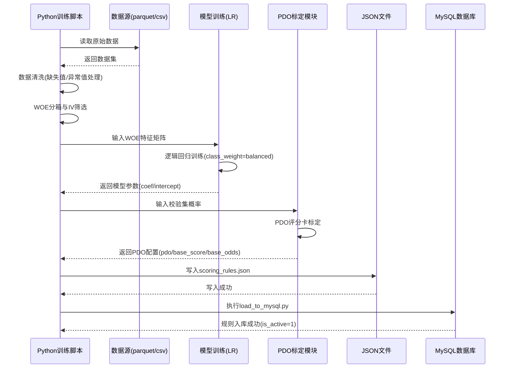
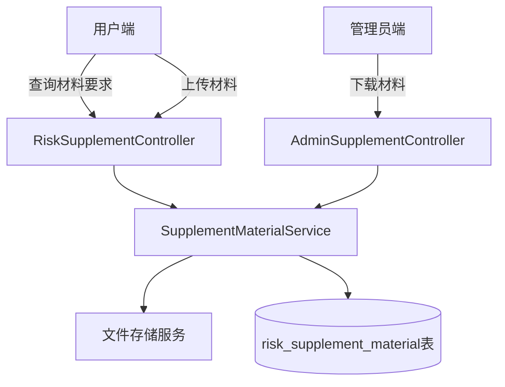
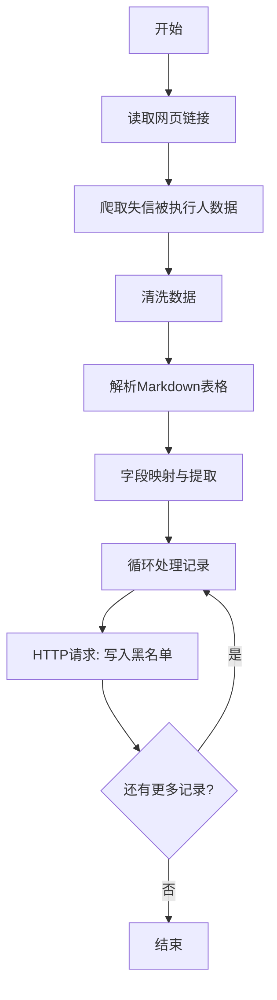
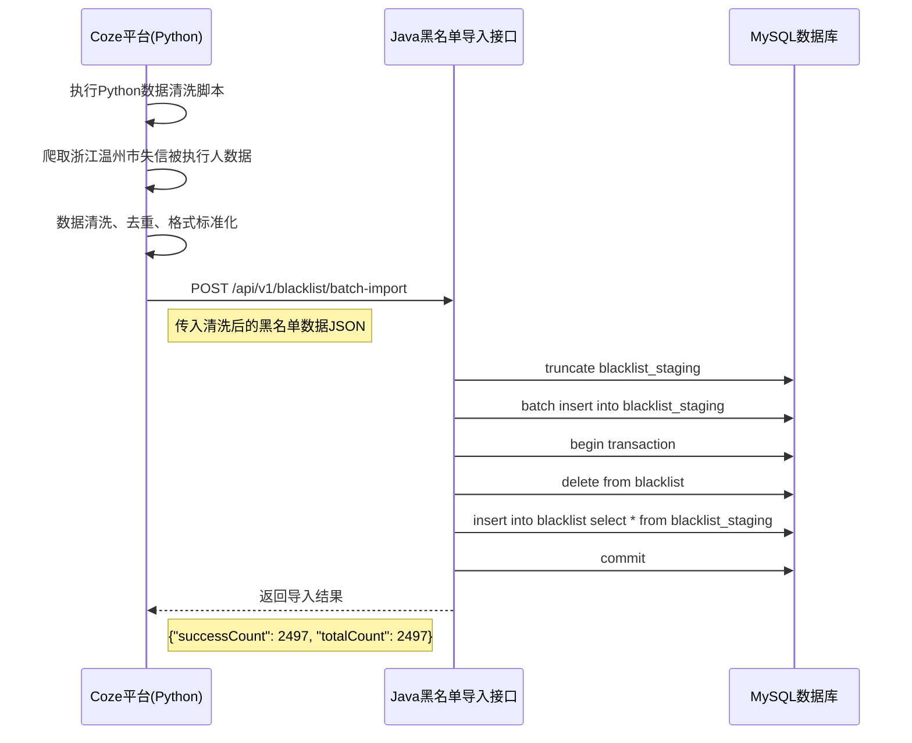
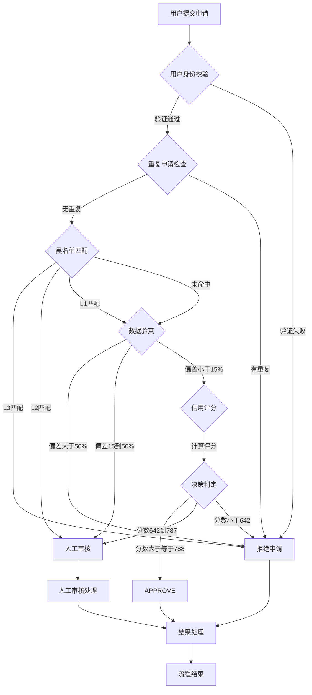
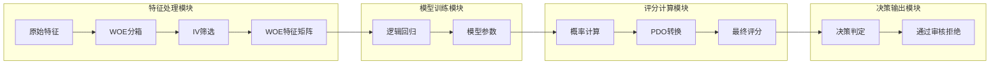
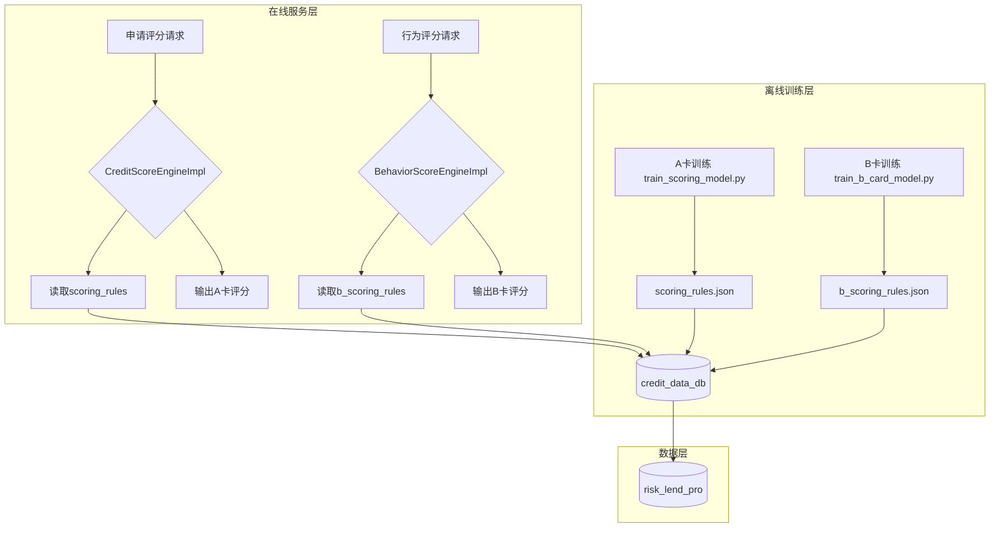

## 1.3 针对复杂工程问题的方案实现

### 1.3.1 开发环境与工具链配置

#### 环境组件配置表

| 组件     | 版本     | 用途           | 配置说明                                      |
| ------ | ------ | ------------ | ----------------------------------------- |
| JDK    | 21     | Java 后端服务运行时 | Spring Boot 3.x 最低要求                      |
| Maven  | 3.9+   | Java 项目构建工具  | 管理依赖与打包                                   |
| Python | 3.9    | 离线模型训练       | 数据处理与评分卡训练                                |
| MySQL  | 8.0+   | 双数据库存储       | 主库 `risk_lend_pro` + 信用库 `credit_data_db` |
| Redis  | 7.0+   | 缓存与会话管理      | 风控报告缓存（TTL 1天）                            |
| IDEA   | 2024.x | 开发 IDE       | Java/Python 混合开发                          |

#### Python 与 Java 联调方式

本项目采用 **双数据库架构**，Python 离线训练与 Java 在线服务共用 `credit_data_db`：

```python
# Python 端数据库配置 (load_to_mysql.py)
DB_CONFIG = {
    "host": "localhost",
    "port": 3306,
    "user": "admin",
    "password": "admin",
    "database": "credit_data_db"  # Python/Java 共用
}
```

Java 端通过数据源配置访问同一数据库，实现训练规则与在线评分的数据共享。

---

### 1.3.2 核心模块A：Python 离线训练与规则生成

#### 1.3.2.1 模块职责与接口定义

**A卡/B卡对比表**：

| 项目   | A卡（贷前申请评分）                               | B卡（贷后行为评分）                                         |
| ---- | ---------------------------------------- | -------------------------------------------------- |
| 训练脚本 | `train_scoring_model.py`                 | `train_b_card_model.py`                            |
| 数据来源 | `home_credit_train_min.parquet`（申请特征）    | `home_credit_train_min.parquet`（行为 `inst_*/pos_*`） |
| 入模特征 | 8维（`ext_source_2/3`、`days_birth` 等）      | 7维（`inst_dpd_max`、`pos_dpd_mean` 等）                |
| 输出规则 | `output/scoring_rules.json`（v7.0-hc-woe） | `output/b_scoring_rules.json`（v1.0-b-woe）          |
| 阈值配置 | 788（通过）/642（人工复核）                        | 684.6（观察）/547.4（降额）                                |
| 评分范围 | 350–950 分                                | 350–950 分                                          |
| 离线指标 | AUC≈0.714, accuracy≈0.661                | AUC≈0.571, accuracy≈0.610                          |

**Python 模块 I/O 表**：

| 输入文件                            | 输出文件/表                                                                    | Java 消费方                                       |
| ------------------------------- | ------------------------------------------------------------------------- | ---------------------------------------------- |
| `home_credit_train_min.parquet` | `output/scoring_rules.json` → `scoring_rules` 表                           | `CreditScoreEngineImpl`                        |
| `home_credit_train_min.parquet` | `output/b_scoring_rules.json` → `behavior_scoring_rules` 表                | `BehaviorScoreEngineImpl`                      |
| `data/raw/blacklist.csv`        | `data/cleaned/cleaned_blacklist.csv` → `blacklist` 表                      | `BlacklistServiceImpl`、`CreditScoreEngineImpl` |
| `home_credit_train_min.parquet` | `data/cleaned/cleaned_user_features.csv` → `user_external_features` 表     | `CreditScoreEngineImpl`、数据核验                   |
| `home_credit_train_min.parquet` | `data/cleaned/cleaned_behavior_features.csv` → `user_behavior_features` 表 | `BehaviorScoreEngineImpl`                      |

#### 1.3.2.2 关键代码与算法逻辑

**模型 I/O 规范**：

| 类型   | 内容                                                        |
| ---- | --------------------------------------------------------- |
| 输入 X | 8维特征 + 样本 TARGET                                          |
| 输出   | coef、scaler mean/scale、intercept、thresholds、scorecard pdo |
| KPI  | AUC、准确率                                                   |

**核心算法链**：数据清洗 → WOE分箱与IV筛选 → 逻辑回归训练 → 模型评估 → PDO分数转换 → JSON规则导出 → 数据库入库

**Python 离线训练流程时序图**：



**PDO 评分卡标定算法**：该函数根据校验集的违约概率分布，计算评分卡的 PDO（Points to Double the Odds）参数，将概率映射到 350-950 分的评分量表。流程：输入概率 → 计算 odds → 取 5%/95% 分位 → 计算 PDO 和基准参数 → 返回评分卡配置。

```python
def calibrate_odds_pdo_scorecard(probs, min_s=350, max_s=950, span_frac=0.82):
    """用校验集违约概率标定 PDO：约 5%–95% 分位的 ln(odds) 跨度映射到量表跨度"""
    eps = 1e-9
    p = np.clip(np.asarray(probs, dtype=np.float64), eps, 1.0 - eps)
    odds = p / (1.0 - p)
    o5 = float(np.quantile(odds, 0.05))
    o95 = float(np.quantile(odds, 0.95))
    o50 = float(np.quantile(odds, 0.50))
    log_den = np.log(o95 + eps) - np.log(o5 + eps)
    span = float(max_s - min_s)
    factor = -(span * float(span_frac)) / log_den
    pdo = float(-factor * np.log(2.0))
    return {
        "scale": "odds_pdo",
        "min_score": min_s,
        "max_score": max_s,
        "pdo": round(pdo, 6),
        "target_score": (min_s + max_s) / 2.0,
        "target_odds": max(o50, eps),
    }
```

**WOE 特征筛选与训练**：

```python
def train_hc_woe_scoring_model(df):
    # IV 筛选特征
    selected, iv_report = select_features(train_df, candidates, y_train, max_features=12)
    
    # 拟合 WOE 分箱
    feature_defs = {}
    for key in selected:
        feature_defs[key] = fit_feature_woe(train_df[key], y_train, key)
    
    # WOE 转换 + LR 训练
    X_train = transform_frame_woe(train_df, feature_defs)
    model = LogisticRegression(class_weight="balanced", random_state=42, max_iter=500)
    model.fit(X_train, y_train)
    
    # PDO 标定
    scorecard_cfg = calibrate_odds_pdo_scorecard(y_pred_proba, min_s=350, max_s=950)
    
    return rules
```

**规则入库流程**：

```python
def load_scoring_rules_to_mysql():
    with open("output/scoring_rules.json", "r", encoding="utf-8") as f:
        rules = json.load(f)
    
    sql = """INSERT INTO scoring_rules (
        version, rule_content, feature_weights, scorecard,
        application_rule_bonus, feature_scores, feature_derivation,
        intercept, threshold_auto_approve, threshold_manual_review, is_active
    ) VALUES (%s, %s, %s, %s, %s, %s, %s, %s, %s, %s, %s)"""
    
    cursor.execute(sql, (
        rules.get("version"),
        json.dumps(rules),
        json.dumps(rules.get("feature_weights", {})),
        json.dumps(rules.get("scorecard", {})),
        json.dumps(rules.get("application_rule_bonus")),
        json.dumps(rules.get("feature_scores")),
        json.dumps(rules.get("feature_derivation")),
        rules.get("intercept", 0),
        rules.get("thresholds", {}).get("auto_approve", 720),
        rules.get("thresholds", {}).get("manual_review", 580),
        1  # is_active
    ))
```

#### 1.3.2.3 评分卡结构详解与使用说明

##### A卡（贷前申请评分卡）详细说明

**当前训练版本**：v7.0-hc-woe

**评分卡整体结构**：

| 顶级字段                 | 类型     | 说明                                        |
| -------------------- | ------ | ----------------------------------------- |
| `version`            | string | 规则版本号，用于版本管理和追溯                           |
| `model_type`         | string | 模型类型，`hc_woe_lr` 表示 Home Credit WOE+LR 模型 |
| `description`        | string | 模型描述                                      |
| `feature_derivation` | object | 特征来源说明                                    |
| `features`           | object | 特征分箱定义（WOE配置）                             |
| `coefficients`       | object | LR 系数                                     |
| `intercept`          | number | LR 截距项                                    |
| `thresholds`         | object | 决策阈值                                      |
| `scorecard`          | object | PDO 评分卡配置                                 |
| `model_metrics`      | object | 模型评估指标                                    |

**入模特征清单（7维）**：

| 特征名                  | 来源    | IV值    | 重要性 | 含义              |
| -------------------- | ----- | ------ | --- | --------------- |
| `ext_source_3`       | 第三方征信 | 0.3456 | 高   | 第三方权威评分B        |
| `ext_source_2`       | 第三方征信 | 0.3011 | 高   | 第三方权威评分A        |
| `edu_mid`            | 申请表   | 0.0642 | 中   | 是否本科学历（1=是，0=否） |
| `phone_change_days`  | 第三方征信 | 0.0522 | 中   | 手机换号天数          |
| `age_years`          | 申请表   | 0.0509 | 中   | 年龄（周岁）          |
| `prev_refused_count` | 第三方征信 | 0.0439 | 中   | 历史被拒次数          |
| `gender_male`        | 申请表   | 0.0341 | 低   | 性别（1=男，0=女）     |

**特征 WOE 分箱示例（以 `ext_source_2` 为例）**：

```json
{
  "ext_source_2": {
    "source": "external",
    "type": "numeric",
    "cuts": [0.344, 0.515, 0.609, 0.682, 0.855],
    "woe": [-0.7606, -0.1057, 0.1811, 0.4648, 0.8340],
    "missing_bin": {"woe": -0.1578, "label": "缺失"}
  }
}
```

**WOE 值解读**：

- WOE（Weight of Evidence）表示特征分箱对违约概率的影响
- **WOE > 0**：该分箱样本违约率高于总体平均违约率（风险更高）
- **WOE < 0**：该分箱样本违约率低于总体平均违约率（风险更低）
- **WOE 绝对值越大**：该分箱对违约预测的区分能力越强

**LR 系数解读**：

| 特征                   | 系数      | 影响方向 | 解读                       |
| -------------------- | ------- | ---- | ------------------------ |
| `ext_source_3`       | -0.8752 | 负向   | ext_source_3 越高，违约概率越低 |
| `ext_source_2`       | -0.8253 | 负向   | ext_source_2 越高，违约概率越低 |
| `edu_mid`            | -0.8747 | 负向   | 本科学历降低违约概率               |
| `phone_change_days`  | -0.4202 | 负向   | 手机使用越稳定，违约概率越低           |
| `age_years`          | -0.4876 | 负向   | 年龄越大，违约概率越低              |
| `prev_refused_count` | -0.6621 | 负向   | 历史被拒次数越少，违约概率越低          |
| `gender_male`        | -0.9071 | 负向   | 男性违约概率略高于女性              |

**PDO 评分卡配置**：

```json
{
  "scale": "odds_pdo",
  "min_score": 350,
  "max_score": 950,
  "pdo": 125.0812,
  "target_score": 650.0,
  "target_odds": 0.7456
}
```

**PDO 参数说明**：

- **PDO（Points to Double the Odds）**：125.08，即评分每增加 125 分，违约几率翻倍
- **target_score**：650，基准评分点
- **target_odds**：0.7456，基准评分点对应的违约几率（约 42.7% 违约概率）
- **评分范围**：350-950 分

**评分计算公式**：

```
odds = p / (1 - p)  （p = 违约概率）
factor = -PDO / ln(2)
offset = target_score - factor * ln(target_odds)
score = offset + factor * ln(odds)
score = clamp(score, min_score, max_score)
```

**决策阈值**：

| 阈值类型            | 值   | 决策结果 |
| --------------- | --- | ---- |
| `auto_approve`  | 788 | 自动通过 |
| `manual_review` | 642 | 人工复核 |

**评分决策逻辑**：

- **score >= 788** → APPROVE（自动通过）
- **642 <= score < 788** → MANUAL_REVIEW（人工复核）
- **score < 642** → REJECT（自动拒绝）

**模型评估指标**：

| 指标       | 值       | 说明               |
| -------- | ------- | ---------------- |
| AUC      | 0.7138  | 模型区分能力（0.7+ 为良好） |
| Accuracy | 0.6610  | 预测准确率            |
| 训练样本数    | 100,000 | 训练数据集大小          |
| 违约率      | 8.72%   | 训练集违约样本比例        |

##### B卡（贷后行为评分卡）详细说明

**当前训练版本**：v1.0-b-woe

**入模特征清单（7维）**：

| 特征名                          | 来源     | IV值    | 含义             |
| ---------------------------- | ------ | ------ | -------------- |
| `inst_amt_paid_1y`           | HC行为数据 | 0.0006 | 近1年分期付款支付金额    |
| `inst_dbd_mean_total`        | HC行为数据 | 0.0080 | 分期付款逾期天数均值（全部） |
| `inst_dbd_mean_1y`           | HC行为数据 | 0.0119 | 近1年分期付款逾期天数均值  |
| `pos_dpd_mean`               | HC行为数据 | 极小     | POS消费逾期天数均值    |
| `inst_late_ratio_total`      | HC行为数据 | 0.0487 | 分期付款逾期比例       |
| `inst_partial_payment_ratio` | HC行为数据 | 0.0394 | 分期付款部分还款比例     |
| `pos_dpd_def_mean`           | HC行为数据 | 极小     | POS消费违约逾期均值    |

**决策阈值**：

| 阈值类型           | 值     | 说明     |
| -------------- | ----- | ------ |
| `watch`        | 684.6 | 观察名单阈值 |
| `reduce_limit` | 547.4 | 降额阈值   |

**贷后评分应用逻辑**：

- **score >= 684.6** → 正常授信
- **547.4 <= score < 684.6** → 进入观察名单，密切关注
- **score < 547.4** → 大幅降额或冻结授信

**评分卡使用流程**：

```
1. 获取特征值
   ├─ 申请表特征（姓名、年龄、学历、性别等）
   └─ 第三方征信特征（ext_source_2/3、手机换号天数等）

2. WOE 转换
   ├─ 根据特征类型查找对应分箱
   └─ 获取该分箱的 WOE 值

3. LR 线性计算
   └─ z = intercept + Σ(coefficient[i] * woe[i])

4. 概率计算
   └─ p = 1 / (1 + exp(-z))

5. PDO 评分映射
   └─ score = offset + factor * ln(p / (1-p))

6. 决策判定
   ├─ score >= auto_approve → APPROVE
   ├─ score >= manual_review → MANUAL_REVIEW
   └─ 否则 → REJECT
```

**Java 端使用示例**：该代码展示了在线评分的完整流程。流程：加载评分规则 → 构建特征映射 → WOE 转换 + LR 线性计算 → 概率计算 → PDO 评分映射 → 决策判定。

```java
// 1. 加载评分规则
ScoringRules rules = scoringRulesMapper.selectActiveRule();

// 2. 构建特征映射
Map<String, Double> features = buildHcWoeRawFeatureMap(request, externalFeatures);

// 3. WOE 转换 + LR 计算
double linear = rules.getIntercept();
for (String feature : features.keySet()) {
    double woe = woeLookup(features.get(feature), rules.getFeatures().get(feature));
    linear += rules.getCoefficients().get(feature) * woe;
}

// 4. 概率计算
double prob = 1.0 / (1.0 + Math.exp(-linear));

// 5. PDO 评分映射
double score = scorecardFromProb(prob, rules.getScorecard());

// 6. 决策判定
String decision = getDecision(score);
```

---

### 1.3.3 核心模块B：Java 在线评分引擎与评估服务

#### 1.3.3.1 模块职责与交互关系

**服务调用链（时序说明）**：

```
Controller → Service → Engine → Mapper/Redis
    ↓           ↓          ↓           ↓
 submit()  execute()  calculateScore()  selectActiveRule()
    ↓           ↓          ↓           ↓
参数校验   黑名单检查   WOE/LR计算     Redis缓存报告
    ↓           ↓          ↓
 数据验真   收入偏差检测   PDO评分映射
    ↓
决策判定(APPROVE/REVIEW/REJECT)
```

**核心调用链代码**：

```java
@Override
@Transactional
public RiskAssessmentResponse submit(Long userId, RiskAssessmentRequest request) {
    // 1. 用户校验
    User user = userMapper.selectById(userId);
    
    // 2. 黑名单检查
    CreditScoreEngine.BlacklistMatchResult blacklistResult = 
        creditScoreEngine.checkBlacklist(request.getName(), request.getIdCard());
    if (blacklistResult.isReject()) {
        riskAssessment.setStatus(StatusEnum.SYSTEM_REJECT.getValue());
        return response;
    }
    
    // 3. 数据验真
    DataVerificationResult verificationResult = verifyUserData(request, externalFeatures);
    if (verificationResult.isReject()) {
        riskAssessment.setStatus(StatusEnum.SYSTEM_REJECT.getValue());
        return response;
    }
    
    // 4. 执行风控评估
    executeRiskAssessment(riskAssessment, request, forceManualReviewByRule, riskTags);
    return response;
}
```

#### 1.3.3.2 关键代码与数据结构

**黑名单三级匹配逻辑**：该代码实现三级黑名单匹配。流程：解析身份证提取地域编码和出生年份 → 遍历黑名单记录 → 依次匹配姓名+地域+出生年（L3）、姓名+地域（L2）、仅姓名（L1）→ 返回最高匹配级别。

```java
@Override
public BlacklistMatchResult checkBlacklist(String name, String idCard) {
    String areaCode = extractAreaCodeFromIdCard(idCard);  // 身份证前6位
    Integer birthYear = extractBirthYearFromIdCard(idCard); // 出生年份
    
    for (Blacklist record : blacklistMapper.selectAll()) {
        if (!matchWildcardName(name, record.getName())) continue;
        
        boolean areaMatch = areaCode.equals(record.getAreaCode());
        boolean birthYearMatch = birthYear.equals(record.getBirthYear());
        
        if (areaMatch && birthYearMatch) 
            return new BlacklistMatchResult(MatchLevel.FULL, record);   // L3: 姓名+地域+出生年
        if (areaMatch) bestNameArea = record;                           // L2: 姓名+地域
        if (bestNameOnly == null) bestNameOnly = record;               // L1: 仅姓名
    }
    // ...
}
```

**PDO 评分计算**：该代码将违约概率转换为评分。流程：读取 PDO 参数 → 计算 odds → 计算 factor 和 offset → 应用公式得到评分 → 截断到 350-950 范围。

```java
private double scorecardFromProb(double probDefault, JsonNode scorecardNode) {
    double pdo = scorecardNode.has("pdo") ? scorecardNode.get("pdo").asDouble() : 80;
    double targetScore = scorecardNode.has("target_score") ? 
        scorecardNode.get("target_score").asDouble() : 650;
    double targetOdds = scorecardNode.has("target_odds") ? 
        scorecardNode.get("target_odds").asDouble() : 1;
    
    double odds = probDefault / (1.0 - probDefault);
    double factor = -pdo / Math.log(2);
    double offset = targetScore - factor * Math.log(targetOdds);
    double score = offset + factor * Math.log(odds);
    
    return Math.max(minS, Math.min(maxS, score));  // clamp to [350, 950]
}
```

**决策函数**：该代码根据评分返回最终决策。流程：加载规则配置 → 根据阈值判断评分区间 → 返回对应决策。

```java
@Override
public String getDecision(double score) {
    FullRuleConfig cfg = loadFullRuleConfig();
    if (score >= cfg.autoApproveThreshold) return "APPROVE";      // >= 788
    if (score >= cfg.manualReviewThreshold) return "MANUAL_REVIEW"; // 642-787
    return "REJECT";                                              // < 642
}
```

**收入偏差检测**：该代码校验用户自填收入与后台数据的一致性。流程：计算后台月收入 → 获取自填收入范围 → 判断偏差比例 → 根据偏差程度返回不同结果。

```java
private DataVerificationResult verifyUserData(RiskAssessmentRequest request, 
        UserExternalFeatures externalFeatures) {
    double backendIncome = externalFeatures.getAmtIncomeTotal().doubleValue() / 12;
    double[] range = getIncomeRange(request.getMonthlyIncome());
    
    if (backendIncome < range[0]) {
        double ratio = (range[0] - backendIncome) / backendIncome;
        if (ratio > 0.5)  // 偏差 > 50% → 自动拒绝
            return new DataVerificationResult(true, false, "收入虚报超过50%");
        else if (ratio > 0.15)  // 偏差 15%-50% → 人工审核
            return new DataVerificationResult(false, true, "收入偏差15%-50%");
    }
    return new DataVerificationResult(false, false, "收入验证通过");
}
```

**WOE 特征查找**：该代码根据原始特征值查找对应的 WOE 值。流程：检查空值 → 获取分箱切割点 → 遍历查找所属分箱 → 返回对应 WOE 值。

```java
private double woeLookup(Double raw, JsonNode featDef) {
    if (raw == null || raw.isNaN()) {
        return featDef.path("missing_bin").path("woe").asDouble(0.0);
    }
    // 数值型特征按分箱查找 WOE
    JsonNode cuts = featDef.get("cuts");
    JsonNode woeArr = featDef.get("woe");
    double x = raw;
    for (int i = 0; i < cuts.size(); i++) {
        if (x <= cuts.get(i).asDouble()) {
            return woeArr.get(Math.min(i, woeArr.size() - 1)).asDouble();
        }
    }
    return woeArr.get(woeArr.size() - 1).asDouble();
}
```

#### 1.3.3.3 补充材料上传模块

**功能概述**：当用户申请被判定为人工审核（REVIEW）时，可通过补充材料模块上传收入证明、银行流水等证明文件，供审核员进行人工复核。

**模块架构**：



**用户端控制器（RiskSupplementController）**：

```java
@RestController
@RequestMapping("/risk/assessment/supplement")
public class RiskSupplementController {
    
    @Autowired
    private SupplementMaterialService supplementMaterialService;
    
    @GetMapping("/requirements")
    public CommonResponse<Map<String, Object>> requirements(HttpServletRequest httpRequest) {
        Long userId = SecurityUtils.getUserIdFromRequest(httpRequest);
        return CommonResponse.success("查询成功", 
            supplementMaterialService.getRequirementsForUser(userId));
    }
    
    @PostMapping("/upload")
    public CommonResponse<Map<String, Object>> upload(
            @RequestParam String materialType,
            @RequestParam MultipartFile file,
            @RequestParam(required = false) String remark,
            HttpServletRequest httpRequest) {
        Long userId = SecurityUtils.getUserIdFromRequest(httpRequest);
        Map<String, Object> result = supplementMaterialService.upload(userId, materialType, file, remark);
        return CommonResponse.success("上传成功", result);
    }
}
```

**管理员端控制器（AdminSupplementController）**：

```java
@RestController
@RequestMapping("/admin/supplement")
public class AdminSupplementController {
    
    @Autowired
    private SupplementMaterialService supplementMaterialService;
    
    @Autowired
    private FileStorageService fileStorageService;
    
    @GetMapping("/file/{materialId}")
    public ResponseEntity<Resource> download(
            @PathVariable Long materialId,
            @RequestParam(required = false, defaultValue = "false") boolean inline) throws Exception {
        RiskSupplementMaterial material = supplementMaterialService.getById(materialId);
        if (material == null) return ResponseEntity.notFound().build();
        
        Path path = fileStorageService.resolvePath(material.getStoredPath());
        if (!Files.exists(path)) return ResponseEntity.notFound().build();
        
        Resource resource = new FileSystemResource(path);
        String contentType = material.getMimeType();
        if (contentType == null || contentType.isBlank()) {
            contentType = MediaType.APPLICATION_OCTET_STREAM_VALUE;
        }
        
        String disposition = inline ? "inline" : "attachment";
        return ResponseEntity.ok()
                .header(HttpHeaders.CONTENT_DISPOSITION,
                        disposition + "; filename=\"" + material.getOriginalName() + "\"")
                .contentType(MediaType.parseMediaType(contentType))
                .body(resource);
    }
}
```

**补充材料流程说明**：

| 步骤 | 说明 | 涉及组件 |
| --- | --- | --- |
| 1 | 用户查询需补充材料清单 | RiskSupplementController.getRequirements() |
| 2 | 用户上传补充材料 | RiskSupplementController.upload() |
| 3 | 保存文件到存储服务 | FileStorageService |
| 4 | 记录材料信息到数据库 | risk_supplement_material 表 |
| 5 | 管理员下载材料审核 | AdminSupplementController.download() |

#### 1.3.3.4 Coze 平台黑名单同步功能

**功能概述**：Coze 平台定期爬取外部黑名单数据源（如浙江温州市失信被执行人公开数据），通过 Python 代码完成数据清洗，然后调用 Java 端提供的批量导入接口将清洗后的数据写入数据库，实现黑名单的自动更新。

**数据来源**：浙江温州市失信被执行人公开数据（约 2497 条），由 Coze 平台爬取并清洗。

**Coze 平台数据清洗 Python 代码**：

```python
import re 
import json 

async def main(args: Args) -> Output: 
    params = args.params 
    # 获取输入 
    input_str = params.get('input', '') 
    
    # 处理转义字符 
    if isinstance(input_str, str): 
        input_str = input_str.replace('\\n', '\n').replace('\\"', '"') 
    else: 
        input_str = str(input_str) 
    
    # 获取表格行 
    lines = input_str.split('\n') 
    table_rows = [] 
    
    for line in lines: 
        line = line.strip() 
        # 排除 Markdown 分隔行 (如 |---|---|) 
        if line.startswith('|') and '|' in line and '---' not in line: 
            line = line.replace('\\\\*', '*').replace('\\*', '*') 
            table_rows.append(line) 
    
    if len(table_rows) < 2: 
        return {"total": 0, "data": []} 
    
    # 解析表头 
    header_line = table_rows[0] 
    headers = [h.strip() for h in header_line.strip('|').split('|')] 
    
    # 精准匹配，匹配到了就不再被后面的列覆盖 
    field_mapping = {} 
    for idx, h in enumerate(headers): 
        h_clean = h.strip() 
        
        if '法院代码' in h_clean and 'court_code' not in field_mapping: 
            field_mapping['court_code'] = idx 
        elif ('姓名' in h_clean or '名称' in h_clean) and '代表人' not in h_clean and 'name' not in field_mapping: 
            field_mapping['name'] = idx 
        elif '执行法院' in h_clean and 'court_name' not in field_mapping: 
            field_mapping['court_name'] = idx 
        elif '案号' == h_clean and 'case_no' not in field_mapping:  
            field_mapping['case_no'] = idx 
        elif '履行情况' in h_clean and 'duty_status' not in field_mapping: 
            field_mapping['duty_status'] = idx 
        elif '行为情况' in h_clean and 'behavior_details' not in field_mapping: 
            field_mapping['behavior_details'] = idx 
        elif '出生日期' in h_clean and 'birth_date' not in field_mapping: 
            field_mapping['birth_date'] = idx 
    
    # 解析数据行 
    results = [] 
    for line in table_rows[1:]: 
        cells = [c.strip() for c in line.strip('|').split('|')] 
        if len(cells) < 15: 
            continue 
        
        # 提取姓名 
        name_idx = field_mapping.get('name', 1) 
        name = cells[name_idx] if name_idx < len(cells) else '' 
        if not name or name == '被执行人姓名/名称' or name == '姓名': 
            continue 
        
        # 提取各个字段 
        case_idx = field_mapping.get('case_no', 7) 
        case_no = cells[case_idx] if case_idx < len(cells) else '' 
        
        court_idx = field_mapping.get('court_name', 4) 
        court_name = cells[court_idx] if court_idx < len(cells) else '' 
        
        duty_idx = field_mapping.get('duty_status', 10) 
        duty_status = cells[duty_idx] if duty_idx < len(cells) else '' 
        
        behavior_idx = field_mapping.get('behavior_details', 15) 
        behavior_details = cells[behavior_idx] if behavior_idx < len(cells) else '' 
        
        birth_idx = field_mapping.get('birth_date', 21) 
        birth_date = cells[birth_idx] if birth_idx < len(cells) else '' 
        birth_year = '' 
        if birth_date: 
            match = re.search(r'(\d{4})', birth_date) 
            if match: 
                birth_year = int(match.group(1)) 
        
        # 行政区划代码 
        area_code = '' 
        code_idx = field_mapping.get('court_code', 0) 
        court_code = cells[code_idx] if code_idx < len(cells) else '' 
        if court_code and len(str(court_code)) >= 6: 
            area_code = str(court_code)[:6] 
        else: 
            if '北京' in court_name: area_code = '110000' 
            elif '天津' in court_name: area_code = '120000' 
            else: area_code = '000000' 
        
        # 判断风险等级 
        risk_level = 'MEDIUM' 
        if '有履行能力' in behavior_details or '规避执行' in behavior_details: 
            risk_level = 'HIGH' 
        elif '全部未履行' in duty_status: 
            risk_level = 'MEDIUM' 
        elif '部分未履行' in duty_status: 
            risk_level = 'LOW' 
        
        results.append({ 
            "name": name, 
            "areaCode": area_code, 
            "birthYear": birth_year, 
            "caseNo": case_no, 
            "courtName": court_name, 
            "dutyStatus": duty_status, 
            "behaviorDetails": behavior_details, 
            "riskLevel": risk_level 
        }) 
    
    # 去重 
    seen = set() 
    unique_results = [] 
    for item in results: 
        key = f"{item['name']}_{item['caseNo']}" 
        if key not in seen: 
            seen.add(key) 
            unique_results.append(item) 
    
    return { 
        "total": len(unique_results), 
        "data": unique_results 
    }
```

**数据清洗流程说明**：

| 步骤 | 说明 |
| --- | --- |
| 1 | 解析 Markdown 表格格式的输入数据 |
| 2 | 自动识别表头字段（姓名、案号、执行法院等） |
| 3 | 提取并校验关键信息（姓名、出生年份、地域编码） |
| 4 | 根据法院名称或代码推导行政区划代码 |
| 5 | 根据履行情况和行为详情判断风险等级 |
| 6 | 基于姓名+案号进行数据去重 |
| 7 | 输出清洗后的结构化数据供后续入库 |

**同步流程**：



**Coze 平台节点流程图**：

| 节点 | 功能 | 输入 | 输出 |
| --- | --- | --- | --- |
| 开始 | 触发定时任务 | 无 | 启动信号 |
| 读取网页链接 | 爬取浙江温州市失信被执行人公开数据 | 网页URL | 原始HTML/表格数据 |
| 清洗数据 | 解析Markdown表格、字段映射、数据提取 | 原始表格数据 | 清洗后的结构化数据 |
| 循环 | 遍历每条记录 | 数据列表 | 逐条处理 |
| HTTP请求 | 调用Java接口写入数据库 | 单条黑名单记录 | 入库结果 |
| 结束 | 完成同步 | 无 | 同步结果 |

**HTTP 请求配置**：

```
POST http://192.168.218.xxx:8080/api/v1/blacklist/batch-import
Headers: Content-Type: application/json
Body: {"name": "xxx", "areaCode": "xxx", "birthYear": xxx, ...}
```

**Java 端黑名单批量导入接口**：

```java
@RestController
@RequestMapping("/api/v1/blacklist")
public class BlacklistController {
    
    @Autowired
    private BlacklistService blacklistService;
    
    @PostMapping("/batch-import")
    public ResponseEntity<BlacklistImportResponse> batchImport(
            @RequestBody List<BlacklistImportRequest> requests) {
        
        int successCount = blacklistService.batchImport(requests);
        
        return ResponseEntity.ok(BlacklistImportResponse.builder()
            .successCount(successCount)
            .totalCount(requests.size())
            .message("黑名单批量导入成功")
            .build());
    }
}
```

**服务层实现**：

```java
@Service
public class BlacklistServiceImpl implements BlacklistService {
    
    @Autowired
    private BlacklistMapper blacklistMapper;
    
    @Override
    @Transactional
    public int batchImport(List<BlacklistImportRequest> requests) {
        // 1. 转换为实体对象
        List<Blacklist> blacklistList = requests.stream()
            .map(this::convertToEntity)
            .collect(Collectors.toList());
        
        // 2. 写入临时表
        blacklistMapper.truncateStagingTable();
        blacklistMapper.batchInsertStaging(blacklistList);
        
        // 3. 原子替换正式表
        blacklistMapper.replaceBlacklistFromStaging();
        
        return blacklistList.size();
    }
    
    private Blacklist convertToEntity(BlacklistImportRequest request) {
        Blacklist blacklist = new Blacklist();
        blacklist.setName(request.getName());
        blacklist.setIdCard(request.getIdCard());
        blacklist.setAreaCode(request.getAreaCode());
        blacklist.setBirthYear(request.getBirthYear());
        blacklist.setSource("COZE_WENZHOU");
        blacklist.setSyncTime(new Date());
        return blacklist;
    }
}
```

**Coze 平台调用流程**：



**同步策略说明**：

| 策略项  | 说明                      |
| ---- | ----------------------- |
| 触发方式 | Coze 平台定时触发后调用 Java 接口    |
| 数据来源 | Coze 平台爬取的浙江温州市失信被执行人数据（约 2497 条） |
| 数据清洗 | 在 Coze 平台的 Python 代码中完成    |
| 更新方式 | 全量替换（先写临时表，再原子替换正式表）    |
| 接口地址 | POST /api/v1/blacklist/batch-import |

---

### 1.3.4 系统集成与部署

#### 1.3.4.1 联调顺序

系统部署与联调须严格遵循以下顺序，确保在线服务启动前规则库已就绪：

（1）Python 数据清洗

- 执行 `clean_blacklist.py`：读取原始黑名单数据，完成去重与标准化，生成清洗后的 `cleaned_blacklist.csv`。
- 执行 `clean_user_features.py`：从 `home_credit_train_min.parquet` 中提取用户外部特征，生成 `user_external_features.csv`。

（2）Python 规则训练

- 执行 `train_scoring_model.py`：训练 A 卡模型，输出 `scoring_rules.json`。
- 执行 `train_b_card_model.py`：训练 B 卡模型，输出 `b_scoring_rules.json`。

（3）规则入库

执行 `load_to_mysql.py`：将 `scoring_rules.json` 写入 `credit_data_db` 库的 `scoring_rules` 表，将 `b_scoring_rules.json` 写入 `behavior_scoring_rules` 表，并将 `is_active` 字段设为 1。

（4）Java 服务启动

执行 `mvn spring-boot:run` 启动 Spring Boot 应用：

- 服务启动时，`FullRuleConfig` 通过 `@PostConstruct` 从数据库读取 `is_active=1` 的规则，解析后缓存至内存 Map。
- 上下文路径配置为 `/api/v1`。

（5）功能验证

使用 Postman 调用 `POST /api/v1/risk/assessment/submit` 接口，传入测试用户数据（包含姓名、身份证、月收入等），检查响应中的 `totalScore`（应在 350–950 区间）和 `systemDecision`（`APPROVE`/`REVIEW`/`REJECT`）。

#### 1.3.4.2 联调顺序的重要性

必须先有激活的规则库，再启动 Java 服务并测试在线评分。若跳过第三步（规则入库）直接启动 Java 服务，`FullRuleConfig` 将读取不到 `is_active=1` 的有效规则。此时系统不会报错退出，而是自动降级启用默认阈值兜底逻辑（APPROVE 线 720 分，REVIEW 线 580 分），该阈值严于正常规则（788/642），可能导致大量正常申请被误拒。因此，严格按照上述顺序部署是保证系统按预期运行的前提。

#### 1.3.4.3 验证检查清单

| 检查项     | 验证方式                                                              | 预期结果           |
| ------- | ----------------------------------------------------------------- | -------------- |
| 规则表有数据  | `SELECT COUNT(*) FROM scoring_rules WHERE is_active = 1`          | > 0            |
| 特征表有数据  | `SELECT COUNT(*) FROM user_external_features`                     | > 0            |
| 黑名单表有数据 | `SELECT COUNT(*) FROM blacklist`                                  | >= 0           |
| B卡规则就绪  | `SELECT COUNT(*) FROM behavior_scoring_rules WHERE is_active = 1` | > 0            |
| 服务端口监听  | `netstat -ano \| findstr 8080`                                   | LISTENING      |

#### 1.3.4.4 API 联调测试示例

```bash
# 使用 curl 或 Postman 测试 submit 接口
curl -X POST http://localhost:8080/api/v1/risk-assessment/submit \
  -H "Content-Type: application/json" \
  -d '{
    "userId": 1,
    "idCard": "110101198503151001",
    "name": "张三",
    "phone": "13800138000",
    "email": "test@example.com",
    "gender": 1,
    "birthday": "1985-03-15",
    "education": "本科",
    "marriage": "已婚",
    "jobType": "公务员",
    "monthlyIncome": "8000-15000",
    "hasHouse": true,
    "hasCar": true,
    "contactPhone": "13900139000"
  }'
```

#### 1.3.4.5 关键配置说明

**数据源配置（application.yml）**：

```yaml
spring:
  datasource:
    master:
      url: jdbc:mysql://localhost:3306/risk_lend_pro
      username: admin
      password: admin
    credit:
      url: jdbc:mysql://localhost:3306/credit_data_db
      username: admin
      password: admin
```

**Redis 缓存配置**：

```java
// 风控报告缓存（TTL 1天）
redisCacheUtil.set(RedisCacheUtil.getRiskReportKey(applyId), report);
```

---

### 1.3.5 完整风控流程图



**评分卡算法模块关系图**：



**双评分卡架构示意图**：



---

### 1.3.6 核心技术要点总结

本系统在复杂工程问题的解决上，实现了以下关键技术突破：

#### （1）双评分卡架构设计

系统采用 A卡（贷前申请评分）与 B卡（贷后行为评分）的双评分卡架构，两套规则物理分离存储于不同数据表，支持独立训练与部署。A卡基于申请特征评估初始授信风险，B卡基于贷后行为数据监控信用变化，形成完整的全生命周期风控体系。

#### （2）WOE+LR+PDO 算法链路

- **WOE 分箱**：采用有监督分箱方法将连续特征离散化，通过信息价值（IV）筛选具有预测能力的特征，增强模型可解释性
- **LR 训练**：使用标准化逻辑回归，通过 class_weight 参数处理信贷数据固有的样本不平衡问题
- **PDO 标定**：将模型输出的违约概率映射到 350-950 评分量表，便于业务人员理解和使用

#### （3）三级黑名单匹配机制

实现基于姓名、地域编码、出生年份的递进式匹配策略，分为 L3（精确匹配）、L2（姓名+地域匹配）、L1（仅姓名匹配）三个等级，有效降低重名误杀率，提升系统灵活性。

#### （4）收入偏差检测模型

建立收入真实性核验机制，根据自填收入与后台征信数据的偏差程度进行分级处理：偏差≤15%自动通过，15%-50%进入人工审核，>50%自动拒绝，形成完整的数据验真闭环。

#### （5）双数据库架构

采用 `risk_lend_pro`（业务库）与 `credit_data_db`（征信库）的双数据库架构：业务库存储用户信息、风控申请记录、审批结果等业务数据；征信库存储评分规则、用户外部特征、黑名单等征信数据，支持 Python 训练模块与 Java 在线服务的数据共享。

#### （6）无状态评分引擎设计

评分引擎采用无状态设计，规则配置通过单例 Bean 注入，用户特征数据由调用方传入，每次评分计算均为纯函数式调用。该设计支持水平扩展，便于部署多副本，且天然适配 Redis 缓存策略。

#### （7）Python Conda 环境配置

Python 离线训练模块运行于 Conda 环境（Python 3.9），通过 Conda 管理数据处理与机器学习依赖。训练流程为：数据清洗 → WOE 分箱与 IV 筛选 → 逻辑回归训练 → 模型评估 → PDO 分数转换 → JSON 规则导出 → 数据库入库。

#### （8）规则库优先的联调策略

系统部署与联调须严格遵循"先有规则库，后有在线服务"的原则：Python 脚本先将训练好的规则写入数据库并设置 is_active=1，Java 服务启动时读取有效规则并缓存至内存，确保在线评分使用最新规则。

#### （9）补充材料上传功能

实现人工审核阶段的补充材料上传功能，支持用户上传收入证明、银行流水等证明文件，管理员可下载审核，完善人工复核流程。

#### （10）Coze 平台黑名单同步

通过 Coze 平台定期爬取外部黑名单数据源（如浙江温州市失信被执行人公开数据），完成数据清洗后调用 Java 接口批量入库，实现黑名单的自动更新。