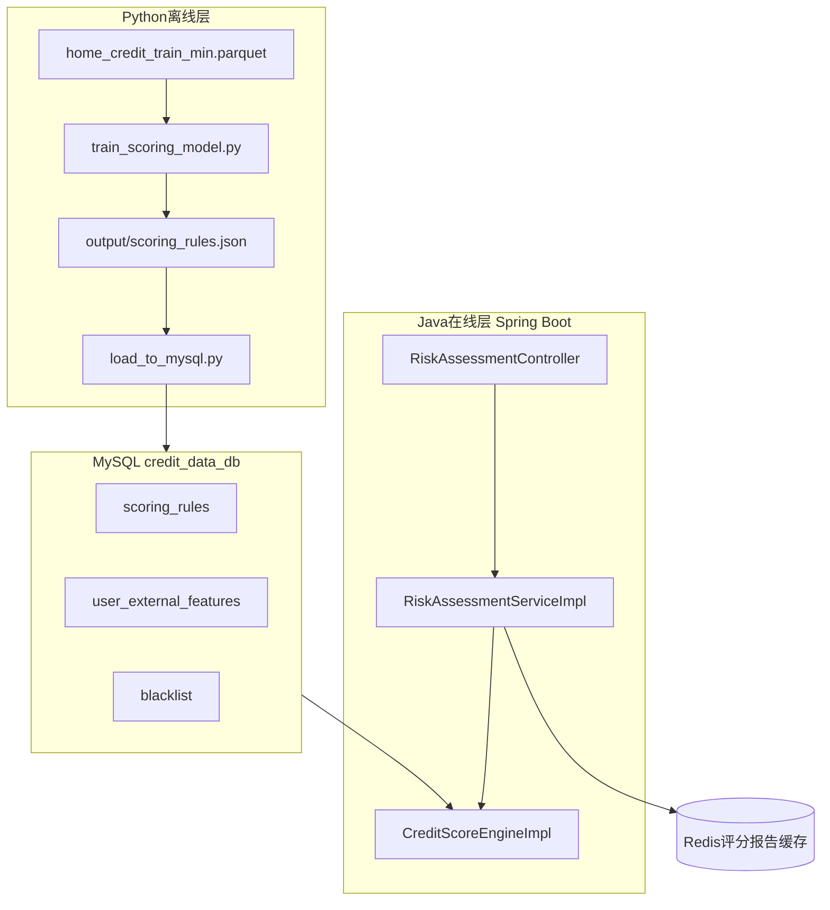

# RiskLendPro 智能信贷风控评分系统 — 中期进展报告（写作提纲 v1.2）

> **文档用途**：供协作者将提纲扩写为正式 Word 中期报告。  
> **终期报告**：请先完成本文，再按 [终期报告结构和说明.md](./终期报告结构和说明.md)（v1.0）撰写总结报告；终期第二章测试整章暂缓，见该文档说明。

---

## 协作者须知（必读）

### 你可以使用的资料（可整段粘贴给 AI）

- 本文件 + [终期报告结构和说明.md](./终期报告结构和说明.md)
- `参考文件/` 目录下全部 `.md`（项目总览、详细风控流程、HomeCredit 使用说明、接口文档等）
- 课程**集群**说明、本组 **Git 提交记录**（自行截图，勿向负责人索要）

### 禁止事项

1. **禁止**克隆/修改/运行 `src/` 源码与连接项目数据库。
2. **禁止**在报告中写真实密码、JWT 密钥、邮箱授权码、服务器 IP（用 `*`** 或「部署环境」）。
3. 参考文献须 GB/T 7714、知网可查；禁止虚构文献、禁止百度百科作正式文献。
4. 标题层级：第 1 章 → 1.1 → 1.1.1，**禁止跳级**。

### 分工：谁提供什么


| 材料类型                       | 负责人          | 协作者                      |
| -------------------------- | ------------ | ------------------------ |
| 业务/风控提纲、附录摘录               | 已写在本文        | 扩写为 Word 正文              |
| **测试截图与测试结论**（3.1.4、终期第二章） | **测试后提供**    | **【暂缓撰写】** 收到图后再写        |
| **分工表、甘特图、Git/集群截图**       | 不提供          | **自行**查集群 + `git log` 截图 |
| **代码/架构图**                 | 不提供          | 用参考文件问 AI 或自绘流程图         |
| 训练 AUC 等模型指标               | 可选提供 1 张训练日志 | 或 `[待填]` 后补              |


### 每节扩写三步（第一章必做）

1. 按「关键词」「中心内容」写正文。
2. 按「**风控侧重**」突出信贷风控论证（本项目核心）。
3. 打开「深入参考资料」对应 md，复制「建议向 AI 提问」问 AI 扩写；**勿编造**参考文件中没有的技术事实。

### 报告元信息


| 项             | 内容                                                                    |
| ------------- | --------------------------------------------------------------------- |
| 项目名称          | RiskLendPro 智能信贷风控评分系统                                                |
| 报告类型          | 工程类中期进展报告                                                             |
| 全文核心关键词（摘要必现） | 离线训练在线推理、逻辑回归、PDO 评分卡、A 卡、黑名单分级匹配、Spring Boot、双数据源 MySQL、JWT、Redis 缓存 |
| 摘要三段式建议       | 背景痛点 → 离线训练+在线决策方法 → 量化结果（模型 KPI 可写；**接口测试数据等负责人测试截图后再填**）            |


---

## 目录

**第一章 综合项目进展情况** 1  
1.1 针对工程问题的方案设计 1  
1.1.1 技术背景与需求分析 1  
1.1.2 总体架构设计 2  
1.1.3 详细设计方案 3  
1.1.3.1 业务流程与处理逻辑 3  
1.1.3.2 模块划分与接口定义 4  
1.1.3.3 数据模型与存储设计 5  
1.2 针对工程问题的推理分析 6  
1.2.1 复杂工程问题的识别与分解 6  
1.2.2 关键技术选型与方案对比 7  
1.2.3 潜在风险分析与缓解策略 8  
1.3 针对工程问题的具体实现 9  
1.3.1 核心模块A：Python 离线训练与规则生成 9  
1.3.1.1 模块职责与功能边界 9  
1.3.1.2 核心算法与逻辑阐述 10  
1.3.2 核心模块B：Java 在线评分引擎与评估服务 11  
1.3.2.1 模块职责与交互关系 11  
1.3.2.2 关键代码与设计模式 12  
1.4 知识技能学习情况 13  
1.4.1 相关技术栈原理与应用 13  
1.4.2 编程语言高级特性实践 13  
1.4.3 系统设计与架构思维培养 14  
1.4.4 项目管理与协作工具使用 14  

**第二章 存在问题与解决方案** 15  
2.1 存在的主要工程问题 15  
2.2 针对性解决方案 16  

**第三章 前期完成度与后续实施计划** 17  
3.1 前期任务完成度评估 17  
3.1.1 需求分析与文档交付 17  
3.1.2 系统设计与原型验证 18  
3.1.3 核心功能开发进度 19  
3.1.4 单元测试与集成情况 20  
3.2 团队协作与个人分工 21  
3.3 后期实施计划 23  
3.3.1 剩余功能开发时间表 23  
3.3.2 最终交付成果预期 24  

**参考文献** 25  

**附录** 代码截图清单与资料摘录  

---

# 第一章 综合项目进展情况

## 1.1 针对工程问题的方案设计

### 1.1.1 技术背景与需求分析

**关键词**：普惠金融、贷前风控、自动化审批、可解释评分、数据不平衡、外部征信模拟

**中心内容（扩写论点）**：

- **行业痛点**：传统人工审贷效率低、标准不一致；贷前需在短时间内综合「申请表信息 + 第三方征信」判断违约概率。
- **工程问题定义**：构建一套 **离线迭代模型/规则、在线实时决策** 的风控系统，输出 `APPROVE` / `REVIEW` / `REJECT` 及授信额度。
- **数据基础**：Home Credit 压缩训练集 `home_credit_train_min.parquet`；违约标签 `TARGET`（1=还款困难）；样本不平衡需在训练章节说明（`class_weight='balanced'`）。
- **非功能需求**：规则可热更新（写入 MySQL 后 Java 读取，无需改代码重启）；评分明细可解释；黑名单采用分级匹配降低误杀。

**建议图表**：无代码图；可配「传统审贷 vs 自动化风控」对比示意图（手绘即可）。

**风控侧重（必写）**：

- 明确本项目是 **贷前 A 卡** 场景：在放款前预测违约，而非贷后催收。
- 强调 **可解释性**：监管与业务需要说明「因何拒贷/降额」。
- 点出 **样本不平衡** 是风控建模的工程难点之一。

**深入参考资料（粘贴给 AI）**：`参考文件/项目总览.md`（§一 项目概述）、`参考文件/HomeCredit评分卡使用说明.md`（§1 评分卡范围）

**建议向 AI 提问**：

> 根据《项目总览.md》和《HomeCredit评分卡使用说明.md》，写 1.1.1 节约 1000 字：普惠金融背景下贷前风控的需求、TARGET 标签含义、以及本系统 APPROVE/REVIEW/REJECT 三种决策的业务含义。

---

### 1.1.2 总体架构设计

**关键词**：离线在线分离、Python 训练层、Java 服务层、MySQL 规则库、Redis、REST API

**中心内容**：

- 系统采用 **Python 离线训练 + Java 在线推理** 两层架构；Python 产出 `scoring_rules.json` 并入库；Java 读征信库算分、写业务库。
- 对外暴露 REST API，统一前缀 `/api/v1`，JWT 认证（注册/登录接口除外）。
- 评估结果可缓存至 Redis，客户端轮询 `status` 直至 `isFinal=true`。

**建议图表**：将下列结构重绘为 Word/Visio「总体架构图」（图注在图下方）。




**可选插图**：自绘「图 1-1 系统总体架构」（用上文 mermaid）；或用 AI 根据 `项目总览.md` §1.3 生成架构说明文字，**无需**负责人提供代码截图。

**风控侧重（必写）**：

- **征信库与业务库分离**：`credit_data_db` 存规则/黑名单/外部特征，降低业务库泄露征信宽表的风险。
- **离线训练不阻塞在线**：模型迭代与线上服务解耦，符合银行常见批训日更/周更节奏。

**深入参考资料（粘贴给 AI）**：`参考文件/项目总览.md`（§1.3 技术架构）、`参考文件/运行说明.md`（环境与启动）

**建议向 AI 提问**：

> 根据《项目总览.md》架构说明和本文 mermaid 图，写 1.1.2 节 800 字，说明 Python 离线层与 Java 在线层如何通过 MySQL、Redis 协作完成风控决策。

**配置摘录（可写入正文，已脱敏）**：

```yaml
spring:
  datasource:
    primary:    # 主库 RiskLendPro：user、risk_assessment、loan 等
      jdbc-url: jdbc:mysql://***/RiskLendPro?...
    credit:     # 征信库 credit_data_db：scoring_rules、blacklist 等
      jdbc-url: jdbc:mysql://***/credit_data_db?...
server:
  port: 8080
  servlet:
    context-path: /api/v1
```

---

### 1.1.3 详细设计方案

#### 1.1.3.1 业务流程与处理逻辑

**关键词**：申请提交、黑名单三级匹配、评分计算、人工复核、额度生成、状态轮询

**中心内容（建议配「图 1-2 风控评估业务流程图」）**：

1. 用户 JWT 登录后调用 `POST /risk/assessment/submit` 提交申请。
2. **准入校验**：用户存在、身份证与注册信息一致、年龄≥18、无其他 `WAITING` 申请。
3. **黑名单核验**：姓名通配匹配 → 身份证地域码 → 出生年份；三级直接拒绝、二级转人工、一级忽略（见附录「黑名单判定矩阵」）。
4. **评分**：从 `user_external_features` 取第三方特征，从 `scoring_rules` 取激活规则 JSON → 逻辑回归概率 → PDO 评分卡分数 → 阈值决策。
5. **持久化**：更新 `risk_assessment` 状态；若 `APPROVE` 则写入 `user_credit_limit`；明细缓存 Redis。
6. 客户端轮询 `GET /risk/assessment/status?applyId=`，`isFinal=true` 后调用 `GET /risk/assessment/result?applyId=` 获取额度。

**业务状态码（写入 1.1.3.2 或本节）**：


| 状态            | 说明    |
| ------------- | ----- |
| WAITING       | 待处理   |
| SYSTEM_REJECT | 系统拒绝  |
| MANUAL_REVIEW | 人工复核中 |
| FINAL_PASS    | 已通过   |
| FINAL_REJECT  | 已拒绝   |


**协作者需补充对比表**（表注在表上方）：「单因子身份证黑名单」vs「姓名+地域+出生年分级匹配」。


| 方案      | 优点       | 缺点             |
| ------- | -------- | -------------- |
| 仅身份证命中  | 实现简单     | 黑名单源常无身份证，无法使用 |
| 本系统分级匹配 | 降低误杀、可解释 | 实现与运维复杂度更高     |


**风控侧重（必写）** — **本章重点**：

- 流程必须写清：**先黑名单、后评分、再决策**，避免「只讲分数不讲拒贷入口」。
- 三级黑名单对应 **误杀率与欺诈漏放** 的权衡；二级 REVIEW 是银行业常见的「软拒绝」。
- PDO 分数 → 776/642 阈值 → 额度生成，形成完整 **贷前闭环**。

**深入参考资料（粘贴给 AI）**：`参考文件/详细风控流程.md`（判定矩阵、收入偏差）、`参考文件/接口文档.md`（风控接口与状态码）、`参考文件/项目总览.md`（§四 核心流程）

**建议向 AI 提问**：

> 根据《详细风控流程.md》黑名单矩阵和本文附录 A.5，写 1.1.3.1 节：用分步骤文字描述风控评估从 submit 到 result 的全流程，并解释为何「姓名+地域+出生年」优于仅身份证匹配。

**可选插图**：自绘流程图或请 AI 输出 PlantUML/文字流程图；勿虚构接口返回字段。

---

#### 1.1.3.2 模块划分与接口定义

**关键词**：Controller-Service-Mapper、模块化、Swagger、统一响应 CommonResponse

**中心内容**：


| 模块        | 职责            | 关键类/文件（负责人校对用，正文写中文职责即可）                                                          |
| --------- | ------------- | --------------------------------------------------------------------------------- |
| 认证        | 注册、登录、JWT     | AuthController、JwtFilter、SecurityConfig                                           |
| 风控评估      | 提交申请、查状态、取结果  | RiskAssessmentController、RiskAssessmentServiceImpl                                |
| 评分引擎      | 算分、决策、额度、评分明细 | CreditScoreEngine、CreditScoreEngineImpl                                           |
| 信贷业务      | 借款、还款、逾期调额    | LoanController、RepaymentController、定时任务类                                          |
| 管理端       | 人工审批、额度调整     | AdminController                                                                   |
| Python 离线 | 清洗、训练、入库      | clean_blacklist.py、clean_user_features.py、train_scoring_model.py、load_to_mysql.py |


**接口定义（可直接抄写进报告）**：

- **基础路径**：`http://{host}:8080/api/v1`
- **认证头**：`Authorization: Bearer {token}`（注册/登录除外）


| 接口                                 | 方法   | 说明        |
| ---------------------------------- | ---- | --------- |
| `/risk/assessment/submit`          | POST | 提交风控评估申请  |
| `/risk/assessment/status?applyId=` | GET  | 轮询评估状态    |
| `/risk/assessment/result?applyId=` | GET  | 获取额度与失效日期 |


**请求体示例（附录 A.2）**；**响应示例（附录 A.3）**。

**建议图表**：表 1-1 模块职责表；表 1-2 核心 API 列表。

**风控侧重（必写）**：

- **评分引擎**与 **风控评估服务** 分离：前者纯计算，后者管状态机与持久化，便于单测引擎。
- 管理端模块支撑 **MANUAL_REVIEW**，是风控闭环不可缺少的一环。

**深入参考资料（粘贴给 AI）**：`参考文件/接口文档.md`（授信评估、管理员审批相关接口）、`参考文件/项目总览.md`（§五 API）

**建议向 AI 提问**：

> 根据《接口文档.md》，整理 RiskLendPro 风控相关 REST 接口表（URL、方法、用途），并说明 JWT 在评估流程中的作用，用于 1.1.3.2 节。

---

#### 1.1.3.3 数据模型与存储设计

**关键词**：双库、实体映射、评分规则版本、外部特征、审计字段

**中心内容**：

- **主库 RiskLendPro**：`user`、`risk_assessment`、`user_credit_limit`、`loan`、`repayment_record`、`limit_adjust_log` 等。
- **征信库 credit_data_db**：`scoring_rules`（`rule_content` JSON、`version`、`is_active`）、`user_external_features`、`blacklist`。
- **规则版本**：Python 训练生成 `output/scoring_rules.json` → `load_to_mysql.py` 写入；Java 读取 `is_active=1` 的记录。
- **入模特征 8 维**（Python/Java 键名必须一致）：`days_birth`、`days_employed`、`amt_income_total`、`ext_source_2`、`ext_source_3`、`amt_req_credit_bureau_mon`、`amt_req_credit_bureau_week`、`active_loans_count`。

**决策阈值（当前规则版本 v6.0-hc，PDO 量表 350–950）**：


| 阈值键           | 分数  | 决策                       |
| ------------- | --- | ------------------------ |
| auto_approve  | 776 | APPROVE                  |
| manual_review | 642 | 低于此为 REJECT，介于二者为 REVIEW |


> 注：早期文档曾写 75/50 分制，当前实现为 PDO 评分卡，扩写时以本节为准。

**可选插图**：附录 A.4 规则 JSON 摘录可作文中「规则配置样例」；ER 图请 AI 根据下表生成。

**风控侧重（必写）** — **本章重点**：

- **8 维特征契约** 是风控模型能否在线落地的关键；务必列表说明每维业务含义。
- `scoring_rules` 版本化 + `is_active`：支撑 **规则热更新** 与回滚。
- `risk_assessment.total_score` 与 `sys_decision` 分离存储，便于审计与人工复核。

**深入参考资料（粘贴给 AI）**：`参考文件/HomeCredit评分卡使用说明.md`（入模特征）、`参考文件/csv数据来源和数据库表设计.md`（字段映射）、`参考文件/java端实体类与数据库设计.md`（`risk_assessment`、`scoring_rules` 表）

**建议向 AI 提问**：

> 根据《HomeCredit评分卡使用说明.md》和《java端实体类与数据库设计.md》，写 1.1.3.3 节：说明双库分工、8 维入模特征及 scoring_rules JSON 与 PDO 阈值 776/642 的含义。

**建议图表**：ER 图或「双库表关系示意图」（可只画 6 张核心表）。

---

## 1.2 针对工程问题的推理分析

### 1.2.1 复杂工程问题的识别与分解

**关键词**：问题分解、贷前/贷后边界、特征对齐、规则与模型一致性

**中心内容**：

- **复杂点 1**：Python 训练特征与 Java 在线推理特征 **键名 100% 对齐**（跨语言工程契约）。
- **复杂点 2**：`TARGET` 违约样本不平衡 → 训练用 `class_weight='balanced'`，阈值需结合业务通过率校准。
- **复杂点 3**：黑名单无身份证，仅靠姓名+地域+出生年 → 需分级避免误杀。
- **复杂点 4**：用户自填收入与征信后台收入偏差 → 转 `MANUAL_REVIEW` 而非直接报错（见附录收入核验策略摘要）。
- **分解结构**：数据层 → 模型层 → 决策层 → 业务层（借款/还款/逾期调额）。

**建议图表**：「问题分解树」或 mindmap（四级标题即可）。

**风控侧重（必写）**：

- 四条复杂点均围绕 **「错放/误拒」** 两类风控损失展开。
- 强调 **贷前/贷后边界**（本项目不做 B 卡）避免报告跑题。

**深入参考资料（粘贴给 AI）**：`参考文件/HomeCredit评分卡使用说明.md`（§1 不做 B 卡）、`参考文件/详细风控流程.md`（收入异常转人工）

**建议向 AI 提问**：

> 将 RiskLendPro 风控工程问题分解为数据层、模型层、决策层、业务层四层，每层举 1 个具体复杂点并说明工程后果，用于 1.2.1 节。

---

### 1.2.2 关键技术选型与方案对比

**关键词**：方案对比、逻辑回归、深度学习、Spring Boot、JSON 规则、JWT

**中心内容**：必须用表格论证「为何选当前方案」，并各用 1–2 段文字展开。


| 维度   | 方案A（本项目）              | 方案B（对比）             | 选型理由                    |
| ---- | --------------------- | ------------------- | ----------------------- |
| 模型   | 逻辑回归 + PDO 评分卡        | XGBoost / 深度网络      | 可解释、数据规模适中、Java 可复现推理公式 |
| 架构   | Python 离线 + Java 在线   | 全 Python FastAPI 一体 | 贴合信贷核心 Java 技术栈；训练与服务解耦 |
| 规则存储 | MySQL JSON + 版本激活     | 硬编码在 Java           | 运营可调价阈值；代码内有兜底配置        |
| 认证   | JWT + Spring Security | 服务端 Session         | 前后端分离、移动端轮询友好           |
| 缓存   | Redis 存评估报告           | 无缓存                 | 降低重复查询与组装开销             |


**写作提示**：每个维度写「对比结论句」+「本项目证据句」（如：特征列表见 1.1.3.3）。

**风控侧重（必写）**：

- **模型维度** 必须写清：逻辑回归 + PDO 的可解释性与监管友好性，是对比表核心行。
- 引用 `参考文件/修改.md` 要求：不能只说「用了 LR」，要对比 XGBoost/深度学习。

**深入参考资料（粘贴给 AI）**：`参考文件/修改.md`（多方案对比、核心模型输入输出）、`参考文件/项目总览.md`（§七 关键设计）

**建议向 AI 提问**：

> 根据《修改.md》的报告要求，扩写 1.2.2 节方案对比表：每个维度用 150 字说明为何本项目方案 A 优于方案 B，重点论证逻辑回归评分卡。

---

### 1.2.3 潜在风险分析与缓解策略

**关键词**：数据漂移、规则缺失、特征缺失、并发申请、配置泄露

**中心内容**：


| 风险         | 影响     | 缓解措施                                                    |
| ---------- | ------ | ------------------------------------------------------- |
| 数据库无激活规则   | 无法一致算分 | Java `FullRuleConfig` 默认阈值 720/580 兜底                   |
| 外部特征缺失     | 分数偏差   | 缺失项贡献按 0 处理；SQL 脚本校验数据完整性                               |
| 训练-推理特征不一致 | 错误审批   | `HC_FEATURE_COLS` 与 Java `buildHcLogisticFeatureMap` 对齐 |
| 黑名单误杀      | 投诉与合规  | 二级仅 REVIEW，三级才 REJECT                                   |
| 敏感配置进仓库    | 安全事故   | 报告与文档脱敏；生产用环境变量                                         |
| 自动化测试不足    | 回归缺陷   | 见 3.1.4（暂缓，等负责人测试截图）与 2.2 补测计划                          |


**风控侧重（必写）**：

- 风险表应体现 **模型风险、数据风险、合规风险**（误杀、特征缺失、规则缺失）。
- 每条缓解措施对应可落地的工程手段，勿写空泛「加强管理」。

**深入参考资料（粘贴给 AI）**：`参考文件/项目总览.md`（§7.3 容错机制）、`参考文件/详细风控流程.md`

**建议向 AI 提问**：

> 根据本文 1.2.3 风险表，为每一行写 2–3 句缓解措施的实施说明，重点写黑名单分级和特征契约对齐，用于中期报告 1.2.3 节。

---

## 1.3 针对工程问题的具体实现

### 1.3.1 核心模块A：Python 离线训练与规则生成

#### 1.3.1.1 模块职责与功能边界

**关键词**：数据清洗、逻辑回归、StandardScaler、PDO、规则 JSON、入库

**中心内容**：

- **输入**：`risk-assessment/data/raw/home_credit_train_min.parquet`
- **输出**：`risk-assessment/output/scoring_rules.json`，并经 `load_to_mysql.py` 写入 `scoring_rules` 表
- **边界**：仅 **贷前 A 卡**（申请时点违约预测）；**不做 B 卡**（贷后逐月行为序列）
- **流水线**：`clean_blacklist.py` → `clean_user_features.py` → `load_to_mysql.py` → `train_scoring_model.py`

**目录结构（可作「图 1-3 Python 模块结构」文字版）**：

```
risk-assessment/
├── clean_blacklist.py / clean_user_features.py
├── load_to_mysql.py
├── train_scoring_model.py
├── data/raw/、data/cleaned/
└── output/scoring_rules.json
```

**风控侧重（必写）** — **模块 A 重点**：

- 离线层产出的是 **Java 可消费的规则 JSON**，不是仅停留在 notebook。
- 明确 **A 卡边界**：申请时点特征，不用贷后行为序列。

**深入参考资料（粘贴给 AI）**：`参考文件/HomeCredit评分卡使用说明.md`（§3–4 操作流程）、`参考文件/运行说明.md`（Python 命令）

**建议向 AI 提问**：

> 根据《HomeCredit评分卡使用说明.md》，写 1.3.1.1 节 Python 离线模块职责：输入 parquet、输出 scoring_rules.json、入库流程及与 Java 的衔接。

---

#### 1.3.1.2 核心算法与逻辑阐述

**关键词**：特征工程、sigmoid、PDO、AUC、准确率、阈值校准

**中心内容（建议「图 1-4 离线训练流程图」）**：

1. 从 Home Credit 宽表映射 8 维数值特征 + 学历/职业/房产等代理变量（与 Java 申请表字段对齐）。
2. `StandardScaler` 标准化 → `LogisticRegression(class_weight='balanced')` 训练。
3. 评估指标：**准确率、AUC** = `[待填]`（负责人可选提供 1 张训练日志截图；否则先写「训练流程已跑通，指标待补充」）。
4. 将违约 odds 映射为 PDO 分数：`Score = Offset + Factor × ln(odds)`，并写入 `thresholds.auto_approve` / `manual_review`。
5. 特征名与 Java 推理 **100% 一致**（契约见附录 A.4、A.7）。

**风控侧重（必写）** — **模块 A 核心**：

- 必须写 **输入（8 维+标签 TARGET）→ 输出（系数、scaler、PDO 参数、阈值）**。
- 必须写 **AUC/准确率** 作为模型 KPI（`修改.md` 要求）；数值 `[待填]` 不得编造。
- 说明 `class_weight='balanced'` 与不均衡样本的关系。

**深入参考资料（粘贴给 AI）**：`参考文件/HomeCredit评分卡使用说明.md`（全流程）、`参考文件/csv数据来源和数据库表设计.md`、`参考文件/修改.md`（模型 KPI）

**建议向 AI 提问**：

> 根据《HomeCredit评分卡使用说明.md》和附录 A.4 scoring_rules.json，写 1.3.1.2 节：用通俗语言解释逻辑回归+StandardScaler+PDO 评分卡三步，并给出 inputs/outputs 表格。

**可选插图**：附录 A.4 作「规则配置图」；训练指标图等负责人提供后再插入。

---

### 1.3.2 核心模块B：Java 在线评分引擎与评估服务

#### 1.3.2.1 模块职责与交互关系

**关键词**：CreditScoreEngine、依赖注入、事务、状态机、双数据源 Mapper

**中心内容**：

- **CreditScoreEngine 接口**：黑名单检测、算分、决策、授信额度、评分明细报告。
- **RiskAssessmentServiceImpl**：编排校验、调用引擎、写 `risk_assessment`、发邮件、写 Redis。
- **调用链**：`RiskAssessmentController` → `RiskAssessmentServiceImpl` → `CreditScoreEngineImpl` + 各 Mapper。
- **实现规模**：`CreditScoreEngineImpl` 约 1600+ 行，体现规则解析与 HC 特征组装复杂度（报告不必贴全文）。

**风控侧重（必写）** — **模块 B 重点**：

- 在线引擎承担 **读规则 + 组装特征 + 算分 + 决策 + 额度** 全部贷前计算。
- 与 `RiskAssessmentServiceImpl` 的边界：后者管 **事务、状态、Redis、邮件**。

**深入参考资料（粘贴给 AI）**：`参考文件/项目总览.md`（§4.2 Java 在线评分流程）、`参考文件/HomeCredit评分卡使用说明.md`（Java 推理衔接）

**建议向 AI 提问**：

> 根据《项目总览.md》Java 评分流程，写 1.3.2.1 节：说明 CreditScoreEngine 与 RiskAssessmentServiceImpl 的职责划分及与双库 Mapper 的交互关系。

---

#### 1.3.2.2 关键代码与设计模式

**关键词**：接口与实现分离、FullRuleConfig、Jackson、@Transactional、ScoreDetailReport

**中心内容**：

- **设计模式**：面向接口编程（`CreditScoreEngine` / `CreditScoreEngineImpl`）；规则封装为内部类 `FullRuleConfig`（JSON + 实体 + 默认阈值）。
- **核心方法链**：`calculateScore` → `calculateScoreWithDetails` → `getDecision` → `calculateCreditLimitWithFeatures`。
- **黑名单**：`checkBlacklist` 返回匹配级别；`isInBlacklist` 为地域码+出生年硬匹配场景。

**风控侧重（必写）** — **模块 B 核心**：

- 正文用 **伪代码 + 文字** 说明 `checkBlacklist` 与 `calculateScore` 即可，不要求贴 Java 源码截图。
- 强调 **ScoreDetailReport** 对可解释风控的价值（每项 feature 的贡献分）。

**深入参考资料（粘贴给 AI）**：`参考文件/详细风控流程.md`、`参考文件/项目总览.md`（评分明细、决策逻辑）

**建议向 AI 提问**：

> 根据本文伪代码和《详细风控流程.md》，写 1.3.2.2 节 1000 字：说明接口+实现分离、FullRuleConfig 解析 JSON 规则、以及黑名单 MatchLevel 如何影响 submit 流程。

**伪代码（可放正文代替长代码）**：

```
submit(request):
  validate user and idCard
  if blacklist level == 3: return REJECT
  if blacklist level == 2: status = MANUAL_REVIEW
  score = engine.calculateScore(request)
  decision = engine.getDecision(score)
  if decision == APPROVE: limit = engine.calculateCreditLimit(...)
  save risk_assessment; cache Redis
```

---

## 1.4 知识技能学习情况

### 1.4.1 相关技术栈原理与应用

**关键词**：Spring Boot、MyBatis-Plus、双数据源、Redis、JWT、scikit-learn

**中心内容（每项扩写 1 段）**：


| 技术           | 原理一句            | 本项目用法一句                         |
| ------------ | --------------- | ------------------------------- |
| Spring Boot  | 自动配置、内嵌容器       | 提供 `/api/v1` REST 与依赖注入         |
| MyBatis-Plus | ORM + 条件构造器     | 读写 `risk_assessment`、征信库 Mapper |
| 双数据源         | 多 DataSource 路由 | primary 业务库 + credit 征信库        |
| Redis        | KV 缓存           | 缓存风控评估报告                        |
| JWT          | 无状态认证           | 除登录注册外接口需 Bearer Token          |
| scikit-learn | LR + 标准化        | 离线训练并导出系数至 JSON                 |


**风控侧重**：双数据源与 Redis 直接服务于「征信读、业务写、评估缓存」风控链路。

**深入参考资料**：`参考文件/项目总览.md`、`参考文件/运行说明.md`

**建议向 AI 提问**：> 将上表扩写为 1.4.1 节六个小节，每项「原理+本项目用法」各 80 字，突出风控场景。

---

### 1.4.2 编程语言高级特性实践

**关键词**：Java 枚举、Jackson 泛型；Python pandas 向量化

**中心内容**：

- **Java**：业务状态使用 `StatusEnum`；请求体 JSON 反序列化为 `RiskAssessmentRequest`；规则 JSON 用 `ObjectMapper` + `JsonNode` 解析。
- **Python**：`edu_tier_from_lc_grade` 等函数将 LC 原始 grade 映射为三档学历，与 Java 学历分档对齐（`train_scoring_model.py` 中 `edu_tier_from_lc_grade`）。

**风控侧重**：`StatusEnum` 与申请学历映射是保证 **决策与特征分档一致** 的辅助手段。

**深入参考资料**：`参考文件/HomeCredit评分卡使用说明.md`（字段与 Java 对齐说明）

**建议向 AI 提问**：> 举例说明 Java 枚举表达风控状态、Python map 表达 LC 学历分档的意义，写 1.4.2 节 600 字。

---

### 1.4.3 系统设计与架构思维培养

**中心内容**：

- 离线/在线分离降低发布风险；**契约先行**（8 维特征名）避免跨语言事故。
- 可解释风控：评分明细 `scoreDetails` 列出每项贡献。
- 失败封闭：校验失败或异常时倾向拒绝或转人工，避免「默认可信」。

**深入参考资料**：`参考文件/详细风控流程.md`、`参考文件/修改.md`

**建议向 AI 提问**：> 结合契约先行、可解释性、失败封闭三点，写 1.4.3 节 500 字「架构思维在本风控项目中的体现」。

---

### 1.4.4 项目管理与协作工具使用

**中心内容**：

- 使用 Git 做版本管理；Markdown 文档（接口、库表、流程）先行再编码。
- Swagger/OpenAPI 注解描述风控接口（`@Operation`）。
- **分工与进度材料自行准备**：从课程 **集群** 文档、组内 `**git log` / `git shortlog` 截图** 撰写，**勿向负责人索要**（见 3.2）。

**深入参考资料**：`参考文件/接口文档.md`（Swagger 对应接口列表）

**建议向 AI 提问**：> 根据 Git 提交记录截图（自行提供），写 200 字说明本人在风控模块相关的提交与文档工作，用于 3.2 或 1.4.4 衔接段。

---

# 第二章 存在问题与解决方案

## 本章写作定位（协作者必读）

中期报告的「存在问题」指 **做项目过程中已经遇到、并正在用工程手段处理的难题**（现象 → 对风控的影响 → 对策），不是「还没做完的待办清单」。

| 应写进第二章 | 不要写进第二章（改见第三章） |
|--------------|------------------------------|
| 特征契约、样本不平衡、黑名单误伤、征信缺失、规则兜底等 **技术/风控难题** | 「还没做功能测试」「还没压测」「P95 未测」 |
| 已实施或进行中的 **解决方案**（与 2.1 逐条对应） | 虚构 bug、虚构测试通过率 |

与 **1.2.3 潜在风险** 的区别：1.2.3 是设计阶段 **事先识别** 的风险；第二章是 **开发联调中真实碰到** 的问题及应对。

> **验证类工作说明**：功能测试、性能压测、安全测试 **不计入** 本章问题条数。材料由负责人在测试后提供截图，协作者写入 **3.1.4【暂缓】** 与 **终期报告第二章**，勿在本章编造接口耗时或通过率。

---

## 2.1 存在的主要工程问题

**关键词**：特征契约、样本不平衡、黑名单误伤、征信特征缺失、规则热更新、PDO 阈值校准

**中心内容（6 条，扩写时每条 150–200 字）**：

### 问题 1：跨语言特征契约不一致风险（工程技术）

- **现象**：Python 训练导出的 8 维特征键（`HC_FEATURE_COLS`）必须与 Java 在线推理（`buildHcLogisticFeatureMap`）**键名、量纲 100% 一致**，否则同一申请在离线与在线得到不同违约概率。
- **对风控的影响**：直接导致 **错放**（高分通过坏人）或 **误拒**（低分拒绝好人）。
- **当前状态**：训练脚本已注释声明对齐；联调需抽样本复核分数。

### 问题 2：违约样本严重不平衡（数据 / 模型）

- **现象**：Home Credit `TARGET=1`（还款困难）占比远低于正常样本（约 15% 量级，以实际 parquet 为准 `[待填]`）。
- **对风控的影响**：朴素分类器倾向预测「全员正常」；阈值若拍脑袋会导致通过率失真。
- **当前状态**：训练使用 `class_weight='balanced'`；PDO 阈值 776/642 需结合通过率再校准。

### 问题 3：黑名单无身份证带来的误伤与漏放权衡（风控业务）

- **现象**：外部黑名单往往只有 **姓名 + 地域 + 出生年**，无法像银行核心系统一样按身份证号精确命中。
- **对风控的影响**：仅姓名易 **漏放**；姓名+地域+出生年全中则 **误杀** 风险仍须控制。
- **当前状态**：采用三级矩阵（附录 A.5）：一级忽略、二级 `MANUAL_REVIEW`、三级 `REJECT`。

### 问题 4：外部征信特征缺失或滞后（数据工程）

- **现象**：在线评分从 `user_external_features` 读取 `ext_source_2/3`、查询次数等；若该身份证 **无记录或字段为空**，第三方维度无法按训练分布入模。
- **对风控的影响**：分数系统性偏低或偏高，审批分布漂移。
- **当前状态**：缺失项按 0 贡献处理；可用 `sql/verify_external_features.sql` 做入库后校验。

### 问题 5：规则热更新与在线兜底口径不一致（系统）

- **现象**：正常路径依赖 `scoring_rules` 表中 `is_active=1` 的 JSON（阈值 776/642）；若库中 **无激活规则**，Java `FullRuleConfig` 使用 **代码内默认阈值**（与 JSON 可能不一致）。
- **对风控的影响**：不同环境（仅跑 Java / 未跑 Python 入库）下 **同一客户决策不一致**。
- **当前状态**：规范联调顺序：先 `train_scoring_model.py` + `load_to_mysql.py`，再启动 Java（见运行说明）。

### 问题 6：（次要）文档与流水线入口不统一、配置脱敏（工程管理）

- **现象**：`risk-assessment/README` 与仓库实际脚本（如 `generate_mock_data.py` 是否存在）可能不一致；部署配置曾含数据库/邮箱等敏感项。
- **对风控的影响**：不影响算法原理，但会导致 **新人无法复现训练→入库→评分** 链路，间接拖慢规则迭代。
- **当前状态**：计划合并运行说明；报告与对外文档一律脱敏。

**风控侧重（必写）**：第二章全文以 **「错放 / 误拒」** 两条风控损失为主线串联 6 条问题；问题 1–5 各占一段，问题 6 不超过 1 段。

**深入参考资料（粘贴给 AI）**：`参考文件/HomeCredit评分卡使用说明.md`、`参考文件/详细风控流程.md`、`参考文件/csv数据来源和数据库表设计.md`、`参考文件/项目总览.md` §7.3、`参考文件/运行说明.md`

**建议向 AI 提问**：

> 根据《HomeCredit评分卡使用说明.md》和《详细风控流程.md》，将中期报告 2.1 的 6 个工程问题各扩写为 180 字：现象、对贷前风控的影响、本项目已采取的措施；第 6 条可略短；不要写「测试未完成」类内容。

---

## 2.2 针对性解决方案

**关键词**：契约 checklist、balanced LR、PDO 校准、分级黑名单、特征默认值、规则入库规范

**中心内容**：下表与 2.1 **序号一一对应**；扩写时为每行增加 2–3 句「如何验证」。

| 序号 | 工程问题（2.1） | 解决方案 | 阶段 | 如何验证 |
|------|-----------------|----------|------|----------|
| 1 | 特征契约不一致 | 训练脚本固定 `HC_FEATURE_COLS`；入库前核对 JSON 字段；计划补充 Java 特征 map 单测 | 已部分完成；单测终期补 | 抽 N 条申请对比 Python 离线分与 Java 在线分 `[待填]` |
| 2 | 样本不平衡 | `LogisticRegression(class_weight='balanced')` + PDO 分位校准；阈值写入 scoring_rules v6.0-hc | 已训练入库 | 报告 AUC、准确率、APPROVE 占比 `[待填]`（负责人训练日志或文档） |
| 3 | 黑名单误伤/漏放 | 三级匹配 + 二级转 `MANUAL_REVIEW`；三级 `SYSTEM_REJECT` | 已实现 | 负责人测试截图：复核/拒绝样例（终期附录 T3/T4） |
| 4 | 征信特征缺失 | 缺失维贡献 0；清洗脚本 + `verify_external_features.sql` | 已实现 | 数据校验记录或 SQL 执行结果说明 |
| 5 | 规则兜底不一致 | 联调 checklist：必须先入库再测 Java；检查 `is_active=1` | 规范已文档化 | 无规则环境实测一次（可选，写入终期测试章） |
| 6 | 文档/安全 | 合并《运行说明》与 HomeCredit 说明；敏感项改环境变量 | 进行中 | 文档评审通过 |

**协作者扩写提示**：

- 每条解决方案须 **回扣第一章**（如 1.1.3.1 流程、1.3.1 训练、1.3.2 引擎），形成「问题—方案—已实现模块」闭环。
- 勿与 **1.2.3 风险表** 简单复制粘贴：1.2.3 写「事先想到的风险」，2.2 写「实际怎么解决的」。
- 涉及测试数据的验证方式，统一写「待负责人提供测试截图后，在 3.1.4 / 终期第二章补充」，**不得虚构 P95、通过率**。
- 可引用 `参考文件/修改.md`：终期用模型 KPI、测试截图证明方案有效。

**风控侧重（必写）**：强调问题 2、3 的解决方案直接决定 **审批质量**；问题 1、4、5 决定 **线上分数是否可信**。

**深入参考资料**：`参考文件/修改.md`、`参考文件/运行说明.md`、中期第一章对应节、终期报告附录 T（测试图占位）

**建议向 AI 提问**：

> 根据中期报告 2.1 六条问题和 2.2 解决方案表，写 1200 字「存在问题与解决方案」正式正文，采用「问题—对策—验证」结构，验证项无数据的用 [待填] 标注。

---

---

# 第三章 前期完成度与后续实施计划

## 3.1 前期任务完成度评估

### 3.1.1 需求分析与文档交付

**中心内容**：已完成接口文档、库表设计、风控流程说明、Home Credit 使用说明；协作者据此扩写 1.1 节。


| 任务项     | 状态  | 证据                       |
| ------- | --- | ------------------------ |
| 接口文档    | 已完成 | 项目 `参考文件/接口文档.md`（负责人持有） |
| 库表与实体设计 | 已完成 | `参考文件/java端实体类与数据库设计.md` |
| 风控流程说明  | 已完成 | `参考文件/详细风控流程.md`、项目总览    |


---

### 3.1.2 系统设计与原型验证

**中心内容**：双库架构、离线在线分离已在开发环境跑通；Python 入库 + Java 读规则算分链路已验证 `[待填：联调日期]`。


| 任务项    | 状态  | 证据                                |
| ------ | --- | --------------------------------- |
| 架构设计   | 已完成 | 1.1.2 架构图                         |
| 双数据源联调 | 已完成 | application.yaml 配置 + 实测算分 `[待填]` |


---

### 3.1.3 核心功能开发进度


| 任务项                    | 状态  | 证据                                                |
| ---------------------- | --- | ------------------------------------------------- |
| Python 训练 + rules JSON | 已完成 | `output/scoring_rules.json` v6.0-hc               |
| Java 风控提交/状态/结果        | 已完成 | RiskAssessmentController 三接口                      |
| 黑名单分级                  | 已完成 | RiskAssessmentServiceImpl + CreditScoreEngineImpl |
| 借款/还款/逾期调额             | 已实现 | Loan/Repayment 模块与定时任务                            |
| 管理端人工审批                | 已实现 | AdminController `[待填：是否前端联调]`                     |


---

### 3.1.4 单元测试与集成情况

> **【暂缓撰写】** 本节正文、表格结论、测试截图 **待项目负责人完成测试并发出截图后再写**。此前仅可在目录中保留标题，或写一句「测试进行中，材料待补充」。

**中心内容（收到测试图后再扩写）**：

- 功能：风控 submit / status / result 三接口（通过、拒绝、人工复核各 1 例）。
- 性能：submit、status 的响应时间 `[待负责人测试截图]`。
- 不得虚构通过率、P95、用例条数。


| 任务项             | 状态  | 证据                         |
| --------------- | --- | -------------------------- |
| 单元测试            | 待材料 | 负责人测试前不写结论                 |
| 集成测试（Postman 等） | 待材料 | 负责人提供的测试截图                 |
| 性能测试            | 待材料 | 负责人提供的 JMeter/Postman 报告截图 |


**深入参考资料**：`参考文件/接口文档.md`（用例设计依据）、[终期报告结构和说明.md](./终期报告结构和说明.md) 第二章（终期详写）

**收到截图后问 AI**：> 根据附件 Postman/JMeter 截图，写 3.1.4 节测试结论表：功能点、步骤、预期、实际、通过/不通过。

---

## 3.2 团队协作与个人分工

> **由协作者自行完成，不向负责人索要。** 材料来源：课程集群说明、组内 Git 仓库、`git log --oneline --graph` 截图、各成员 commit 记录截图。

**中心内容**：

1. 在集群/课程平台查找本项目部署或实验环境说明（若有），截 1–2 张图作「运行环境」。
2. 导出 Git 提交图：`git log --oneline --graph -20`，按时间线写各成员工作侧重。
3. 用下表填写**真实姓名**（组内自知，勿留空等负责人填）。


| 角色  | 职责（示例）    | 完成度   | 证据（自行截图）                            |
| --- | --------- | ----- | ----------------------------------- |
| 成员甲 | 风控/Java   | （自评%） | git log 中 risk/assessment 相关 commit |
| 成员乙 | Python/数据 | （自评%） | train_scoring_model 相关 commit       |
| 成员丙 | 前端/测试/文档  | （自评%） | 接口文档或测试相关 commit                    |


**建议向 AI 提问**：

> 我附上本组 git log 截图（粘贴描述或 OCR 文字），请写 400 字「团队协作与个人分工」，并生成一张分工表，用于中期报告 3.2 节。

---

## 3.3 后期实施计划

### 3.3.1 剩余功能开发时间表

**中心内容**：协作者将下表转为甘特图（图注在图下方）。


| 周次   | 任务                                                          |
| ---- | ----------------------------------------------------------- |
| W1–2 | 补充单测与集成测试；整理 Postman 集合                                     |
| W3   | 重训模型、评审 PDO 阈值与通过率                                          |
| W4   | 性能压测、整理图表数据写入终期报告                                           |
| W5–6 | 终期报告（**第二章测试**在负责人截图到位后撰写，见 [终期报告结构和说明.md](./终期报告结构和说明.md)） |


---

### 3.3.2 最终交付成果预期

**中心内容**：

- 可运行的 Spring Boot 服务（Docker 或 jar 部署说明 `[待填]`）。
- 可复现的 Python 训练脚本与 `scoring_rules.json` 生成流程。
- 完整接口文档 + 中期/终期报告 + 核心 KPI 表（AUC、审批分布、接口耗时）。
- 演示用例：至少 1 条通过、1 条拒绝、1 条人工复核样例 `[待填]`。

---

## 参考文献（撰写指引）

- 格式：**GB/T 7714**。
- 检索关键词：信用评分卡、逻辑回归 风险管理、互联网金融 反欺诈、申请评分卡 A卡。
- 可引用：Home Credit Default Risk 公开竞赛数据集说明（按学校要求决定是否给 URL）。
- **禁止**：虚构文献、百度百科作正式参考文献、未标注的 AI 生成「假文献」。

---

# 附录（协作者专用摘录，单文件自给自足）

## 附录 A 接口与业务摘录

### A.1 统一响应格式

```json
{
  "code": 200,
  "message": "操作成功",
  "success": true,
  "data": {}
}
```

### A.2 风控评估请求示例

```json
{
  "idCard": "510106199903170001",
  "name": "张三",
  "birthday": "1999-03-17",
  "monthlyIncome": "8000-15000",
  "jobType": "私营企业",
  "education": "本科",
  "marriage": "未婚",
  "hasHouse": false,
  "hasCar": false
}
```

### A.3 风控评估响应示例（字段级）

```json
{
  "code": 200,
  "success": true,
  "data": {
    "totalScore": 78,
    "systemDecision": "APPROVE",
    "suggestedAmount": 120000,
    "scoreDetails": [],
    "externalFeatures": {},
    "blacklistCheck": { "hit": false }
  }
}
```

> 注：正式环境分数可能为 PDO 量表（350–950），示例数值仅作结构说明，以实测为准。

### A.4 scoring_rules.json 结构摘录（v6.0-hc）

```json
{
  "version": "v6.0-hc",
  "model_type": "hc_lr_standardized",
  "feature_weights": { "days_birth": 0.016, "ext_source_2": -0.487 },
  "thresholds": { "auto_approve": 776, "manual_review": 642 },
  "scorecard": {
    "min_score": 350,
    "max_score": 950,
    "pdo": 131.4,
    "target_score": 650.0
  }
}
```

### A.5 黑名单分级判定矩阵


| 匹配程度  | 命中因子      | 风险判定 | 决策动作        | 业务解释       |
| ----- | --------- | ---- | ----------- | ---------- |
| 全不中   | 姓名未命中     | 安全   | 自动通过        | 库中无相关记录    |
| 一级弱匹配 | 仅姓名       | 低风险  | 通过/标记       | 全国重名多，通常忽略 |
| 二级中匹配 | 姓名+地域     | 中风险  | 人工审批 REVIEW | 同城重名需核实    |
| 三级强匹配 | 姓名+地域+出生年 | 高风险  | 直接拒绝 REJECT | 极大概率为本人    |


### A.6 收入偏差核验策略（摘要）


| 偏差程度       | 逻辑     | 处理                                |
| ---------- | ------ | --------------------------------- |
| <15%       | 视为正常波动 | 通过核验，取较小值入模                       |
| 15%–50%    | 中度偏差   | 打标 INCOME_OUTLIER，转 MANUAL_REVIEW |
| >50% 或身份不符 | 重度偏差   | 自动拒绝，对外提示「身份核验未通过」                |


### A.7 8 维入模特征说明


| 特征键                            | 含义                 |
| ------------------------------ | ------------------ |
| days_birth                     | 出生日期换算为与 HC 一致的负天数 |
| days_employed                  | 入职天数（负值，来自第三方表）    |
| amt_income_total               | 年总收入               |
| ext_source_2 / ext_source_3    | 第三方征信分             |
| amt_req_credit_bureau_mon/week | 近月/周征信查询次数         |
| active_loans_count             | 活跃贷款笔数             |


---

## 附录 B 可选插图清单


| 类型              | 谁准备       | 说明                        |
| --------------- | --------- | ------------------------- |
| 架构图、流程图、ER 图    | 协作者       | 用参考文件 + AI 或自绘            |
| 规则 JSON、接口 JSON | 协作者       | 用本文附录 A 摘录                |
| **功能/性能测试截图**   | **负责人**   | 测试后发给协作者，插入 3.1.4 / 终期第二章 |
| 训练 AUC 日志（可选）   | 负责人可选 1 张 | 无则模型指标写 `[待填]`            |
| Git / 集群截图      | **协作者自行** | 用于 3.2，不向负责人索要            |


---

## 附录 C 量化指标占位表


| 指标                      | 数值   | 数据来源                    | 填写人        |
| ----------------------- | ---- | ----------------------- | ---------- |
| 训练集样本量                  | [待填] | parquet / HomeCredit 说明 | 负责人或协作者据文档 |
| 违约率 TARGET.mean         | [待填] | 训练日志                    | 负责人可选截图    |
| 测试集 AUC                 | [待填] | train 输出                | 同上         |
| 测试集准确率                  | [待填] | 同上                      | 同上         |
| 自动通过率 APPROVE%          | [待填] | 批量评估                    | 负责人测试后     |
| assess/submit P95 耗时 ms | [待填] | **仅负责人测试截图**            | 负责人        |
| 并发用户数（压测）               | [待填] | **仅负责人测试截图**            | 负责人        |


---

## 附录 D 参考文件索引与 AI 提问库

### D.1 章节 → 参考文件速查


| 报告章节          | 优先打开的参考文件                                                |
| ------------- | -------------------------------------------------------- |
| 1.1.1         | 项目总览.md、HomeCredit评分卡使用说明.md                             |
| 1.1.2         | 项目总览.md、运行说明.md                                          |
| 1.1.3.1       | 详细风控流程.md、接口文档.md、项目总览.md §4                             |
| 1.1.3.2       | 接口文档.md                                                  |
| 1.1.3.3       | HomeCredit评分卡使用说明.md、csv数据来源和数据库表设计.md、java端实体类与数据库设计.md |
| 1.2.x         | 修改.md、详细风控流程.md、HomeCredit评分卡使用说明.md                     |
| 1.3.1         | HomeCredit评分卡使用说明.md、运行说明.md                             |
| 1.3.2         | 项目总览.md、详细风控流程.md                                        |
| **2.1 / 2.2** | **HomeCredit评分卡使用说明.md、详细风控流程.md、csv数据来源和数据库表设计.md、运行说明.md、修改.md** |
| 3.1.4 / 终期第2章 | 接口文档.md + **负责人测试截图**                                    |
| 3.2 / 终期第4章   | **Git 截图、集群文档**（自理）                                      |


### D.2 可复制 AI 提问（风控为主）

1. 根据《项目总览.md》，写 RiskLendPro 贷前风控系统的背景与三类决策 APPROVE/REVIEW/REJECT 的业务含义（800 字）。
2. 根据《详细风控流程.md》黑名单矩阵，画文字版流程图并解释三级匹配如何降低误杀（600 字）。
3. 根据《HomeCredit评分卡使用说明.md》，列表说明 8 维入模特征及每维数据来源（申请表 vs 第三方）（500 字）。
4. 解释 PDO 评分卡公式 Score=Offset+Factor×ln(odds)，以及阈值 776/642 与审批策略的关系（400 字）。
5. 对比逻辑回归+PDO 与 XGBoost 在本项目数据规模下的优劣，强调可解释性（500 字，用于 1.2.2）。
6. 说明 Python 离线训练产物 scoring_rules.json 各字段（feature_weights、scaler、thresholds）如何被 Java 在线消费（600 字）。
7. 根据《csv数据来源和数据库表设计.md》，写 TARGET 不平衡对训练与阈值的影响（400 字）。
8. 写「收入偏差 15%/50% 转人工」规则的业务理由（300 字，摘自详细风控流程）。
9. 根据《java端实体类与数据库设计.md》，描述 risk_assessment 表状态机 WAITING→FINAL_PASS/REJECT（400 字）。
10. 写 RiskAssessment 提交接口与 status/result 轮询的时序说明，面向非技术人员（400 字）。
11. 列举本系统风控相关 REST API 及 JWT 用法（表格，据接口文档.md）。
12. 根据《修改.md》，为中期报告写一段「多方案对比表」各行的扩写段落（每行 120 字）。
13. 写 1.2.3 风险缓解措施的实施细节，每条 2 句（400 字）。
14. 用伪代码描述 submit：黑名单→算分→决策→写额度（250 字）。
15. 说明双库 primary/credit 在合规与架构上的意义（300 字）。
16. **【收到负责人测试截图后】** 根据截图写 Postman 风控三接口测试用例表（通过/拒绝/复核）。
17. **【自备 git log 后】** 根据提交记录写组内分工与个人贡献（400 字）。
18. 根据《运行说明.md》，写 Python 训练流水线命令顺序及每步产出（350 字）。
19. 写人工复核 MANUAL_REVIEW 时管理员应核查的要点（300 字，据详细风控流程）。
20. 为摘要写 200 字：背景+方法+结果占位（含 A 卡、PDO、分级黑名单关键词）。
21. 将 2.1 问题 1「跨语言特征契约」扩写为 180 字，说明键名不一致会导致错放/误拒（据 HomeCredit 使用说明）。
22. 将 2.1 问题 3「黑名单误伤」与 2.2 第 3 行方案合并写 400 字，引用详细风控流程矩阵，说明为何二级 REVIEW 而非一律拒绝。
23. 根据 2.2 六行解决方案表，写完整第二章正文 1200 字，验证方式无测试图的用 [待填]，勿写「测试未完成」为工程问题。

---

*文档版本：写作提纲 **v1.2**（第二章重写：工程/风控难题 vs 第三章验证待办）| 适用项目：RiskLendPro | 可持有参考文件问 AI，禁止运行 src/ 与连库 | 终期见 [终期报告结构和说明.md](./终期报告结构和说明.md)*