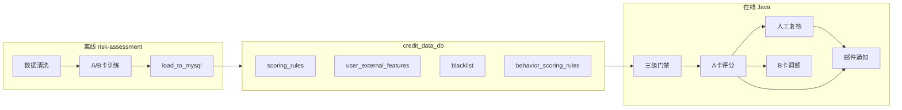
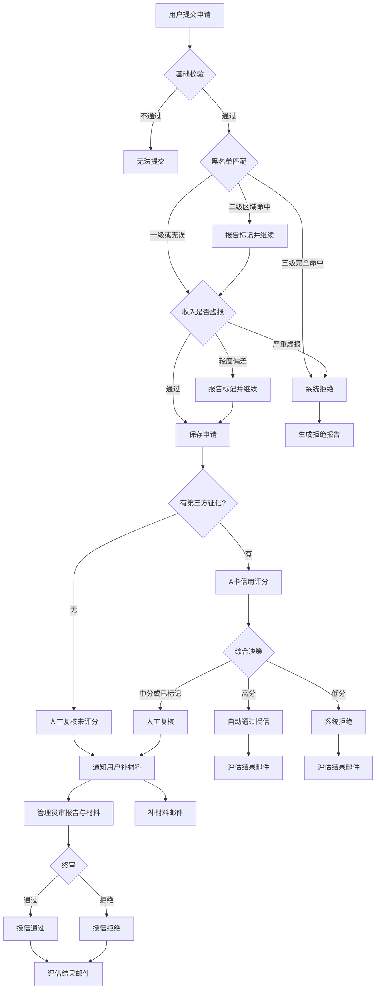
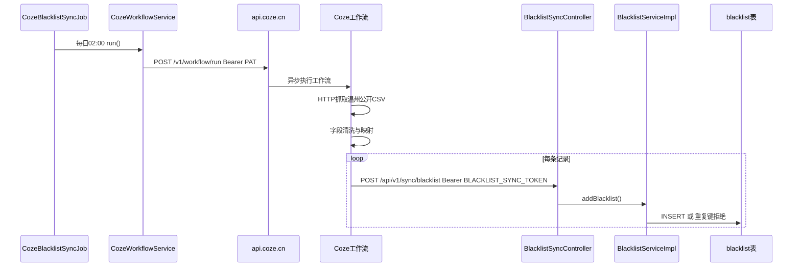

# 本阶段风控工作 PPT 框架（v2）

> 建议总页数：**15 页**（含封面与总结）。第 4、5、10、12 页为**规则/使用详解页**，内容较多，演讲时可拆成 2 页或放附录。\
> **用途**：答辩 PPT 内容大纲，不含幻灯片制作。

---

## 第 1 页｜封面

- **标题**：RiskLendPro 风控体系建设 — 本阶段工作总结
- **副标题**：离线评分卡 + 在线多级决策 + 贷后 B 卡监控
- **要点**：Python 训练 / MySQL 规则入库 / Java 在线执行

---

## 第 2 页｜整体架构



- 离线：[`risk-assessment/`](../risk-assessment/) — 清洗 → 训练 → 入库
- 在线：门禁 → A 卡 → 决策 →（贷后）B 卡 + 邮件触达
- **说明**：训练阶段从 HC 宽表提取 **19 维候选特征**，IV 筛选后 **7 维入模**；Java 推理侧会构建完整特征映射，但评分仅消费 `scoring_rules.json` 中 7 个系数键

---

## 第一部分：离线风控建模

---

## 第 3 页｜数据来源与清洗流水线

| 链路 | 脚本 | 输入 | 输出表 |
|------|------|------|--------|
| 黑名单 | `clean_blacklist.py` | 温州失信被执行人 CSV | `blacklist` |
| A 卡特征 | `clean_user_features.py` | HC parquet 10 万行 | `user_external_features`（500 条演示） |
| B 卡行为 | `clean_behavior_features.py` | parquet + A 卡 id 对齐 | `user_behavior_features` |

- 多编码探测、法院→地区码映射、去重、风险等级标注
- HC 字段标准化 + 异常值裁剪；演示环境合成身份证、按地区抽样 500 条

---

## 第 4 页｜A 卡 — 训练规则与特征体系（详解）

**定位**：贷前申请评分卡（v7.0-hc-woe）｜IV 筛选 + WOE 分箱 + LR + PDO（350–950）

**训练管线**

```
HC parquet(10万) → 19维候选特征 → IV≥0.02筛选+去相关 → 7维入模
→ WOE分箱 → LogisticRegression → PDO标定 → scoring_rules.json
```

**模型指标**：违约率 8.7%｜AUC **0.714**｜阈值 **788 / 642**

---

### 表 1：19 维候选特征（训练全量，[`feature_engineering_hc.py`](../risk-assessment/feature_engineering_hc.py)）

| 特征键 | 业务含义 | 来源 | IV | 是否入模 |
|--------|----------|------|-----|----------|
| ext_source_3 | 第三方综合信用分（HC EXT_SOURCE_3） | 第三方 | 0.346 | **是** |
| ext_source_2 | 第三方综合信用分（HC EXT_SOURCE_2） | 第三方 | 0.301 | **是** |
| edu_mid | 中等及以上学历（0/1） | 申请表 | 0.064 | **是** |
| phone_change_days | 距上次换号天数 | 第三方 | 0.052 | **是** |
| age_years | 年龄 | 申请表 | 0.051 | **是** |
| prev_refused_count | 历史被拒次数 | 第三方 | 0.044 | **是** |
| gender_male | 性别男（0/1） | 申请表 | 0.034 | **是** |
| cc_utilization | 信用卡使用率 | 第三方 | 0.018 | 否（IV<0.02） |
| amt_income_total | 年收入总额 | 申请表 | 0.017 | 否 |
| active_loans_count | 活跃贷款笔数 | 第三方 | 0.017 | 否 |
| loan_overdue_max_6m | 近6月最大逾期 | 第三方 | 0.014 | 否 |
| own_car | 是否有车 | 申请表 | 0.012 | 否 |
| credit_income_ratio | 信贷收入比 | 衍生 | 0.011 | 否 |
| employment_stable | 就业稳定性 | 申请表/第三方 | 0.010 | 否 |
| married | 已婚（0/1） | 申请表 | 0.003 | 否 |
| own_realty | 是否有房 | 申请表 | 0.000 | 否 |
| edu_high | 高学历（0/1） | 申请表 | 0.000 | 否 |
| credit_inquiry_1m | 近1月征信查询 | 第三方 | 0.000 | 否 |
| credit_inquiry_week | 近1周征信查询 | 第三方 | 0.000 | 否 |

> **澄清**：代码侧维护 19 维候选 + 完整字段映射；**最终 LR 模型仅 7 维有非零系数**。未入模特征仍存在于清洗 CSV / `user_external_features` 及 Java `buildHcWoeRawFeatureMap`，供扩展与额度策略使用。

---

### 表 2：7 维入模特征 — 字段说明与 LR 系数（[`scoring_rules.json`](../risk-assessment/output/scoring_rules.json)）

| 特征 | 字段说明 | 申请表映射 | 第三方/HC 字段 | LR 系数 |
|------|----------|------------|----------------|---------|
| ext_source_3 | 外部信用分，越高风险越低 | — | `user_external_features.ext_source_3` | -0.875 |
| ext_source_2 | 外部信用分（另一数据源） | — | `ext_source_2` | -0.825 |
| edu_mid | 学历≥大专为 1 | `education` → high/mid/low 档位 | — | -0.875 |
| phone_change_days | 换号间隔（天），频繁换号风险高 | — | `days_last_phone_change` 取绝对值 | -0.420 |
| age_years | 当前年龄 | `birthday` 推算 | — | -0.488 |
| prev_refused_count | 历史贷款被拒次数 | — | `prev_refused_count`，默认 0 | -0.662 |
| gender_male | 男性=1，女性=0 | `gender` | — | -0.907 |

**评分公式（训练产出，Java 在线复现）**

1. 原始值 → WOE 查表（含 `missing_bin` 缺失分箱）
2. `z = intercept(-0.0009) + Σ(系数 × WOE)`
3. `prob = sigmoid(z)` → PDO 映射 → **350–950 分**
4. PDO 参数：`target_score=650`，`pdo=125.08`，校验集 odds 分位标定

**决策阈值**

| 阈值键 | 分数 | 业务含义 |
|--------|------|----------|
| auto_approve | 788 | 自动通过 |
| manual_review | 642 | 人工审核带下界 |
| < 642 | — | 系统拒绝 |

**产出**：`scoring_rules.json` → 表 `scoring_rules`（含 features/coefficients/scorecard 完整 JSON）

---

## 第 5 页｜B 卡 — 训练规则与特征体系（详解）

**定位**：贷后行为评分卡（v1.0-b-woe）｜监控/降额，**不参与贷前硬拒**

**训练管线**

```
HC parquet inst_/pos_列 → 自动选取7维行为特征 → WOE+LR+PDO
→ b_scoring_rules.json + cleaned_behavior_features.csv
```

**模型指标**：AUC **0.571**（区分度有限，已与 A 卡表/规则物理分离）

---

### 表 1：7 维 B 卡入模特征 — 字段说明与 LR 系数

| 特征键 | 业务含义 | HC 来源列 | LR 系数 | 备注 |
|--------|----------|-----------|---------|------|
| inst_amt_paid_1y | 近1年分期已还金额 | INST 聚合 | -1.554 | 还款越多通常越好 |
| inst_dbd_mean_total | 全周期逾期天数均值 | INST 聚合 | +0.160 | 逾期天数越长风险越高 |
| inst_dbd_mean_1y | 近1年逾期天数均值 | INST 聚合 | -0.823 | |
| inst_late_ratio_total | 迟还期数占比 | INST 聚合 | -0.733 | IV 最高(0.049) |
| inst_partial_payment_ratio | 部分还款期数占比 | INST 聚合 | -0.322 | |
| pos_dpd_mean | POS 逾期天数均值 | POS 聚合 | ≈0 | 当前分箱区分度极低 |
| pos_dpd_def_mean | POS 严重逾期均值 | POS 聚合 | ≈0 | 当前分箱区分度极低 |

**入库**：`user_behavior_features.feature_json`（按 `id_card` 关联）+ `behavior_scoring_rules`

**决策阈值（贷后）**

| 阈值键 | 分数 | 业务含义 |
|--------|------|----------|
| watch | 684.6 | 进入观察，额度系数 0.9 |
| reduce_limit | 547.4 | 大幅降额，系数 0.8 及以下 |

---

## 第 6 页｜规则入库与 Python–Java 联调

- [`load_to_mysql.py`](../risk-assessment/load_to_mysql.py) → 5 张核心表
- 统一 WOE 查表 + `scorecardFromProb` PDO 公式
- [`score_demo_users.py`](../risk-assessment/score_demo_users.py) 离线校准 9 个 persona
- 契约文档：[`参考文件/HomeCredit评分卡使用说明.md`](../参考文件/HomeCredit评分卡使用说明.md)

---

## 第二部分：在线风控决策

---

## 第 7 页｜在线风控主流程

**定位**：答辩用总览；技术细节见第 8–11 页。

用户提交授信申请后，系统按以下顺序处理：

**身份与重复校验 → 黑名单门禁 → 收入验真 → A 卡评分 → 自动/人工决策 → 邮件通知**

二级黑名单命中、收入轻度偏差等情况，会在管理员**详细风控报告**中留下文字标记（如「二级区域命中黑名单」「收入偏差需复核」），供审批对照；是否转人工复核由规则与信用分综合决定。



**说明**：二级命中、收入轻度偏差不立刻拒绝，先完成 A 卡评分；若分数过低仍系统拒绝。报告中的文字标记与评分明细一并供管理员判断。

**三种结果与通知**

| 结果 | 典型情形 | 用户通知 |
|------|----------|----------|
| 自动通过 | A 卡高分 | 评估通过邮件 |
| 系统拒绝 | 黑名单三级 / 收入严重虚报 / A 卡低分 | 评估拒绝邮件（门禁直拒当前不发，见第 15 页） |
| 人工复核 | 二级黑名单、收入轻度偏差、中分、缺征信等 | 补材料邮件 → 管理员终审后再发结果邮件 |

> **演讲口径**：进入正式评分后，每条终态路径都会触发邮件（通过/拒绝发评估结果，人工发补材料清单）；仅门禁阶段直拒目前无邮件，属已知缺口。

**交叉引用**：黑名单细节 → 第 8 页；收入偏差 → 第 9 页；A 卡评分 → 第 10 页；补件与邮件 → 第 11 页。

**贷后延伸**：授信通过且首次放款后，启动 B 卡贷后监控与额度联动（详见第 12 页）。

---

## 第 8 页｜黑名单三级命中

| 级别 | 匹配规则 | 处置 |
|------|----------|------|
| L3 | 姓名 + 身份证前6位 + 出生年 | 立即拒绝 |
| L2 | 姓名 + 地区码 | 强制人工，需补身份证/住址 |
| L1 | 仅姓名 | 打标继续，不阻断 |

- 实现：[`CreditScoreEngineImpl.checkBlacklist()`](../src/main/java/org/example/risklendpro/service/impl/CreditScoreEngineImpl.java)
- 二级命中会在风控报告中标记「姓名+地域命中」等说明，并转人工复核（见第 7 页）
- 三级拒绝在门禁阶段结束，生成拒绝报告，当前不发评估结果邮件
- **已知问题**：一级/二级存在同名误判风险 → 见第 15 页优化方向

---

## 第 9 页｜自填数据偏差三级校验

| 级别 | 偏差率 | 处置 |
|------|--------|------|
| L3 | > 50% | 系统拒绝 |
| L2 | 15%–50% | 强制人工 |
| L1 | ≤ 15% | 自动通过，打标留痕 |

- 对比：自填收入档位 vs 第三方 `amt_income_total/12`（仅检测**向下虚报**）
- **无第三方记录时**：收入校验**跳过**，不在此阶段拦截；进入评分阶段后判「第三方缺失 → 人工复核」（见第 7 页）

---

## 第 10 页｜A 卡在线使用详解（重点）

**引擎**：[`CreditScoreEngineImpl`](../src/main/java/org/example/risklendpro/service/impl/CreditScoreEngineImpl.java)  
**触发时机**：通过黑名单 L3、收入 L3 门禁并 `insert` 申请单后，在 `executeRiskAssessment()` 内执行；需 `user_external_features` 有记录才可评分，否则转人工（见第 7 页）

---

### Step 1 — 加载规则

- 从 `scoring_rules` 表读取 `is_active=1` 的规则 JSON（`model_type=hc_woe_lr`）
- 解析 `features`（WOE 分箱）、`coefficients`（7 维）、`scorecard`（PDO 参数）、`thresholds`

### Step 2 — 组装原始特征

- 按 `id_card` 查 `user_external_features`
- `buildHcWoeRawFeatureMap()`：申请表（性别/婚姻/学历/生日/收入等）+ 第三方字段 → **19 维原始值 Map**
- **评分时仅遍历 coefficients 中的 7 个键**，其余特征不参与 LR 线性求和

### Step 3 — WOE 变换 + LR 求和

```
对每个入模特征：
  raw → woeLookup(cuts/woe/missing_bin) → woeVal
  linear += coefficient × woeVal
prob = sigmoid(linear)
```

### Step 4 — PDO 映射为信用分

- `scorecardFromProb(prob)` → 350–950 整数分
- 当前规则 `application_rule_bonus.enabled=false`，婚姻/车辆规则加成未启用

### Step 5 — 决策 + 授信额度

| 分数 | sysDecision | 额度策略 |
|------|-------------|----------|
| ≥ 788 | APPROVE → FINAL_PASS | 月收入×12，上限 50 万 |
| 642–787 | MANUAL_REVIEW | 月收入×10，上限 30 万 |
| < 642 | REJECT → SYSTEM_REJECT | 月收入×8，上限 20 万 |

- 额外：`prev_refused_count` 历史被拒 → 额度惩罚（最高扣 50%）
- **规则叠加**：若 `forceManualReviewByRule=true` 且分数 < 642 → 仍 **SYSTEM_REJECT**（分数拒绝优先）

### Step 6 — 落库与报告

- 写入 `risk_assessment`（totalScore、sysDecision、creditLimit、status）
- Redis 缓存风控报告（scoreDetails、externalFeatures、blacklistCheck）
- 管理员：`GET /admin/risk/report/{applyId}` 查看逐特征贡献

### Step 7 — 邮件通知

- **自动通过 / 自动拒绝**（评分阶段终态）：`EmailUtil.sendRiskAssessmentNotification()` — 评估结果邮件
- **人工复核**（评分阶段终态）：`sendManualReviewSupplementNotice()` — **补材料邮件**（同属邮件触达，非评估结果）
- **管理员终审后**：`POST /admin/risk/approve` 再发评估通过/拒绝邮件
- **门禁直拒**（黑名单 L3 / 收入 L3）：当前代码**不发**邮件（见第 7 页邮件触达矩阵）

---

## 第 11 页｜人工复核、附加资料与邮件触达

**触发**：黑名单 L2、收入 L2、评分人工带、第三方缺失

**补件清单**（[`SupplementRequirementResolver`](../src/main/java/org/example/risklendpro/service/SupplementRequirementResolver.java)）

| 触发规则 | 必填材料 |
|----------|----------|
| BLACKLIST_MATCH_LEVEL_2 | 身份证正反面、住址证明 |
| INCOME_OUTLIER | 收入证明（工资流水/税单/雇主信） |
| SCORE_MANUAL_REVIEW | 可选：在职证明、征信说明 |

**存储现状**：`upload/risk-supplement/` 项目根目录本地存储（联调便利）→ 见第 15 页迁移 OSS

**管理员闭环**

- 列表 + 风控报告 + 附加资料下载 → `POST /admin/risk/approve` 终审

**邮件通知体系**（[`EmailUtil`](../src/main/java/org/example/risklendpro/utils/EmailUtil.java)）

| 场景 | 触发点 | 邮件内容 |
|------|--------|----------|
| 门禁直拒 | 黑名单 L3 / 收入 L3（未进评分） | 当前不发（待补，见第 15 页） |
| 授信评估结果 | 自动通过 / 自动拒绝 / 管理员终审 | 通过或拒绝 + 额度 |
| 需补材料 | 进入人工复核（系统未终审） | 材料清单 + 保留天数 |
| 材料过期 | 定时清理任务 | 提醒重新上传 |
| 借款结果 | 自动放款 / 待审批 | 放款成功 / 超额待审 |
| 还款提醒 | 定时任务 | 到期前提醒 / 当日提醒 |
| 逾期通知 | 还款计划逾期 | 期数 + 逾期天数 + 金额 |

---

## 第 12 页｜B 卡激活、变化机制与用户影响（详解）

**与 A 卡关系**：A 卡决定**能否借、初始额度**；B 卡决定**贷后额度动态调整**

---

### 激活条件（一次性开关 `b_card_enabled=true`）

| 场景 | 触发代码 | 说明 |
|------|----------|------|
| 首笔自动审批放款 | `LoanServiceImpl` → `behaviorScoreService.activate()` | 额度内借款自动通过时 |
| 管理员批准超额借款 | `AdminServiceImpl.approveLoan()` | 人工审批通过后同样激活 |

> 仅授信通过、尚未放款 → B 卡**未激活**

---

### 计分构成（[`BehaviorScoreService`](../src/main/java/org/example/risklendpro/service/BehaviorScoreService.java)）

```
基础分 base = WOE+LR(user_behavior_features.feature_json)  // 无快照则默认700
实时delta = -最大逾期天数×3 - 逾期期数×12 + 按时还款率×40
最终B分 = clamp(base + delta, 350, 950)
```

- 每次重算写入 `user_b_card_log`（base/delta/final/liveFeatures）

---

### 重算触发时机

| 事件 | 说明 |
|------|------|
| 激活时 | 首次计算并落库 |
| 每次还款 | `RepaymentScheduleTask` → `recalculate()` |
| 每日凌晨2点 | `OverdueLimitAdjustTask` 对逾期用户重算 |
| 管理员手动 | `POST /admin/b-card/recalculate/{userId}` |

---

### 额度联动 — 对用户后续贷款的影响

**B 卡已激活 + 用户逾期时**，按 B 分乘系数调整 `total_limit`：

| B 分区间 | 额度系数 | 用户感知 |
|----------|----------|----------|
| ≥ watch+50（≈735） | 1.0 | 额度不变 |
| ≥ watch（684.6） | 0.9 | 总额度降 10% |
| ≥ reduce（547.4） | 0.8 | 降 20% |
| ≥ reduce-100 | 0.5 | 降 50% |
| ≥ reduce-200 | 0.2 | 降 80% |
| 更低 | 0.0 | 额度清零，无法新增借款 |

- 同步调整 `remaining_limit`；变更记录写入 `limit_adjust_log`
- **B 卡未激活时**：回退 M1–M4 逾期等级硬规则（0.8/0.5/0.2/0）

**对用户后续贷款的实际影响**

1. 剩余可借金额随 B 分下降而减少
2. 超额借款更频繁进入管理员审批
3. 按时还款 → delta 正向 → B 分回升 → 额度系数恢复
4. 长期逾期 → B 分持续走低 → 可能额度清零、阻断复借

---

## 第三部分：运营支撑与总结

---

## 第 13 页｜Coze 平台黑名单增量同步



- **双通道**：全量 [`clean_blacklist.py`](../risk-assessment/clean_blacklist.py) + `load_to_mysql.py`（开发/首次）；增量 Java → Coze → `/sync/blacklist`（生产）
- **职责拆分**：因扣子平台不可用 Cron，**定时由 Java** `CozeBlacklistSyncJob` 触发；Java 调用 Coze API + 提供写入接口；**爬取、清洗、循环 POST** 在 Coze 工作流内完成
- **配置**：`risk.coze.enabled`、`COZE_API_TOKEN`、`workflow-id`；工作流环境变量 `SPRING_BASE_URL`、`BLACKLIST_SYNC_TOKEN`（对应 `risk.blacklist-sync.api-token`）
- **去重**：Java 侧按 `(name, area_code, birth_year)` 已存在则拒绝 INSERT
- **现状局限**：增量源目前为**温州公开 CSV 单一数据源** → 见第 15 页扩展多源

---

## 第 14 页｜本阶段技术难点

1. **Python–Java 评分一致**：19 维映射 vs 7 维入模，WOE/PDO 全链路契约
2. **宽表降维**：300+ 列 → IV 筛选 → 7 维，平衡可解释性与 AUC
3. **标签泄漏防护**：禁止用 `loan_status` 反推逾期特征
4. **训练/推理特征来源差异**：申请表字段 → HC 键名映射
5. **多级规则叠加**：黑名单/收入/评分三层 + 拒绝优先级
6. **B 卡 AUC 偏低（0.57）**：申请时点标签训练行为特征，时序错配

---

## 第 15 页｜阶段成果与后续优化方向

**阶段成果**

- 完整离线流水线 + 5 张核心表 + A 卡 AUC 0.71 上线
- 在线三级门禁 + A 卡决策 + 人工补资料闭环
- B 卡贷后监控 + 额度动态联动
- Coze 黑名单自动同步 + 全链路邮件通知

**后续优化（按优先级）**

| 方向 | 现状问题 | 优化思路 |
|------|----------|----------|
| **黑名单三级逻辑** | L1 仅姓名、L2 缺出生年，**同名误判**风险 | 引入模糊匹配阈值、白名单、多字段交叉验证；L2 默认阻断评分 |
| **黑名单数据源** | 增量源目前仅**温州公开 CSV**，覆盖面有限 | 接入法院 API、行业共享名单、多 Coze 工作流/多源聚合 |
| **门禁拒绝通知** | 黑名单 L3 / 收入 L3 直拒**不发邮件** | 门禁终态补发评估拒绝通知，与评分拒绝体验一致 |
| **补资料存储** | 文件存项目根目录 `upload/risk-supplement/` | 迁移 **OSS/S3** + 签名 URL + 访问审计 |
| **B 卡模型** | AUC 0.57，HC 历史行为非真实贷后 | 积累本平台还款数据，用真实逾期标签重训 |
| **收入验真** | 仅检测向下虚报 | 增加向上瞒报、多源收入交叉 |
| **邮件可靠性** | 同步发送，无重试队列 | 引入异步消息队列 + 失败重试 |
| **生产入库** | `load_to_mysql` 开发态 DROP 重建 | 改为增量 UPSERT + 规则版本切换 |
| **风控报告** | Redis 缓存与 DB 可能不一致 | 明确 TTL + 终审后强制刷新 |

---

## 演讲逻辑建议

| 板块 | 页码 | 时长 | 重点 |
|------|------|------|------|
| 开场 | 1–2 | 2 min | 架构 + 19候选/7入模说明 |
| 离线建模 | 3–6 | 6 min | **第4/5页规则表** |
| 在线决策 | 7–11 | 8 min | **第10页A卡使用** + 邮件 |
| 贷后 | 12–13 | 4 min | **第12页B卡影响** |
| 收尾 | 14–15 | 3 min | 难点 + **优化路线图** |

**叙事主线**：数据来 → 模型训（19→7）→ 线上怎么判 → 判不准怎么办 → 贷后怎么管 → 名单怎么更 → 还要改什么

---

## 可选附录（不计入主页面数）

### 附录 A：A 卡 7 维 WOE 分箱 cut 点明细

| 特征 | 分箱切点（cuts） |
|------|------------------|
| ext_source_3 | 0.317, 0.46, 0.578, 0.685, 0.888 |
| ext_source_2 | 0.344, 0.515, 0.609, 0.682, 0.855 |
| edu_mid | 分类：0=否, 1=是 |
| phone_change_days | 178, 558, 1060, 1732, 4153 |
| age_years | 30.7, 37.0, 42.9, 50.0, 69.0 |
| prev_refused_count | 1, 58 |
| gender_male | 分类：0=否, 1=是 |

### 附录 B：9 个演示 persona 分数对照

来源：[`score_demo_users.py`](../risk-assessment/score_demo_users.py) 与 [`sql/测试用例.md`](../sql/测试用例.md)，用于 Python–Java 联调校准。

### 附录 C：`risk_assessment.status` 状态机

```
WAITING
  → SYSTEM_REJECT（黑名单L3 / 收入L3 / 分数拒绝）
  → MANUAL_REVIEW（L2 / 收入L2 / 分数人工带 / 第三方缺失）
  → FINAL_PASS（自动通过 或 管理员 PASS）
  → FINAL_REJECT（管理员 REJECT）
```

### 附录 D：B 卡 WOE 分箱 cut 点明细

| 特征 | 分箱切点（cuts） |
|------|------------------|
| inst_amt_paid_1y | 41311.6, 126289.2, 333744.6, 9000329.0 |
| inst_dbd_mean_total | 4.306, 7.386, 10.703, 15.846, 194.889 |
| inst_dbd_mean_1y | 0, 2.625, 7.167, 13.0, 212.727 |
| inst_late_ratio_total | 0.0426, 0.139, 1.0 |
| inst_partial_payment_ratio | 0.0156, 0.143, 1.0 |
| pos_dpd_mean | 2622.078 |
| pos_dpd_def_mean | 1671.398 |
