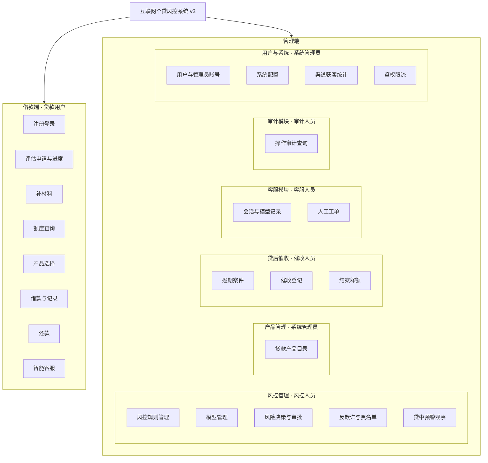

# 综设 III 用户角色与功能模块图

依据课件要求：先定角色，再按角色拆功能，用颜色区分 **已有（综设 II）**、**本学期优化**、**完全新增**。管理端结构在现有「风控 / 产品 / 用户 / 客服」基础上，补齐 **贷后催收** 与 **审计**。

图例（绘制 PPT / ProcessOn 时请统一）：

| 颜色 | 含义 | 本学期处理 |
|------|------|------------|
| 绿色 | 已有 | 迁入对应微服务，主流程保持可用 |
| 橙色 | 本学期优化 | 改持久化、鉴权、产品绑定、可解释决策等 |
| 黄色 | 完全新增 | 无则从零建设 |

---

## 1. 用户角色

| 角色 | 使用端 | 核心职责 | 对应后端服务 |
|------|--------|----------|--------------|
| 贷款用户 | Android 借款端 | 注册获客、选产品、申请评估、借款还款、咨询客服 | user / risk / loan / cs |
| 风控管理人员 | Vue 管理端 | 规则与模型、评估审批、反欺诈、贷中观察 | risk-service，贷中处置协同 loan-service |
| 贷后催收人员 | Vue 管理端 | 逾期案件、催收登记、结案 | loan-service |
| 审计人员 | Vue 管理端 | 只读查询审批、调额、催收、工单等操作记录 | user-service 审计表 |
| 客服人员 | Vue 管理端 | 人工工单受理、回复、关闭；查看会话 | cs-service |
| 系统管理员 | Vue 管理端 | 管理员账号、用户状态、系统配置、产品上下架、渠道、网关安全 | user-service、loan-service 产品、gateway |

同一 Vue 登录后按角色显示菜单。本学期最小实现：JWT 中区分 `USER` 与 `ADMIN`；管理端内部用菜单权限区分风控 / 催收 / 客服 / 审计 / 系统（若来不及做五套角色码，允许共用管理员账号、用菜单分组演示，但 **贷款用户 Token 不得访问 `/admin/**`**）。

---

## 2. 角色—功能对照

| 角色 | 已有（绿） | 本学期优化（橙） | 完全新增（黄） |
|------|------------|------------------|----------------|
| 贷款用户 | 登录、评估提交/进度/结果、补材料、额度、借款、还款计划 | 借款绑定产品、利率从产品读取 | 渠道/邀请码注册、产品列表、智能客服、转人工 |
| 风控管理人员 | 待审批列表、通过/拒绝、评分报告、黑名单同步、B 卡监控入口 | 决策可解释、反欺诈落库、A 分档阈值、规则启停 | 模型版本只读页、决策策略配置（最小） |
| 贷后催收人员 | 逾期列表、邮件提醒（字段有占位） | 逾期等级沿用 N/M1/M2/M3 | 催收案件、催收动作、结清关案 |
| 审计人员 | 无独立模块（曾拼装操作日志） | — | 统一审计查询（审批/调额/催收/工单） |
| 客服人员 | 无（仅邮件文案「联系客服」） | — | 会话记录、大模型对话审计、人工工单 |
| 系统管理员 | 管理员登录、用户列表/冻结、部分系统页 | 配置落库、关闭公开注册、USER 访问管理端 403、脱敏 | 产品目录维护、渠道漏斗、限流与密钥外置 |

---

## 3. 功能模块图（建议按此重画，保留三色）

根节点名称与课件一致，可用「全功能版 v2（结构图称 v3）」。

三色标注（复制到绘图工具时给节点上色）：

**绿色 · 已有**

- 注册登录（不含渠道）、评估申请与进度、补材料、额度查询、借款与记录、还款
- 风险决策与审批（人工通过/拒绝）、反欺诈入口雏形、黑名单同步、B 卡监控入口
- 用户与管理员账号（基础 CRUD）

**橙色 · 本学期优化**

- 借款绑定 `productId`、利率/期限从产品读取
- 风控规则启停与列表（库表已有，补管理能力与可解释）
- 反欺诈处置落库；A 卡分档阈值；系统配置落库
- 逾期列表改为真实催收字段；鉴权改为 USER 无法打管理端

**黄色 · 完全新增**

- 产品选择、产品目录
- 渠道/邀请码、渠道统计
- 模型管理页、决策策略最小配置
- 贷中预警案件、催收案件与登记、结案释额
- 智能客服、人工工单、会话与模型调用记录
- 统一审计查询、网关限流与密钥外置

管理端二级模块相对你现有草图的增量：**增加「贷后催收」「审计模块」**；「风控管理」下除规则/模型/决策外，保留黑名单与贷中观察，避免催收与风控挤在同一菜单。

---

## 4. 模块与需求编号对照

细粒度需求见 [综设III需求清单.md](./综设III需求清单.md)，飞书「需求列表」按同一编号导入。

| 模块 | 需求编号前缀 | 主要角色 |
|------|----------------|----------|
| 风控规则管理 | R01 | 风控管理人员 |
| 模型管理 | R02 | 风控管理人员 |
| 风险决策与审批 | R03 | 风控管理人员、贷款用户 |
| 产品管理 | R04 | 系统管理员、贷款用户 |
| 借款与还款 | R05 | 贷款用户、系统管理员 |
| 贷中监控 | R06 | 风控管理人员 |
| 贷后催收 | R07 | 贷后催收人员 |
| 智能客服 | R08 | 贷款用户、客服人员 |
| 获客 | R09 | 贷款用户、系统管理员 |
| 用户与账号 | R10 | 系统管理员、贷款用户 |
| 审计 | R11 | 审计人员 |
| 系统安全与配置 | R12 | 系统管理员 |
